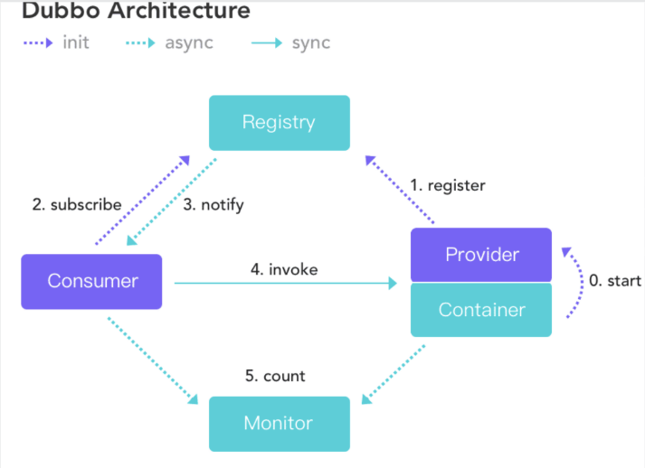
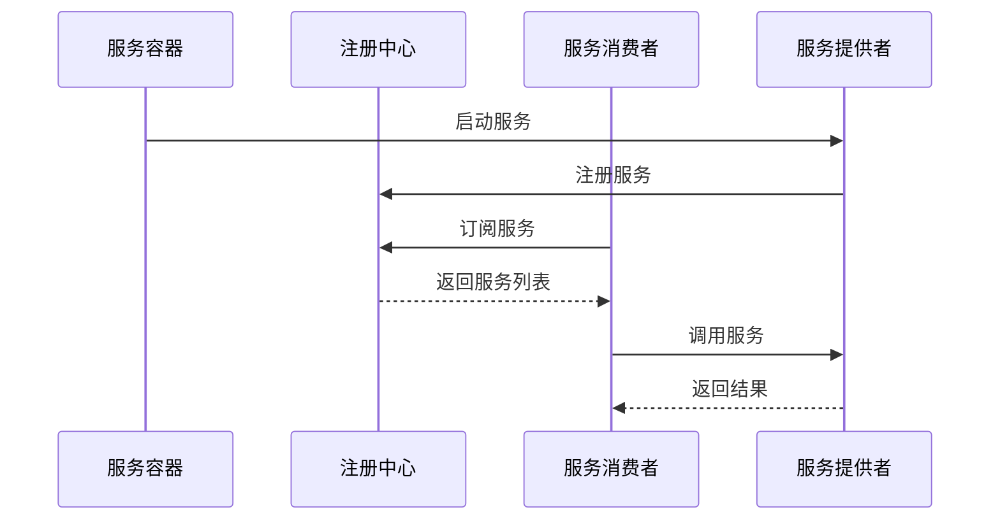

# Dubbo 分布式服务框架

Dubbo是阿里巴巴开源的高性能RPC框架，专注于服务治理，是国内最流行的分布式服务框架之一。

## 一、Dubbo架构



### 1.1 核心组件

| 组件 | 角色 | 说明 |
|------|------|------|
| **Provider** | 服务提供者 | 暴露服务的服务提供方 |
| **Consumer** | 服务消费者 | 调用远程服务的服务消费方 |
| **Registry** | 注册中心 | 服务注册与发现的中心 |
| **Monitor** | 监控中心 | 统计服务调用次数和调用时间 |
| **Container** | 服务容器 | 服务运行的容器 |

### 1.2 调用流程



## 二、Dubbo核心特性

### 2.1 高性能RPC
- 基于Netty的高性能通信
- 支持多种序列化方式（Hessian、JSON、Protobuf）
- 连接池管理和复用

### 2.2 服务治理

| 功能 | 说明 |
|------|------|
| **服务注册与发现** | 自动注册、动态发现服务 |
| **负载均衡** | 支持随机、轮询、最少活跃数等策略 |
| **容错机制** | 失败重试、降级、熔断 |
| **路由规则** | 条件路由、脚本路由 |
| **动态配置** | 运行时调整配置 |

### 2.3 协议支持

| 协议 | 特点 | 适用场景 |
|------|------|----------|
| **Dubbo协议** | 高性能、二进制 | 内部服务调用 |
| **HTTP协议** | 跨语言、标准 | 对外API |
| **gRPC协议** | 跨语言、HTTP/2 | 跨语言服务 |
| **Thrift协议** | 跨语言、高效 | 跨语言服务 |

### 2.4 多语言支持
- Java（原生）
- Go
- Python
- Node.js
- PHP

## 三、Dubbo配置

### 3.1 服务提供者配置

```xml
<dubbo:service interface="com.example.Service" ref="serviceImpl" />
```

### 3.2 服务消费者配置

```xml
<dubbo:reference id="service" interface="com.example.Service" />
```

### 3.3 注解方式（Spring Boot）

```java
// 提供者
@DubboService
public class ServiceImpl implements Service { ... }

// 消费者
@DubboReference
private Service service;
```

## 四、服务治理实践

### 4.1 负载均衡策略

| 策略 | 说明 |
|------|------|
| **Random** | 随机选择 |
| **RoundRobin** | 轮询选择 |
| **LeastActive** | 最少活跃调用数 |
| **ConsistentHash** | 一致性哈希 |

### 4.2 容错策略

| 策略 | 说明 |
|------|------|
| **Failover** | 失败自动切换，重试其他服务器 |
| **Failfast** | 快速失败，只调用一次 |
| **Failsafe** | 失败安全，忽略异常 |
| **Failback** | 失败自动恢复，后台记录失败请求 |
| **Forking** | 并行调用多个服务器 |

### 4.3 服务降级

```java
// Mock实现
public class ServiceMock implements Service {
    public String sayHello(String name) {
        return "降级返回";
    }
}
```

## 五、与Spring Cloud对比

| 维度 | Dubbo | Spring Cloud |
|------|-------|--------------|
| **通信协议** | RPC | HTTP |
| **性能** | 高 | 中等 |
| **生态** | 专注服务治理 | 全栈微服务 |
| **适用场景** | 内部服务调用 | 对外API、跨语言 |

---

## 本目录包含的文档

- [Dubbo详解](Dubbo.md)
- [分布式服务框架](分布式服务框架.md)
