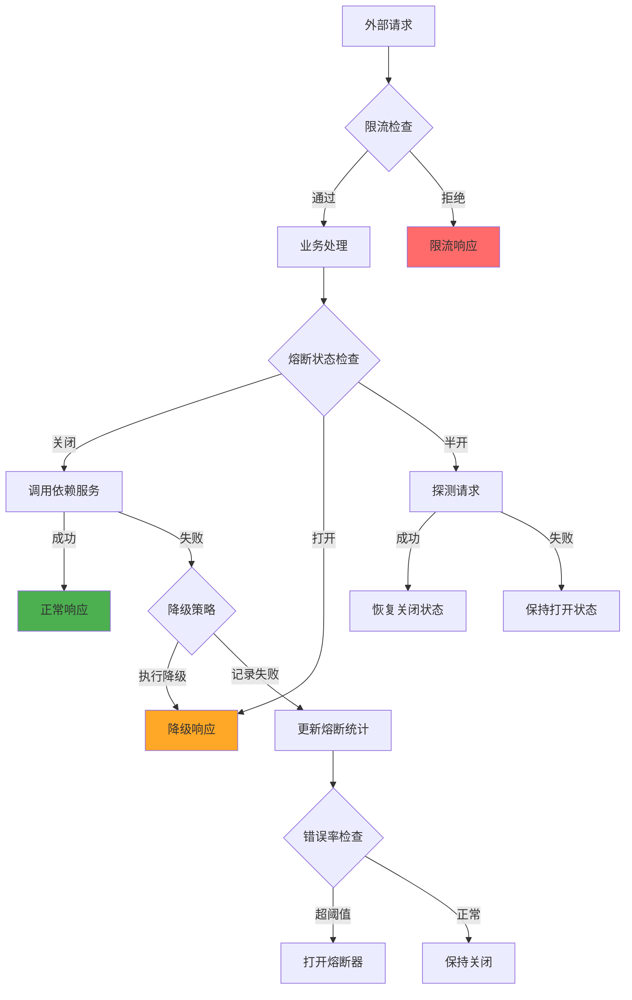
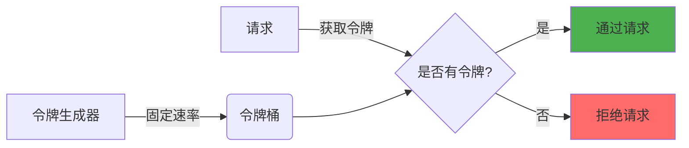
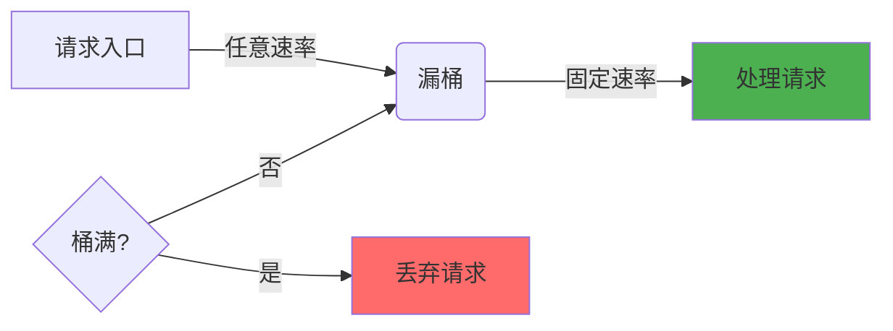
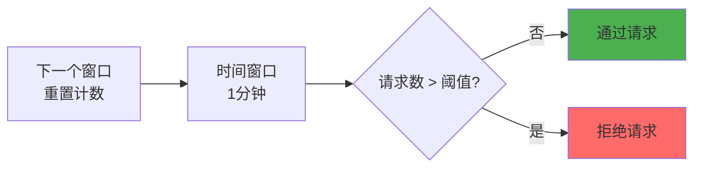
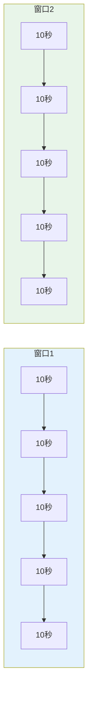
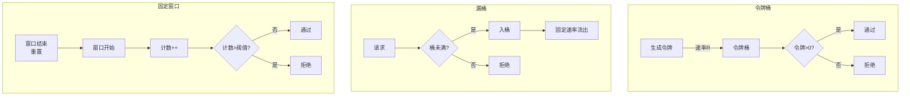
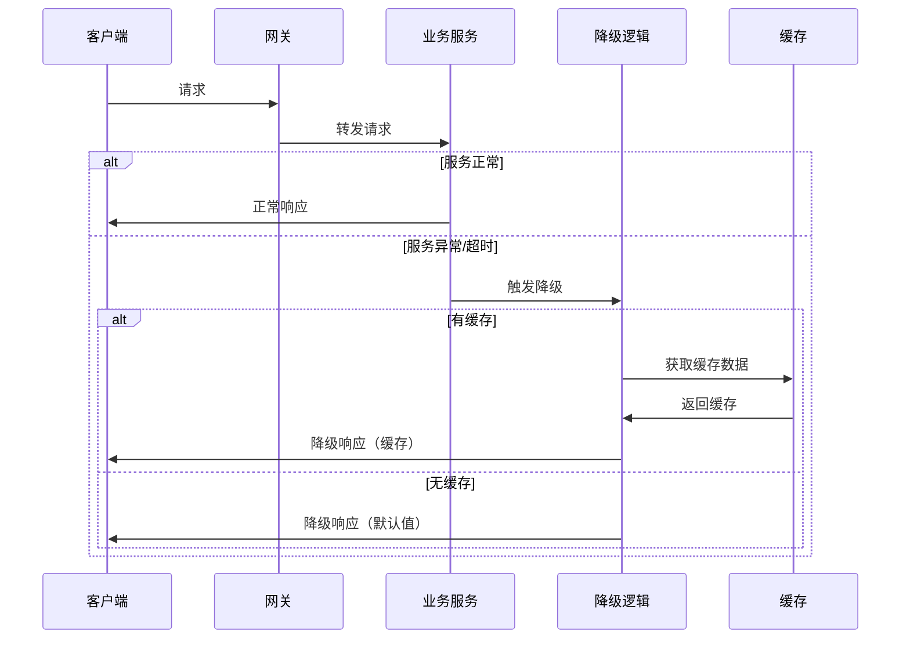
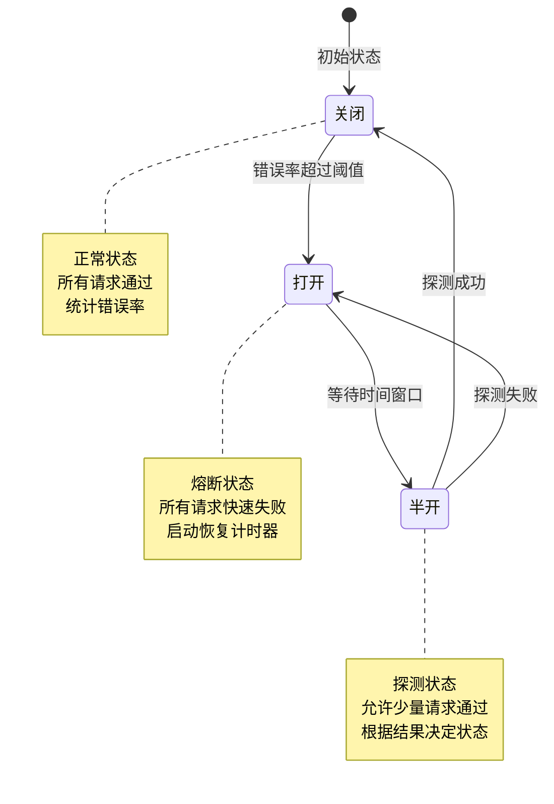

# 限流、降级与熔断

在分布式系统和微服务架构中，为了保证系统的稳定性和高可用性，限流、降级与熔断是三个核心的保护机制。本文将详细介绍这三种机制的原理、实现和应用。

## 1. 概述与背景

### 1.1 为什么需要限流、降级与熔断

在高并发场景下，系统可能面临以下风险：

- **流量突增**：如促销活动、热点事件导致请求量暴增
- **依赖服务故障**：下游服务不可用导致级联失败
- **资源耗尽**：CPU、内存、数据库连接等资源被耗尽
- **雪崩效应**：一个服务故障导致整个系统瘫痪

限流、降级与熔断就是为了解决这些问题而设计的保护机制。

### 1.2 三种机制的定位和关系

| 机制 | 定位 | 目标 |
|------|------|------|
| **限流** | 控制流量 | 防止系统被过量请求压垮 |
| **降级** | 优雅妥协 | 在资源不足时保证核心功能可用 |
| **熔断** | 故障隔离 | 防止故障扩散，保护系统稳定性 |

### 1.3 三者关系图



## 2. 限流详解

### 2.1 限流的定义和作用

**限流**（Rate Limiting）是指对系统的访问流量进行控制，使其在系统可承受的范围内。

**作用**：
- 保护系统不被突发流量压垮
- 防止恶意请求攻击
- 保证公平访问（每个用户/IP有合理的配额）
- 优化资源利用

### 2.2 常见限流算法

#### 2.2.1 令牌桶算法（Token Bucket）

令牌桶算法以固定速率向桶中添加令牌，请求需要获取令牌才能通过。



**特点**：
- 可以应对突发流量（桶内有积累的令牌）
- 平滑限流
- 实现相对复杂

#### 2.2.2 漏桶算法（Leaky Bucket）

漏桶算法以固定速率流出请求，过量的请求会被暂存或丢弃。



**特点**：
- 强制平滑输出
- 无法应对突发流量
- 实现简单

#### 2.2.3 固定窗口算法

固定窗口算法在固定时间窗口内统计请求数，超过阈值则限流。



**特点**：
- 实现简单
- 存在"突刺现象"（窗口边界可能有双倍流量）

#### 2.2.4 滑动窗口算法

滑动窗口算法将时间窗口分成多个小格，随着时间推移滑动窗口。



**特点**：
- 解决了固定窗口的突刺问题
- 实现相对复杂

### 2.3 算法原理对比图



### 2.4 限流维度

| 维度 | 说明 | 示例 |
|------|------|------|
| **QPS** | 每秒查询数 | 1000 QPS |
| **并发数** | 同时处理的请求数 | 500 并发 |
| **资源使用率** | CPU、内存等 | CPU < 80% |
| **用户维度** | 按用户ID限流 | 每个用户每分钟100次 |
| **IP维度** | 按IP地址限流 | 每个IP每分钟60次 |
| **接口维度** | 按接口限流 | /api/user 限流200 QPS |

### 2.5 限流阈值设置原则

1. **压测确定**：通过性能压测获取系统极限能力
2. **留有余量**：设置阈值为极限值的 70%-80%
3. **动态调整**：根据系统负载动态调整阈值
4. **分层限流**：网关层、服务层、数据层分别限流
5. **监控告警**：实时监控限流情况，及时调整

## 3. 降级详解

### 3.1 降级的定义和作用

**降级**（Degradation）是指在系统资源不足或出现故障时，暂时关闭非核心功能，保证核心功能正常运行。

**作用**：
- 保证核心服务可用
- 释放系统资源
- 提供优雅的用户体验

### 3.2 降级类型

#### 3.2.1 服务降级

当依赖服务不可用时，使用本地逻辑或缓存数据替代。

#### 3.2.2 功能降级

暂时关闭非核心功能，如推荐、评论等。

#### 3.2.3 数据降级

使用缓存数据或简化数据替代实时数据。

### 3.3 降级策略

| 策略 | 说明 | 适用场景 |
|------|------|----------|
| **自动降级** | 系统根据规则自动触发 | 超时、失败率过高 |
| **手动降级** | 运维人员手动开关 | 大促前主动降级 |

### 3.4 降级流程图



## 4. 熔断详解

### 4.1 熔断的定义和作用

**熔断**（Circuit Breaker）是指当服务错误率达到阈值时，暂时切断对该服务的调用，防止故障扩散。

**作用**：
- 防止雪崩效应
- 快速失败，减少资源浪费
- 给服务恢复时间

### 4.2 熔断器状态机

熔断器有三种状态，通过状态机进行管理。



#### 4.2.1 关闭状态（Closed）

- 正常处理所有请求
- 统计请求的成功、失败次数
- 当错误率超过阈值时，切换到打开状态

#### 4.2.2 打开状态（Open）

- 快速拒绝所有请求
- 直接调用降级方法
- 启动熔断器睡眠窗口计时器
- 睡眠窗口到期后，切换到半开状态

#### 4.2.3 半开状态（Half-Open）

- 允许有限数量的探测请求通过
- 如果探测请求成功，切换到关闭状态
- 如果探测请求失败，切换回打开状态

### 4.3 常见实现方案

#### 4.3.1 Hystrix（Netflix 开源）

Netflix 开源的熔断器组件，已进入维护模式。

**特点**：
- 成熟稳定
- 功能全面
- 线程池隔离
- 丰富的监控

#### 4.3.2 Sentinel（阿里巴巴开源）

阿里巴巴开源的流量控制组件，功能强大。

**特点**：
- 轻量级高性能
- 多种限流策略
- 实时监控
- 控制台支持

#### 4.3.3 Resilience4j（轻量级）

基于 Java 8 函数式编程的轻量级熔断器。

**特点**：
- 轻量级无依赖
- 函数式编程风格
- 模块化设计
- 响应式支持

## 5. 主流框架对比

### 5.1 详细对比

| 特性 | Hystrix | Sentinel | Resilience4j |
|------|---------|----------|--------------|
| **隔离策略** | 线程池/信号量 | 并发线程数/QPS | 信号量 |
| **熔断策略** | 错误率 | 错误率/慢调用比例 | 错误率/慢调用比例 |
| **限流策略** | 无 | QPS/限流维度/预热 | RateLimiter |
| **降级策略** | Fallback | Fallback | Fallback |
| **控制台** | DashBoard | Sentinel-Dashboard | 无 |
| **性能** | 中等（线程池开销） | 高 | 高 |
| **活跃度** | 维护中 | 活跃 | 活跃 |
| **学习成本** | 中等 | 中等 | 较低 |

### 5.2 Hystrix 使用示例

```java
@HystrixCommand(
    fallbackMethod = "getUserFallback",
    commandProperties = {
        @HystrixProperty(name = "execution.isolation.thread.timeoutInMilliseconds", value = "1000"),
        @HystrixProperty(name = "circuitBreaker.requestVolumeThreshold", value = "20"),
        @HystrixProperty(name = "circuitBreaker.errorThresholdPercentage", value = "50")
    }
)
public User getUser(Long id) {
    return userService.getUserById(id);
}

public User getUserFallback(Long id) {
    return new User(id, "降级用户");
}
```

### 5.3 Sentinel 使用示例

```java
// 定义资源
@SentinelResource(
    value = "getUser",
    blockHandler = "handleBlock",
    fallback = "handleFallback"
)
public User getUser(Long id) {
    return userService.getUserById(id);
}

// 限流处理
public User handleBlock(Long id, BlockException ex) {
    return new User(id, "限流用户");
}

// 降级处理
public User handleFallback(Long id, Throwable ex) {
    return new User(id, "降级用户");
}
```

### 5.4 Resilience4j 使用示例

```java
// 配置断路器
CircuitBreakerConfig config = CircuitBreakerConfig.custom()
    .failureRateThreshold(50)
    .waitDurationInOpenState(Duration.ofSeconds(10))
    .ringBufferSizeInClosedState(100)
    .build();

CircuitBreaker circuitBreaker = CircuitBreaker.of("userService", config);

// 使用断路器
Supplier<User> supplier = CircuitBreaker.decorateSupplier(
    circuitBreaker,
    () -> userService.getUserById(id)
);

User user = Try.ofSupplier(supplier)
    .recover(throwable -> new User(id, "降级用户"))
    .get();
```

## 6. 实践与最佳实践

### 6.1 实施步骤

1. **梳理依赖**：识别系统的关键依赖服务
2. **设置阈值**：通过压测确定合理的限流、熔断阈值
3. **选择框架**：根据业务需求选择合适的框架
4. **实现保护**：在关键路径上添加限流、降级、熔断逻辑
5. **配置监控**：配置监控指标和告警规则
6. **灰度发布**：先在小范围验证，再逐步推广
7. **持续优化**：根据运行数据持续优化配置

### 6.2 配置建议

#### 6.2.1 限流配置建议

| 场景 | 推荐算法 | 阈值设置 |
|------|----------|----------|
| 网关层 | 令牌桶 | 基于QPS |
| 服务接口 | 滑动窗口 | 基于压测结果的70% |
| 外部API | 漏桶 | 遵循服务商限制 |

#### 6.2.2 熔断配置建议

| 参数 | 推荐值 | 说明 |
|------|--------|------|
| 错误率阈值 | 50% | 根据业务容忍度调整 |
| 请求量阈值 | 20 | 确保有足够样本 |
| 等待时间 | 5-30秒 | 给服务恢复时间 |

### 6.3 监控与告警

#### 6.3.1 关键监控指标

- **限流指标**：限流次数、限流QPS、限流比例
- **熔断指标**：熔断次数、熔断状态、错误率
- **降级指标**：降级次数、降级比例
- **性能指标**：响应时间、吞吐量、错误率

#### 6.3.2 告警规则

- 限流比例 > 10%，持续5分钟
- 熔断器长时间处于打开状态
- 错误率突增 > 20%
- 响应时间超过阈值

### 6.4 常见问题和解决方案

| 问题 | 原因 | 解决方案 |
|------|------|----------|
| 限流导致正常请求被拒绝 | 阈值设置过低 | 动态调整阈值，优化限流算法 |
| 熔断器频繁打开关闭 | 阈值设置不合理 | 调整错误率和等待时间 |
| 降级后用户体验差 | 降级逻辑简单 | 提供友好的降级提示，使用缓存数据 |
| 多实例限流不一致 | 未使用分布式限流 | 使用 Redis 等实现分布式限流 |

### 6.5 Sentinel 完整代码示例

```java
import com.alibaba.csp.sentinel.Entry;
import com.alibaba.csp.sentinel.SphU;
import com.alibaba.csp.sentinel.slots.block.BlockException;
import com.alibaba.csp.sentinel.slots.block.RuleConstant;
import com.alibaba.csp.sentinel.slots.block.flow.FlowRule;
import com.alibaba.csp.sentinel.slots.block.flow.FlowRuleManager;

import java.util.ArrayList;
import java.util.List;

public class SentinelExample {

    private static final String RESOURCE_NAME = "helloWorld";

    public static void main(String[] args) {
        // 初始化限流规则
        initFlowRules();

        // 模拟请求
        while (true) {
            try (Entry entry = SphU.entry(RESOURCE_NAME)) {
                // 被保护的业务逻辑
                System.out.println("Hello World");
            } catch (BlockException ex) {
                // 限流处理
                System.out.println("Blocked!");
            }

            try {
                Thread.sleep(20);
            } catch (InterruptedException e) {
                Thread.currentThread().interrupt();
            }
        }
    }

    private static void initFlowRules() {
        List<FlowRule> rules = new ArrayList<>();
        FlowRule rule = new FlowRule();
        rule.setResource(RESOURCE_NAME);
        // 限流类型：QPS
        rule.setGrade(RuleConstant.FLOW_GRADE_QPS);
        // 限流阈值：20 QPS
        rule.setCount(20);
        rules.add(rule);
        FlowRuleManager.loadRules(rules);
    }
}
```

### 6.6 最佳实践总结

1. **分层保护**：网关、服务、数据层层层防护
2. **提前演练**：大促前进行限流降级演练
3. **动态配置**：支持运行时动态调整规则
4. **灰度验证**：新规则先在小范围验证
5. **全面监控**：实时监控各项指标
6. **快速响应**：建立完善的告警和应急机制
7. **文档完善**：记录所有规则和应急预案

## 总结

限流、降级与熔断是保证分布式系统稳定性的三大利器：

- **限流**是第一道防线，控制流量入口
- **降级**是优雅妥协，保证核心功能
- **熔断**是故障隔离，防止雪崩效应

在实际应用中，这三种机制通常配合使用，形成完整的保护体系，确保系统在各种异常情况下都能稳定运行。
