# InnoDB 中的数据结构

## 目录

1. [InnoDB 存储结构概述](#1-innodb-存储结构概述)
2. [B+Tree 数据结构](#2-btree-数据结构)
3. [为什么选择 B+Tree](#3-为什么选择-btree)
4. [InnoDB 索引与 B+Tree](#4-innodb-索引与-btree)
5. [B+Tree 能解决什么问题](#5-btree-能解决什么问题)
6. [B+Tree 的优缺点](#6-btree-的优缺点)
7. [InnoDB 其他数据结构](#7-innodb-其他数据结构)
8. [InnoDB 页分裂与页合并](#8-innodb-页分裂与页合并)

---

## 1. InnoDB 存储结构概述

### 1.1 InnoDB 逻辑存储结构

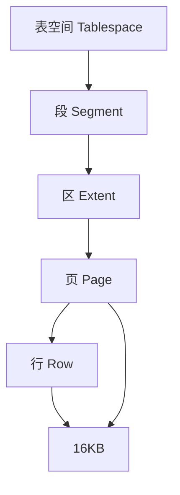
```mermaid
flowchart TD
    A[表空间 Tablespace] --> B[段 Segment]
    B --> C[区 Extent]
    C --> D[页 Page]
    D --> E[行 Row]
    
    E --> F[16KB]
    D --> F
```

| 结构层级 | 说明 | 大小 |
|---------|------|------|
| **表空间** | 数据存储的顶层容器 | - |
| **段** | 表、索引、回滚段等 | - |
| **区** | 连续的 64 个页 | 1 MB |
| **页** | InnoDB 最小存储单元 | 16 KB |
| **行** | 用户数据 | - |

### 1.2 InnoDB 页面类型

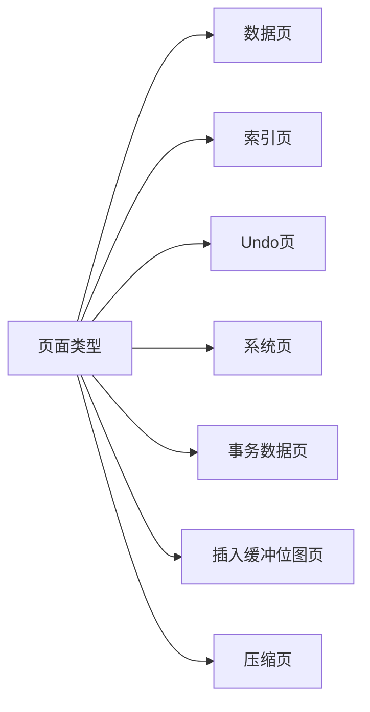
```mermaid
flowchart LR
    A[页面类型] --> B[数据页]
    A --> C[索引页]
    A --> D[Undo页]
    A --> E[系统页]
    A --> F[事务数据页]
    A --> G[插入缓冲位图页]
    A --> H[压缩页]
```

---

## 2. B+Tree 数据结构

### 2.1 B+Tree 定义

**B+Tree** 是一种自平衡的多路搜索树（B-Tree）的变种，是 InnoDB 索引的核心数据结构。

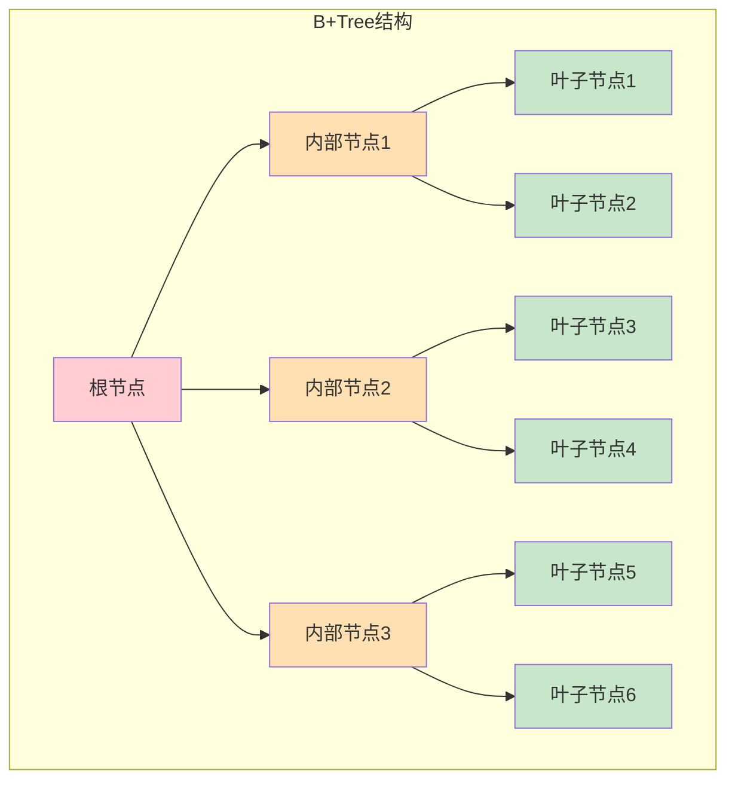
```mermaid
flowchart TD
    subgraph B+Tree结构
        A[根节点] --> B[内部节点1]
        A --> C[内部节点2]
        A --> D[内部节点3]
        
        B --> E[叶子节点1]
        B --> F[叶子节点2]
        C --> G[叶子节点3]
        C --> H[叶子节点4]
        D --> I[叶子节点5]
        D --> J[叶子节点6]
    end
    
    style A fill:#ffcdd2
    style B fill:#ffe0b2
    style C fill:#ffe0b2
    style D fill:#ffe0b2
    style E fill:#c8e6c9
    style F fill:#c8e6c9
    style G fill:#c8e6c9
    style H fill:#c8e6c9
    style I fill:#c8e6c9
    style J fill:#c8e6c9
```

### 2.2 B+Tree vs B-Tree 对比

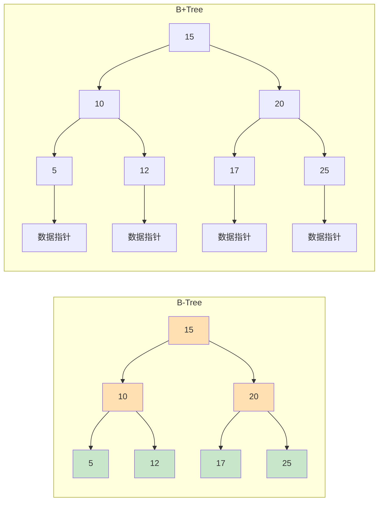
```mermaid
flowchart LR
    subgraph B-Tree
        A1[15] --> A2[10]
        A1 --> A3[20]
        A2 --> A4[5]
        A2 --> A5[12]
        A3 --> A6[17]
        A3 --> A7[25]
        
        style A1 fill:#ffe0b2
        style A2 fill:#ffe0b2
        style A3 fill:#ffe0b2
        style A4 fill:#c8e6c9
        style A5 fill:#c8e6c9
        style A6 fill:#c8e6c9
        style A7 fill:#c8e6c9
    end
    
    subgraph B+Tree
        B1[15] --> B2[10]
        B1 --> B3[20]
        B2 --> B4[5]
        B2 --> B5[12]
        B3 --> B6[17]
        B3 --> B7[25]
        
        B4 --> B8[数据指针]
        B5 --> B9[数据指针]
        B6 --> B10[数据指针]
        B7 --> B11[数据指针]
    end
```

| 特性 | B-Tree | B+Tree |
|------|-------|--------|
| 数据存储 | 所有节点都存储数据 | 仅叶子节点存储数据 |
| 查询稳定性 | 查询效率不稳定 | 所有查询复杂度相同 |
| 范围查询 | 需要中序遍历 | 叶子节点链表，效率高 |
| 空间利用率 | 较低 | 较高（内部节点不存数据） |

### 2.3 B+Tree 节点结构

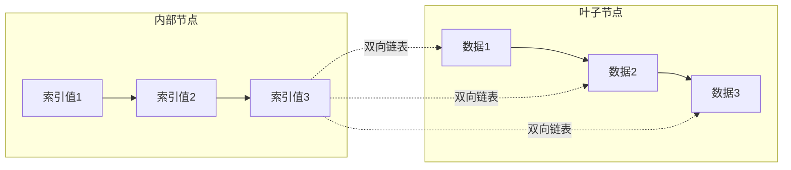
```mermaid
flowchart LR
    subgraph 内部节点
        A1[索引值1] --> A2[索引值2]
        A2 --> A3[索引值3]
    end
    
    subgraph 叶子节点
        B1[数据1] --> B2[数据2]
        B2 --> B3[数据3]
    end
    
    A3 -.->|双向链表| B1
    A3 -.->|双向链表| B2
    A3 -.->|双向链表| B3
```

---

## 3. 为什么选择 B+Tree

### 3.1 磁盘 IO 优化

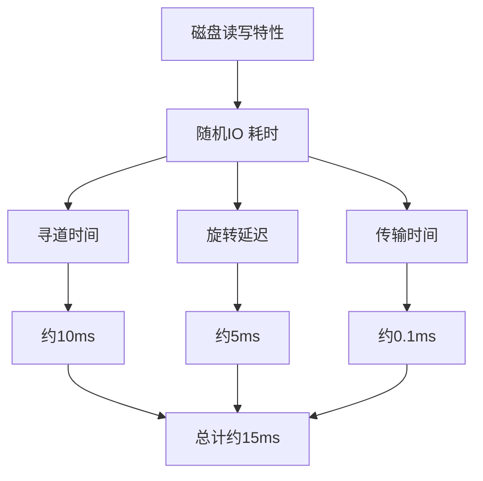
```mermaid
flowchart TD
    A[磁盘读写特性] --> B[随机IO 耗时]
    B --> C[寻道时间]
    B --> D[旋转延迟]
    B --> E[传输时间]
    
    C --> F[约10ms]
    D --> G[约5ms]
    E --> H[约0.1ms]
    
    F --> I[总计约15ms]
    G --> I
    H --> I
```

**问题**：磁盘 IO 是数据库的主要性能瓶颈

**解决方案**：
- 减少磁盘 IO 次数
- 每次 IO 读取更多数据
- 利用局部性原理

### 3.2 B+Tree 如何优化磁盘 IO

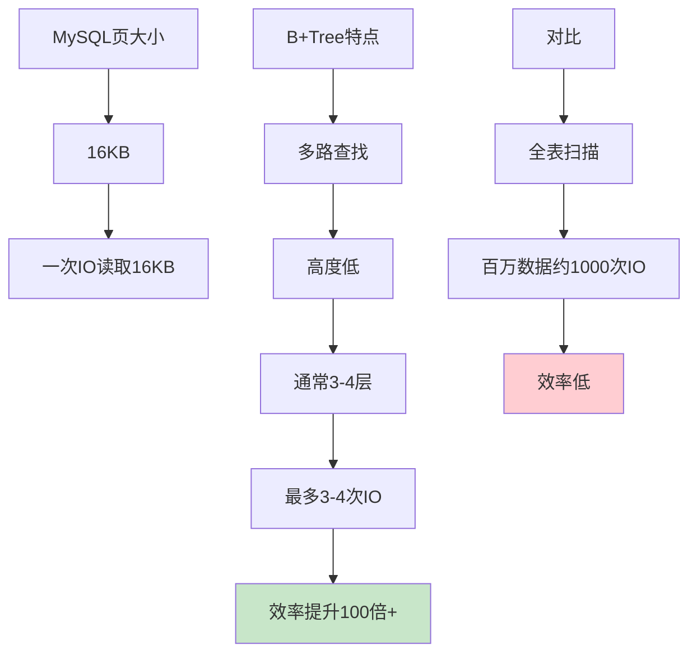
```mermaid
flowchart TD
    A[MySQL页大小] --> B[16KB]
    B --> C[一次IO读取16KB]
    
    D[B+Tree特点] --> E[多路查找]
    E --> F[高度低]
    F --> G[通常3-4层]
    G --> H[最多3-4次IO]
    
    I[对比] --> J[全表扫描]
    J --> K[百万数据约1000次IO]
    
    H --> L[效率提升100倍+]
    K --> M[效率低]
    
    style L fill:#c8e6c9
    style M fill:#ffcdd2
```

### 3.3 局部性原理利用

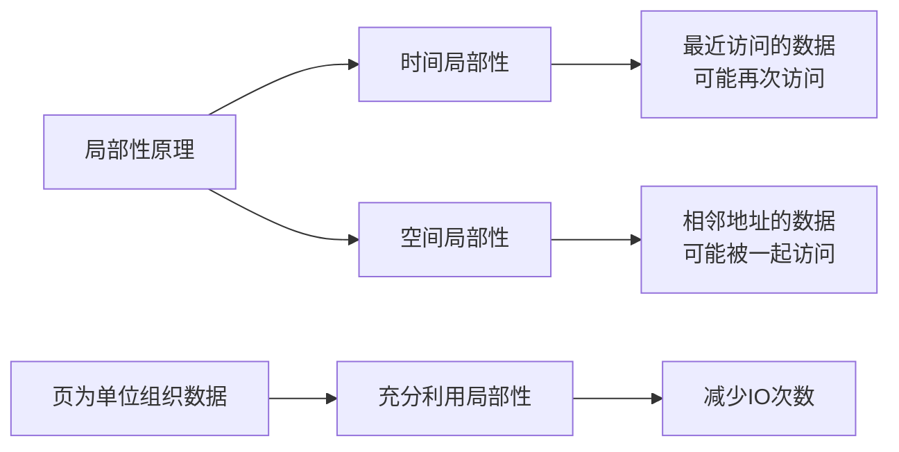
```mermaid
flowchart LR
    A[局部性原理] --> B[时间局部性]
    A --> C[空间局部性]
    
    B --> D[最近访问的数据<br/>可能再次访问]
    
    C --> E[相邻地址的数据<br/>可能被一起访问]
    
    F[页为单位组织数据] --> G[充分利用局部性]
    G --> H[减少IO次数]
```

### 3.4 对比其他数据结构

| 数据结构 | 查询复杂度 | 插入复杂度 | 范围查询 | 磁盘友好性 |
|---------|-----------|-----------|---------|-----------|
| **B+Tree** | O(log n) | O(log n) | 高效 | ⭐⭐⭐⭐⭐ |
| Hash | O(1) | O(1) | 不支持 | ⭐⭐ |
| 二叉树 | O(log n) | O(log n) | 一般 | ⭐ |
| 红黑树 | O(log n) | O(log n) | 一般 | ⭐ |

---

## 4. InnoDB 索引与 B+Tree

### 4.1 聚簇索引（Clustered Index）

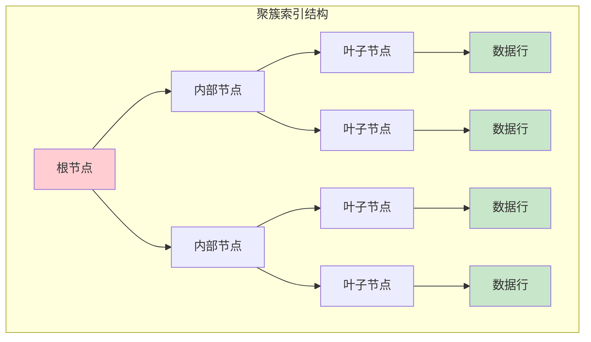
```mermaid
flowchart TD
    subgraph 聚簇索引结构
        A[根节点] --> B[内部节点]
        A --> C[内部节点]
        B --> D[叶子节点]
        B --> E[叶子节点]
        C --> F[叶子节点]
        C --> G[叶子节点]
        
        D --> H[数据行]
        E --> I[数据行]
        F --> J[数据行]
        G --> K[数据行]
    end
    
    style A fill:#ffcdd2
    style H fill:#c8e6c9
    style I fill:#c8e6c9
    style J fill:#c8e6c9
    style K fill:#c8e6c9
```

**特点**：
- 主键索引即数据
- 叶子节点存储完整行数据
- 每张表只能有一个聚簇索引

### 4.2 辅助索引（Secondary Index）

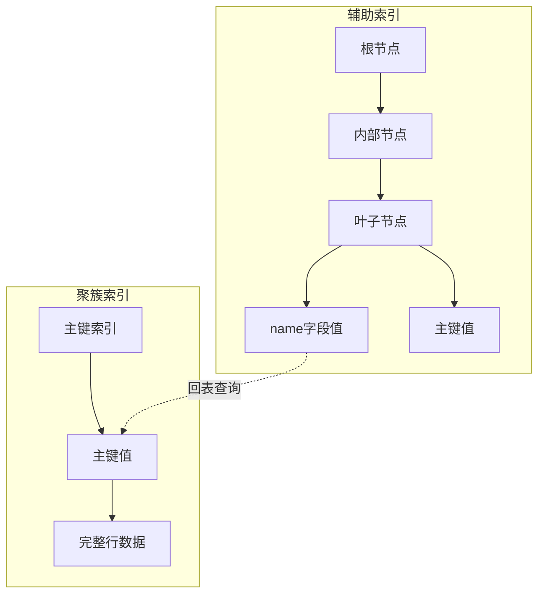
```mermaid
flowchart TD
    subgraph 辅助索引
        A[根节点] --> B[内部节点]
        B --> C[叶子节点]
        
        C --> D[name字段值]
        C --> E[主键值]
    end
    
    subgraph 聚簇索引
        F[主键索引] --> G[主键值]
        G --> H[完整行数据]
    end
    
    D -.->|回表查询| G
```

**查询过程**：
1. 在辅助索引中找到主键值
2. 使用主键值到聚簇索引中查找完整数据
3. 称为**回表查询**

### 4.3 索引树高度计算

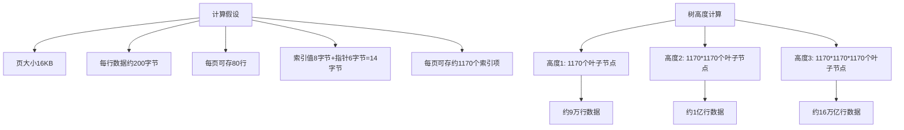
```mermaid
flowchart TD
    A[计算假设] --> B[页大小16KB]
    A --> C[每行数据约200字节]
    A --> D[每页可存80行]
    A --> E[索引值8字节+指针6字节=14字节]
    A --> F[每页可存约1170个索引项]
    
    G[树高度计算] --> H[高度1: 1170个叶子节点]
    H --> I[约9万行数据]
    G --> J[高度2: 1170*1170个叶子节点]
    J --> K[约1亿行数据]
    G --> L[高度3: 1170*1170*1170个叶子节点]
    L --> M[约16万亿行数据]
```

**结论**：B+Tree 通常 3-4 层即可支撑千万级数据

---

## 5. B+Tree 能解决什么问题

### 5.1 快速定位数据

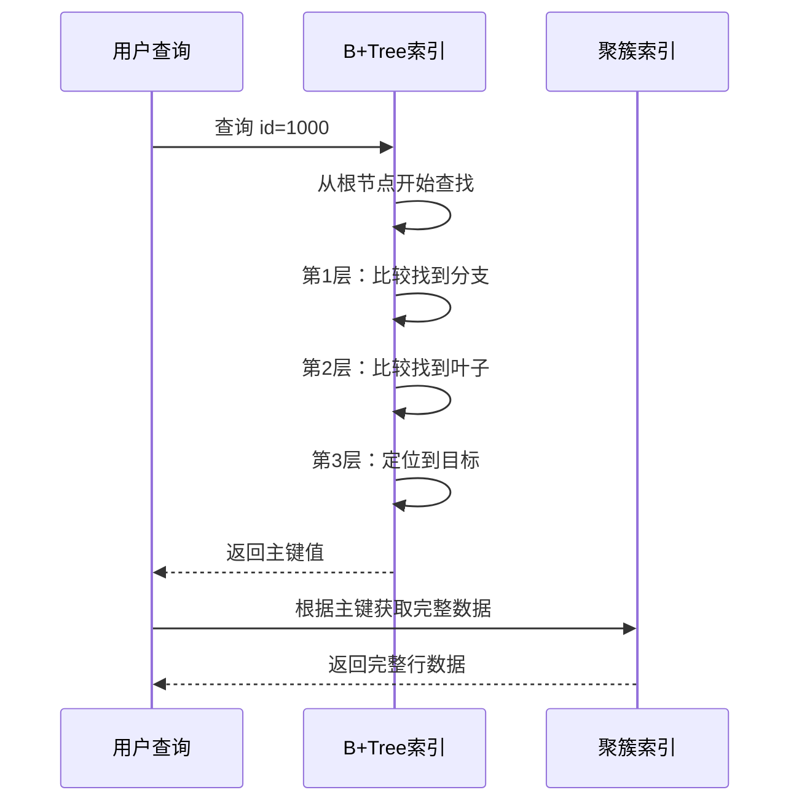
```mermaid
sequenceDiagram
    participant User as 用户查询
    participant Index as B+Tree索引
    participant Data as 聚簇索引
    
    User->>Index: 查询 id=1000
    Index->>Index: 从根节点开始查找
    Index->>Index: 第1层：比较找到分支
    Index->>Index: 第2层：比较找到叶子
    Index->>Index: 第3层：定位到目标
    Index-->>User: 返回主键值
    
    User->>Data: 根据主键获取完整数据
    Data-->>User: 返回完整行数据
```

**解决的问题**：无需全表扫描，O(log n) 时间复杂度定位数据

### 5.2 高效范围查询


```mermaid
flowchart LR
    A[查询 age BETWEEN 20 AND 30] --> B[定位起始点]
    B --> C[叶子节点链表]
    C --> D[顺序遍历]
    D --> E[返回所有满足条件的记录]
    
    style B fill:#ffe0b2
    style C fill:#c8e6c9
    style D fill:#c8e6c9
    style E fill:#c8e6c9
```

**解决的问题**：利用叶子节点双向链表，快速范围扫描

### 5.3 高并发写入

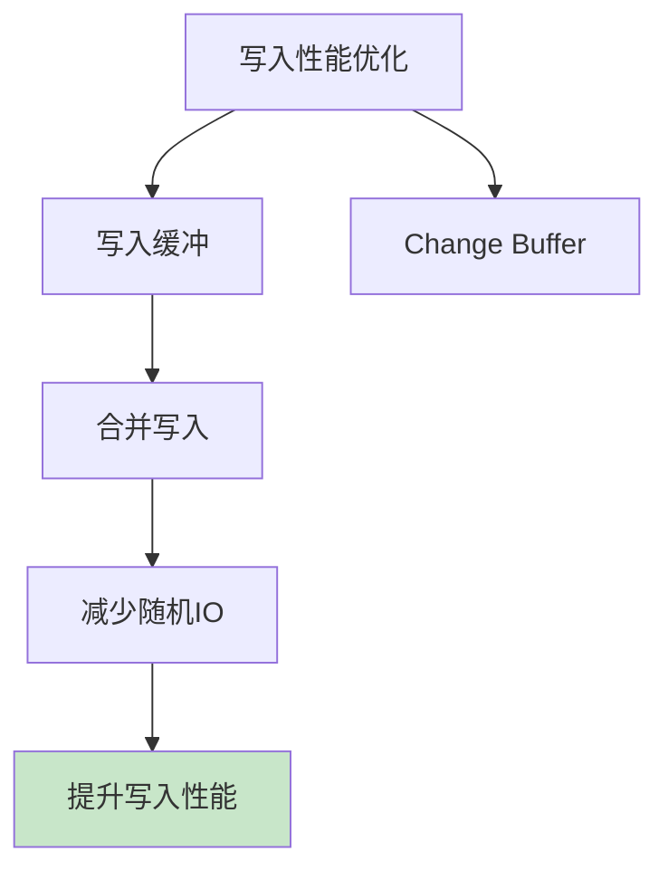
```mermaid
flowchart TD
    A[写入性能优化] --> B[写入缓冲]
    A --> C[Change Buffer]
    B --> D[合并写入]
    D --> E[减少随机IO]
    E --> F[提升写入性能]
    
    style F fill:#c8e6c9
```

**解决的问题**：
- 减少随机 IO
- 批量合并更新
- 提高写入吞吐量

### 5.4 数据一致性

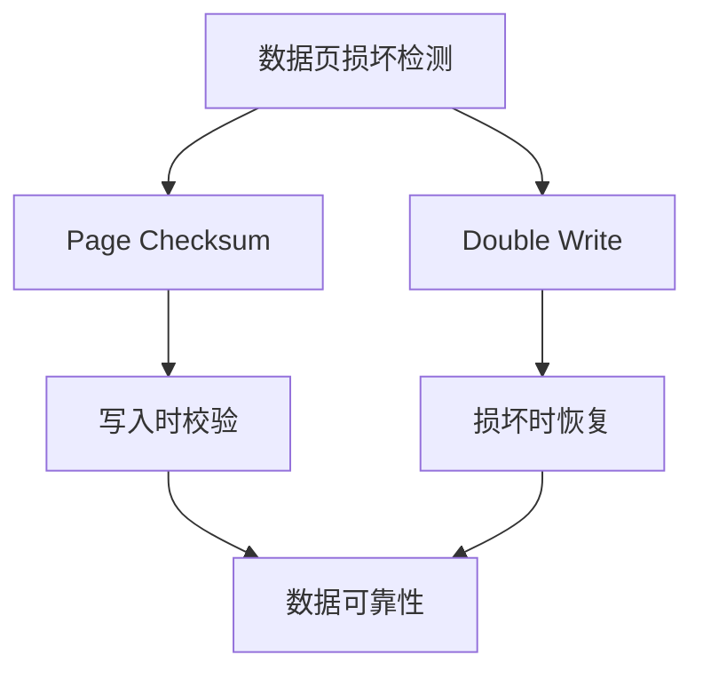
```mermaid
flowchart TD
    A[数据页损坏检测] --> B[Page Checksum]
    A --> C[Double Write]
    
    B --> D[写入时校验]
    C --> E[损坏时恢复]
    
    D --> F[数据可靠性]
    E --> F
```

**解决的问题**：
- 页损坏检测
- 崩溃恢复
- 数据完整性保证

---

## 6. B+Tree 的优缺点

### 6.1 优点

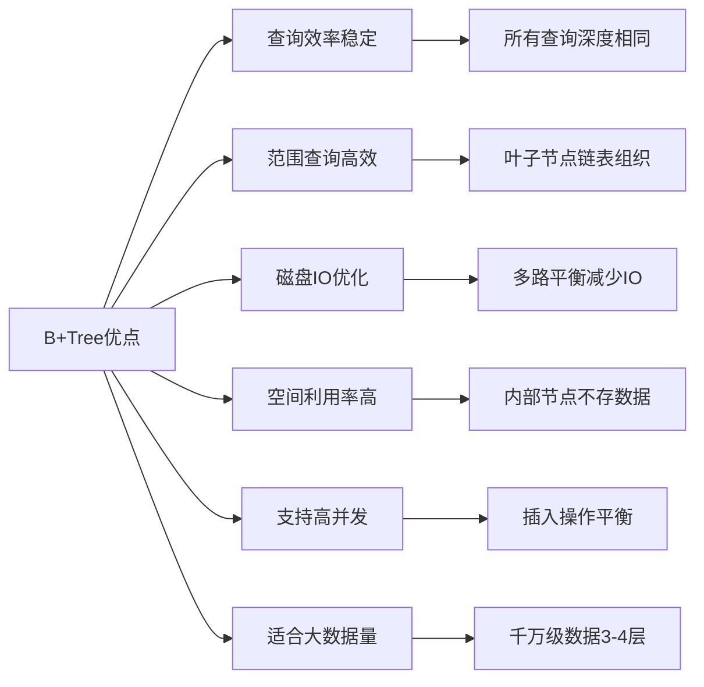
```mermaid
flowchart LR
    A[B+Tree优点] --> B[查询效率稳定]
    A --> C[范围查询高效]
    A --> D[磁盘IO优化]
    A --> E[空间利用率高]
    A --> F[支持高并发]
    A --> G[适合大数据量]
    
    B --> H[所有查询深度相同]
    C --> I[叶子节点链表组织]
    D --> J[多路平衡减少IO]
    E --> K[内部节点不存数据]
    F --> L[插入操作平衡]
    G --> M[千万级数据3-4层]
```

| 优点 | 说明 |
|------|------|
| 查询稳定 | 所有查询经过相同层数 |
| 范围查询快 | 叶子节点链表，支持顺序访问 |
| IO 优化 | 多路查找，高度低 |
| 空间利用率 | 内部节点只存索引，空间利用率高 |
| 高并发 | 插入操作自动平衡 |
| 大数据量 | 千万级数据仅需 3-4 层 |

### 6.2 缺点

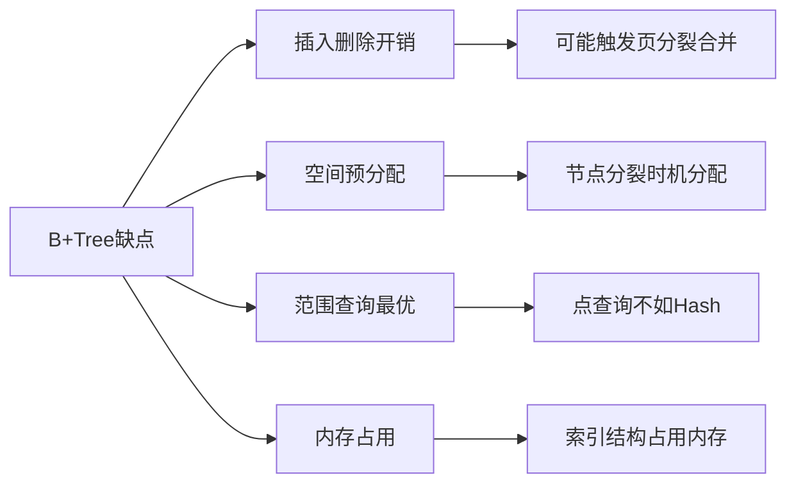
```mermaid
flowchart LR
    A[B+Tree缺点] --> B[插入删除开销]
    A --> C[空间预分配]
    A --> D[范围查询最优]
    A --> E[内存占用]
    
    B --> F[可能触发页分裂合并]
    C --> G[节点分裂时机分配]
    D --> H[点查询不如Hash]
    E --> I[索引结构占用内存]
```

| 缺点 | 说明 |
|------|------|
| 插入删除开销 | 可能触发页分裂和合并 |
| 空间预分配 | 节点分裂时需要预分配空间 |
| 点查询 | 不如 Hash 索引快 |
| 内存占用 | 索引结构占用内存 |

---

## 7. InnoDB 其他数据结构

### 7.1 自适应哈希索引（Adaptive Hash Index）

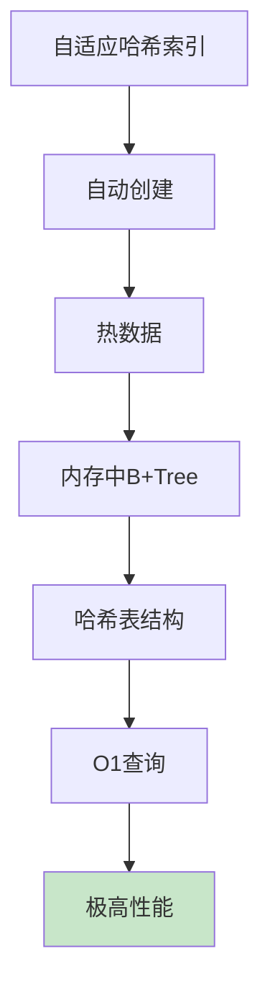
```mermaid
flowchart TD
    A[自适应哈希索引] --> B[自动创建]
    B --> C[热数据]
    C --> D[内存中B+Tree]
    D --> E[哈希表结构]
    
    E --> F[O1查询]
    F --> G[极高性能]
    
    style G fill:#c8e6c9
```

**特点**：
- InnoDB 自动根据访问频率创建
- 只缓存热数据页
- 适合等值查询

### 7.2 插入缓冲（Insert Buffer）

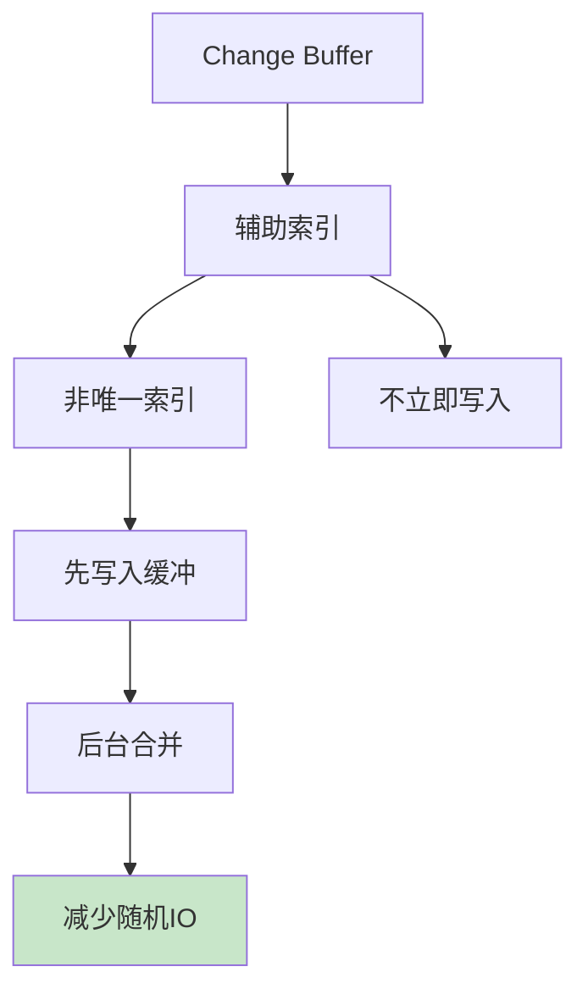
```mermaid
flowchart TD
    A[Change Buffer] --> B[辅助索引]
    B --> C[非唯一索引]
    B --> D[不立即写入]
    
    C --> E[先写入缓冲]
    E --> F[后台合并]
    F --> G[减少随机IO]
    
    style G fill:#c8e6c9
```

**解决的问题**：
- 非唯一索引的随机 IO
- 批量合并减少 IO

### 7.3 Redo Log

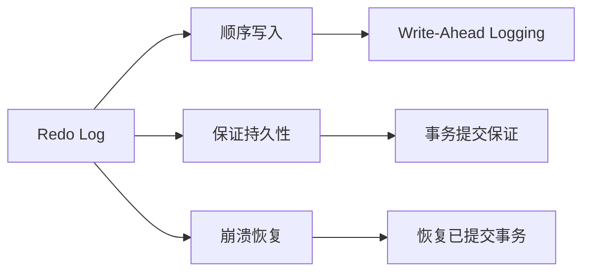
```mermaid
flowchart LR
    A[Redo Log] --> B[顺序写入]
    A --> C[保证持久性]
    A --> D[崩溃恢复]
    
    B --> E[Write-Ahead Logging]
    C --> F[事务提交保证]
    D --> G[恢复已提交事务]
```

---

## 8. InnoDB 页分裂与页合并

### 8.1 页分裂（Page Split）

#### 什么是页分裂

**页分裂**是 InnoDB 维护 B+Tree 索引结构的重要机制。当一个数据页已满，无法插入新记录时，InnoDB 会将该页分裂成两个页。

```mermaid
flowchart TD
    A[插入新记录] --> B{页是否已满?}
    B -->|否| C[直接插入]
    B -->|是| D[触发页分裂]
    D --> E[创建新页]
    E --> F[移动一半数据]
    F --> G[更新父节点指针]
    G --> H[插入完成]
    
    style D fill:#ffcdd2
    style H fill:#c8e6c9
```

#### 页分裂的触发条件

| 条件 | 说明 |
|------|------|
| **页空间不足** | 插入记录时，当前页无法容纳 |
| **填充因子** | 页使用率超过 MERGE_THRESHOLD（默认 50%） |
| **顺序插入** | 在页末尾插入时可能触发顺序分裂 |

#### 页分裂的过程

```mermaid
sequenceDiagram
    participant Client as 客户端
    participant InnoDB as InnoDB引擎
    participant Page as 数据页
    participant NewPage as 新数据页
    
    Client->>InnoDB: INSERT 新记录
    InnoDB->>Page: 检查页空间
    Page-->>InnoDB: 页已满
    
    InnoDB->>NewPage: 创建新页
    InnoDB->>Page: 锁定当前页
    InnoDB->>NewPage: 移动一半数据
    InnoDB->>Page: 更新页目录
    InnoDB->>InnoDB: 更新父节点指针
    
    InnoDB->>Page: 插入新记录
    InnoDB-->>Client: 插入成功
```

#### 页分裂的类型

```mermaid
flowchart LR
    A[页分裂类型] --> B[中间分裂<br/>Middle Split]
    A --> C[顺序分裂<br/>Sequential Split]
    
    B --> D[从中间位置分裂]
    D --> E[数据均匀分布]
    
    C --> F[在末尾位置分裂]
    F --> G[适合顺序插入]
    
    style B fill:#ffe0b2
    style C fill:#c8e6c9
```

| 类型 | 适用场景 | 特点 |
|------|---------|------|
| **中间分裂** | 随机插入 | 数据均匀分布到两个页 |
| **顺序分裂** | 顺序插入 | 新记录放入新页，减少后续分裂 |

#### 页分裂的影响

```mermaid
flowchart TD
    A[页分裂影响] --> B[性能开销]
    A --> C[空间浪费]
    A --> D[树高度增加]
    
    B --> B1[额外的IO操作]
    B --> B2[锁竞争增加]
    
    C --> C1[两个页都不满]
    C --> C2[索引碎片化]
    
    D --> D1[查询深度增加]
    D --> D2[可能触发级联分裂]
    
    style B fill:#ffcdd2
    style C fill:#ffcdd2
    style D fill:#ffcdd2
```

---

### 8.2 页合并（Page Merge）

#### 什么是页合并

**页合并**是页分裂的逆操作。当删除记录导致页空间使用率过低时，InnoDB 会将相邻页合并，释放空间。

```mermaid
flowchart TD
    A[删除记录] --> B{页使用率过低?}
    B -->|否| C[删除完成]
    B -->|是| D[触发页合并]
    D --> E[选择相邻页]
    E --> F[合并数据]
    F --> G[更新父节点指针]
    G --> H[释放空页]
    
    style D fill:#ffcdd2
    style H fill:#c8e6c9
```

#### 页合并的触发条件

| 条件 | 说明 |
|------|------|
| **页使用率过低** | 低于 MERGE_THRESHOLD（默认 50%） |
| **有相邻页** | 存在可以合并的兄弟页 |
| **删除操作** | DELETE 或 UPDATE 导致数据减少 |

#### 页合并的过程

```mermaid
sequenceDiagram
    participant Client as 客户端
    participant InnoDB as InnoDB引擎
    participant Page1 as 数据页1
    participant Page2 as 数据页2
    
    Client->>InnoDB: DELETE 记录
    InnoDB->>Page1: 删除记录
    InnoDB->>Page1: 检查页使用率
    Page1-->>InnoDB: 使用率过低
    
    InnoDB->>Page2: 查找相邻页
    InnoDB->>Page1: 锁定两个页
    InnoDB->>Page2: 合并数据到Page2
    InnoDB->>InnoDB: 更新父节点指针
    InnoDB->>Page1: 释放Page1
    
    InnoDB-->>Client: 删除成功
```

#### 页合并的影响

```mermaid
flowchart TD
    A[页合并影响] --> B[减少空间浪费]
    A --> C[降低树高度]
    A --> D[提高查询效率]
    
    B --> B1[释放空闲页]
    B --> B2[减少碎片]
    
    C --> C1[减少IO次数]
    C --> C2[优化索引结构]
    
    D --> D1[更紧凑的数据存储]
    D --> D2[更好的缓存利用率]
    
    style B fill:#c8e6c9
    style C fill:#c8e6c9
    style D fill:#c8e6c9
```

---

### 8.3 页分裂与页合并的平衡

#### 为什么需要平衡

```mermaid
flowchart TD
    A[页操作平衡] --> B[过多分裂]
    A --> C[过多合并]
    
    B --> B1[空间浪费]
    B --> B2[性能下降]
    B --> B3[碎片化严重]
    
    C --> C1[频繁IO操作]
    C --> C2[锁竞争增加]
    C --> C3[CPU开销大]
    
    style B1 fill:#ffcdd2
    style B2 fill:#ffcdd2
    style B3 fill:#ffcdd2
    style C1 fill:#ffcdd2
    style C2 fill:#ffcdd2
    style C3 fill:#ffcdd2
```

#### InnoDB 的优化策略

```mermaid
flowchart LR
    A[InnoDB优化策略] --> B[预留空间<br/>Fill Factor]
    A --> C[批量插入优化]
    A --> D[延迟合并]
    
    B --> E[留出空间减少分裂]
    C --> F[减少分裂次数]
    D --> G[避免频繁合并]
```

| 策略 | 说明 | 配置参数 |
|------|------|---------|
| **预留空间** | 页不填满，预留空间 | `innodb_fill_factor` |
| **批量插入** | 优化批量插入性能 | `innodb_buffer_pool_size` |
| **延迟合并** | 不立即合并，等待时机 | `MERGE_THRESHOLD` |

---

### 8.4 实际案例与优化建议

#### 如何减少页分裂

```mermaid
flowchart TD
    A[减少页分裂] --> B[使用自增主键]
    A --> C[批量插入优化]
    A --> D[合理设置页大小]
    A --> E[定期优化表]
    A --> F[使用逻辑删除]
    
    B --> B1[顺序插入减少分裂]
    C --> C1[减少分裂次数]
    D --> D1[根据数据特点调整]
    E --> E1[重建索引减少碎片]
    F --> F1[避免数据频繁删除]
    
    style B fill:#c8e6c9
    style C fill:#c8e6c9
    style D fill:#c8e6c9
    style E fill:#c8e6c9
    style F fill:#c8e6c9
```

#### 自增主键 vs 随机主键

```mermaid
flowchart LR
    subgraph 自增主键
        A1[顺序插入] --> A2[页末尾追加]
        A2 --> A3[分裂次数少]
    end
    
    subgraph 随机主键
        B1[随机插入] --> B2[中间位置插入]
        B2 --> B3[分裂次数多]
    end
    
    style A3 fill:#c8e6c9
    style B3 fill:#ffcdd2
```

| 主键类型 | 页分裂频率 | 空间利用率 | 查询性能 |
|---------|-----------|-----------|---------|
| **自增主键** | 低 | 高 | 好 |
| **UUID** | 高 | 低 | 较差 |
| **随机ID** | 高 | 低 | 较差 |

#### 监控页分裂

```sql
-- 查看索引统计信息
SELECT 
    table_name,
    index_name,
    stat_name,
    stat_value
FROM mysql.innodb_index_stats
WHERE table_name = 'your_table'
  AND stat_name IN ('n_leaf_pages', 'size');

-- 查看表碎片情况
SELECT 
    table_name,
    data_free,
    data_length,
    index_length,
    ROUND(data_free / (data_length + index_length) * 100, 2) AS fragmentation_ratio
FROM information_schema.TABLES
WHERE table_schema = 'your_database';

-- 优化表（重建索引）
OPTIMIZE TABLE your_table;

-- 分析表
ANALYZE TABLE your_table;
```

#### 最佳实践建议

```mermaid
flowchart TD
    A[最佳实践] --> B[设计阶段]
    A --> C[开发阶段]
    A --> D[运维阶段]
    
    B --> B1[选择自增主键]
    B --> B2[合理设计索引]
    
    C --> C1[批量插入代替单条插入]
    C --> C2[避免大事务]
    
    D --> D1[定期监控索引碎片]
    D --> D2[定期优化表]
    
    style B1 fill:#c8e6c9
    style C1 fill:#c8e6c9
    style D1 fill:#c8e6c9
```

| 阶段 | 建议 |
|------|------|
| **设计阶段** | 使用自增主键、避免过多索引 |
| **开发阶段** | 批量插入、避免大事务 |
| **运维阶段** | 监控碎片、定期优化 |

---

## 总结

```mermaid
flowchart LR
    A[B+Tree核心价值] --> B[磁盘IO优化]
    A --> C[查询效率保障]
    A --> D[范围查询高效]
    A --> E[大数据量支持]
    
    B --> F[多路查找]
    B --> G[高度3-4层]
    
    C --> H[Olog_n复杂度]
    C --> I[查询稳定]
    
    D --> J[叶子节点链表]
    D --> K[顺序遍历]
    
    E --> L[千万级数据]
    E --> M[亿级可控]
    
    style F fill:#ffe0b2
    style G fill:#ffe0b2
    style H fill:#c8e6c9
    style I fill:#c8e6c9
    style J fill:#ffe0b2
    style K fill:#ffe0b2
    style L fill:#c8e6c9
    style M fill:#c8e6c9
```

### 核心要点

1. **B+Tree 是磁盘友好的多路搜索树**
2. **通过多路平衡减少磁盘 IO 次数**
3. **叶子节点链表支持高效范围查询**
4. **3-4 层高度可支撑千万级数据**
5. **InnoDB 所有索引都是 B+Tree 结构**
6. **聚簇索引存储完整数据，辅助索引存储主键**
7. **页分裂维护插入性能，页合并优化空间利用**
8. **使用自增主键可有效减少页分裂**

---

## 参考资料

1. [MySQL 官方文档 - InnoDB Table and Index Architecture](https://dev.mysql.com/doc/refman/8.0/en/innodb-table-and-index-structure.html)
2. [MySQL 官方文档 - The InnoDB Storage Engine](https://dev.mysql.com/doc/refman/8.0/en/innodb-storage-engine.html)
3. [数据库系统概念 - B+Tree 详解](https://www.db-book.com/)
