# InnoDB 如何解决脏读、不可重复读以及幻读

## 目录

1. [前置概念](#1-前置概念)
2. [问题定义](#2-问题定义)
3. [事务隔离级别](#3-事务隔离级别)
4. [InnoDB 解决方案](#4-innodb-解决方案)
5. [实战示例](#5-实战示例)

***

## 1. 前置概念

### 1.1 事务特性（ACID）

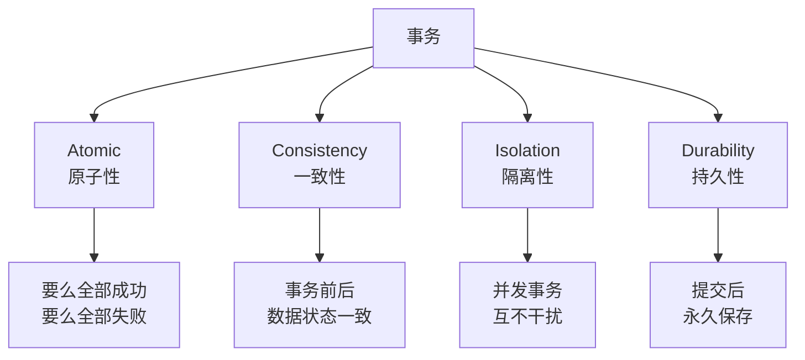

### 1.2 并发事务问题


***

## 2. 问题定义

### 2.1 脏读（Dirty Read）

**定义**：一个事务读取了另一个事务未提交的数据。

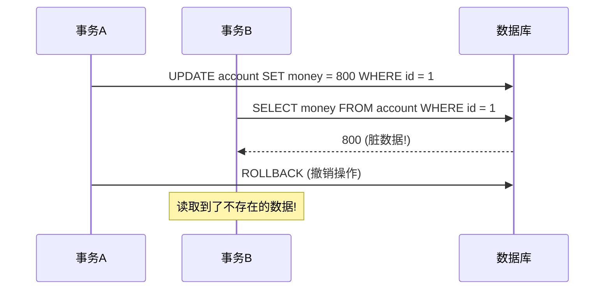

**危害**：读到不存在的数据，导致业务逻辑错误。

***

### 2.2 不可重复读（Non-Repeatable Read）

**定义**：同一事务内，两次读取同一数据，结果不一致。

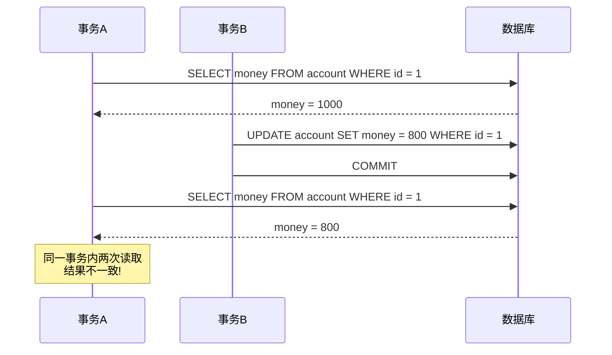

**危害**：同一查询结果不同，影响业务判断。

***

### 2.3 幻读（Phantom Read）

**定义**：同一事务内，两次查询返回的记录数不同，像出现"幻影"。

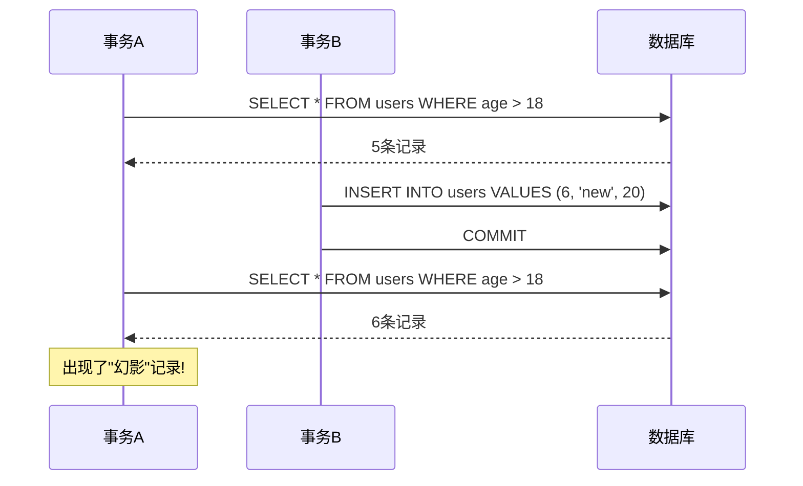

**危害**：统计数据不准确，如库存数量错误。

***

## 3. 事务隔离级别

### 3.1 四种隔离级别

| 隔离级别                 | 脏读  | 不可重复读 | 幻读  | 说明       |
| -------------------- | --- | ----- | --- | -------- |
| **READ UNCOMMITTED** | 可能  | 可能    | 可能  | 最低级别     |
| **READ COMMITTED**   | 不可能 | 可能    | 可能  | 大多数数据库默认 |
| **REPEATABLE READ**  | 不可能 | 不可能   | 可能  | MySQL默认  |
| **SERIALIZABLE**     | 不可能 | 不可能   | 不可能 | 最高级别     |

### 3.2 隔离级别对比

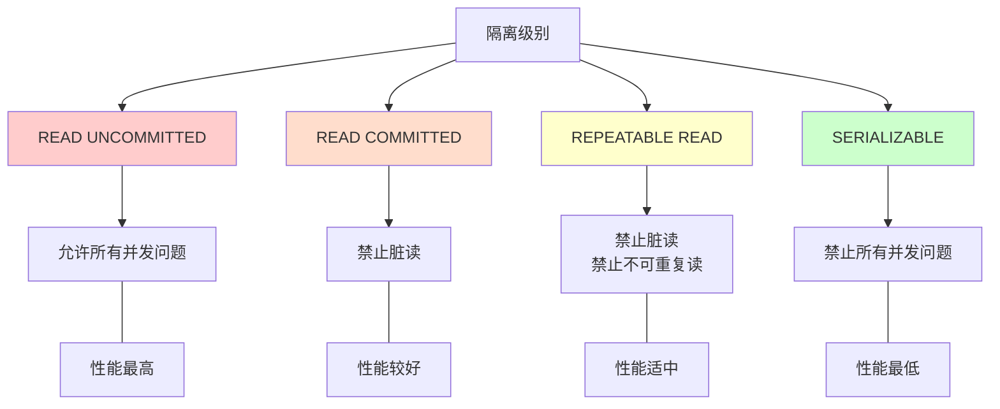

***

## 4. InnoDB 解决方案

### 4.1 整体架构

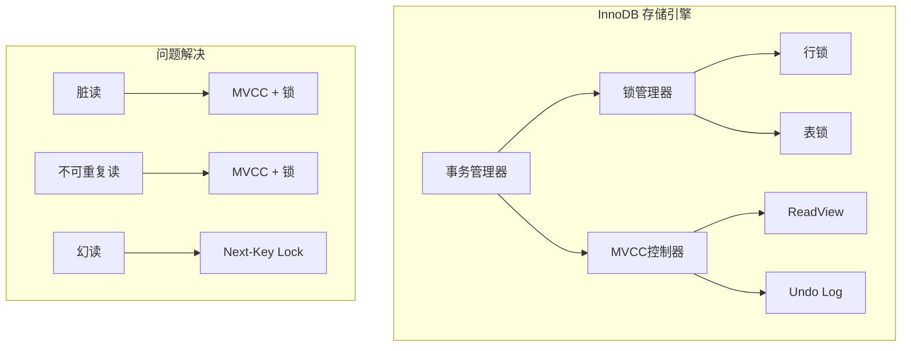

***

### 4.2 解决方案一：MVCC（多版本并发控制）

#### 4.2.1 MVCC 工作原理

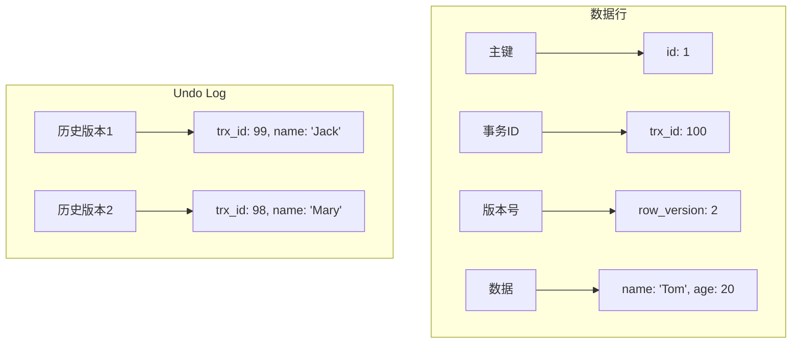

#### 4.2.2 ReadView 机制

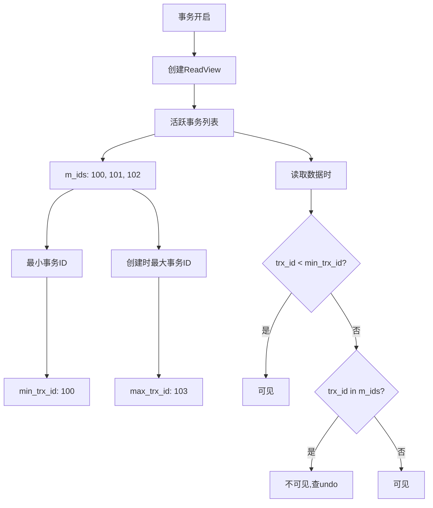

#### 4.2.3 MVCC 解决脏读和不可重复读

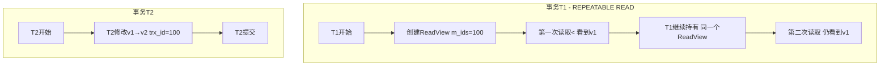

***

### 4.3 解决方案二：锁机制

#### 4.3.1 锁类型

| 锁类型     | 英文 | 作用   | 兼容性         |
| ------- | -- | ---- | ----------- |
| **共享锁** | S锁 | 允许读取 | 与S锁兼容，与X锁互斥 |
| **排他锁** | X锁 | 允许修改 | 与所有锁互斥      |

#### 4.3.2 锁粒度

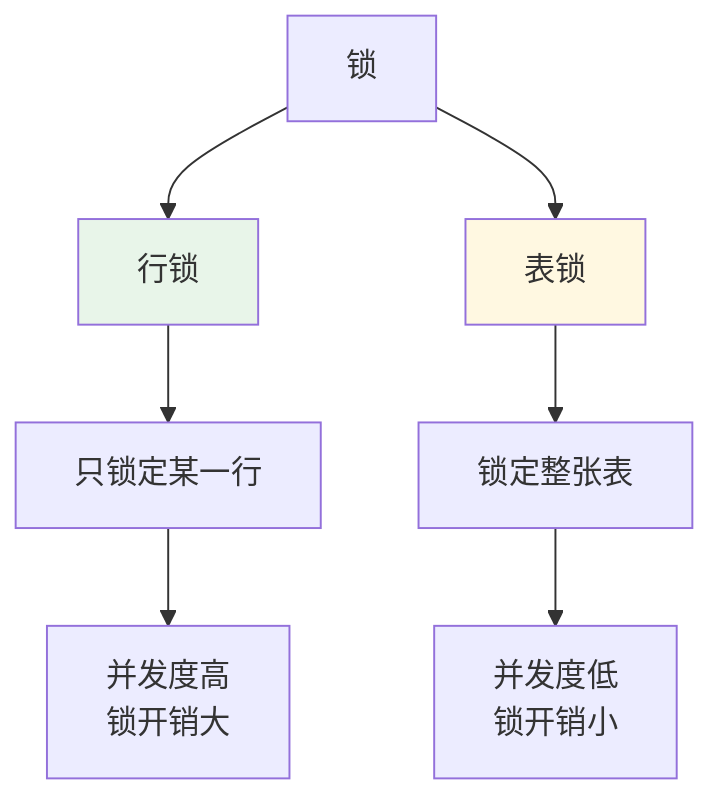

#### 4.3.3 记录锁（Record Lock）

```sql
-- 只锁定 id = 1 这一行
SELECT * FROM users WHERE id = 1 FOR UPDATE;
```

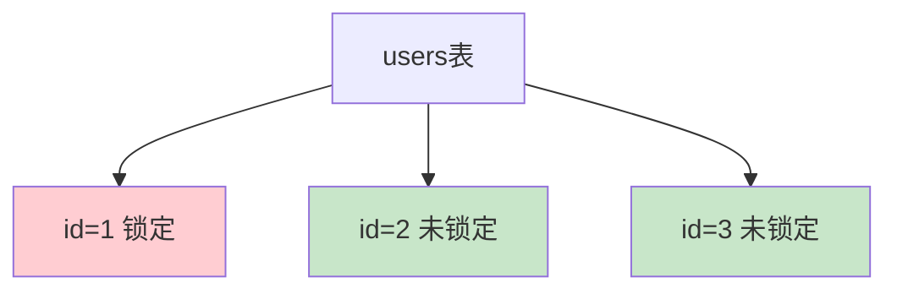

***

### 4.4 解决方案三：Next-Key Lock（临键锁）

#### 4.4.1 解决幻读的核心机制

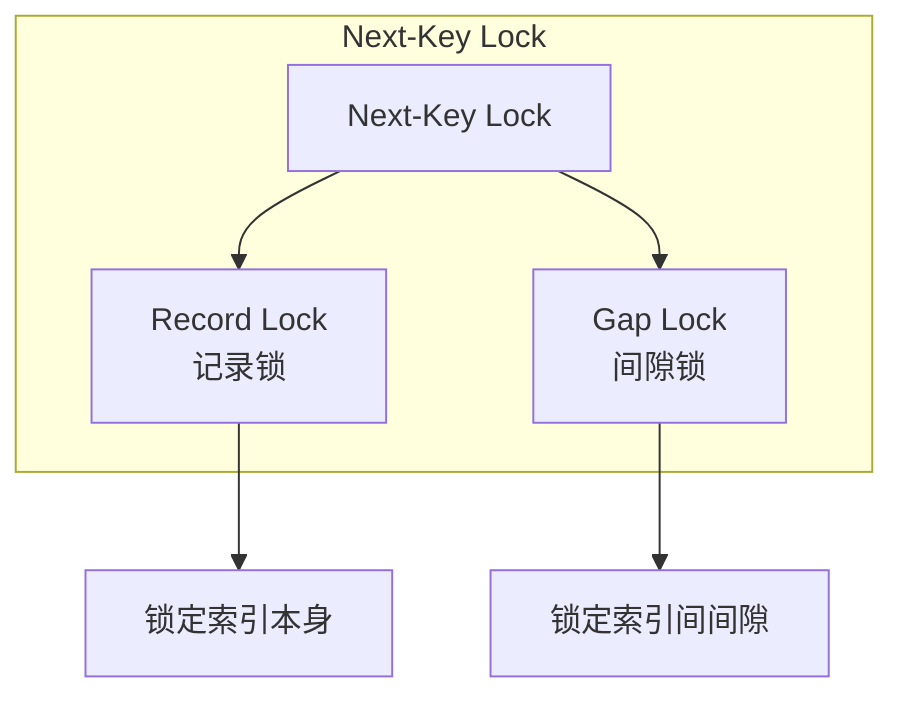

#### 4.4.2 临键锁示例

假设 `id` 索引有值：1, 3, 5, 7, 9

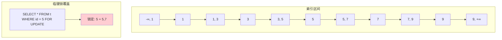

#### 4.4.3 临键锁解决幻读

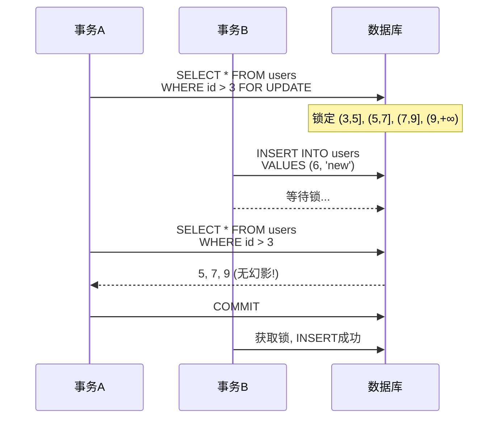

***

### 4.5 InnoDB 隔离级别实现

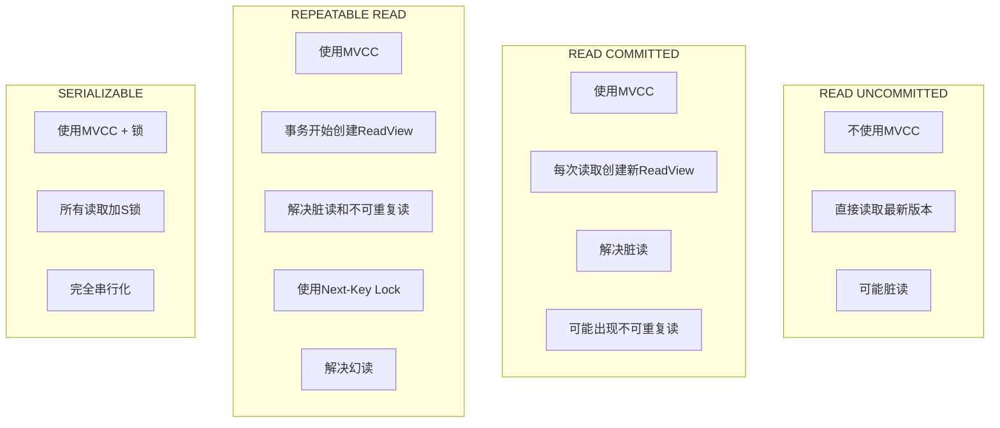

***

## 5. 实战示例

### 5.1 设置隔离级别

```sql
-- 查看当前隔离级别
SHOW VARIABLES LIKE 'transaction_isolation';

-- 设置隔离级别
SET SESSION transaction_isolation = 'REPEATABLE-READ';
SET GLOBAL transaction_isolation = 'READ-COMMITTED';
```

### 5.2 验证脏读

```sql
-- 终端1：设置未提交读
SET SESSION transaction_isolation = 'READ-UNCOMMITTED';

-- 终端1：开启事务
START TRANSACTION;
UPDATE account SET balance = 800 WHERE id = 1;

-- 终端2：查询（会看到未提交的数据！）
SELECT * FROM account WHERE id = 1;  -- balance = 800

-- 终端1：回滚
ROLLBACK;

-- 终端2：再次查询
SELECT * FROM account WHERE id = 1;  -- balance = 1000
```

### 5.3 验证不可重复读

```sql
-- 终端1：设置读已提交
SET SESSION transaction_isolation = 'READ-COMMITTED';

-- 终端1：开启事务
START TRANSACTION;
SELECT * FROM account WHERE id = 1;  -- balance = 1000

-- 终端2：更新并提交
UPDATE account SET balance = 800 WHERE id = 1;
COMMIT;

-- 终端1：再次查询（结果不同！）
SELECT * FROM account WHERE id = 1;  -- balance = 800
COMMIT;
```

### 5.4 验证幻读（REPEATABLE READ）

```sql
-- 终端1：设置可重复读
SET SESSION transaction_isolation = 'REPEATABLE-READ';

-- 终端1：开启事务
START TRANSACTION;
SELECT * FROM users WHERE age > 18;  -- 5条记录

-- 终端2：插入新记录
INSERT INTO users VALUES (6, 'new', 20);
COMMIT;

-- 终端1：再次查询（结果相同，无幻读！）
SELECT * FROM users WHERE age > 18;  -- 仍为5条记录

-- 终端1：插入相同条件的记录（会失败！）
INSERT INTO users VALUES (7, 'another', 22);
-- ERROR: Duplicate entry 或 锁等待超时
COMMIT;
```

### 5.5 验证 Next-Key Lock

```sql
-- 终端1：
START TRANSACTION;
SELECT * FROM users WHERE id BETWEEN 3 AND 5 FOR UPDATE;
-- 锁定范围： (1,3], (3,5], (5,7]

-- 终端2：以下操作会被阻塞
INSERT INTO users VALUES (4, 'test', 20);  -- 阻塞！
INSERT INTO users VALUES (6, 'test', 20);  -- 阻塞！
INSERT INTO users VALUES (2, 'test', 20);  -- 可以（不在范围内）
```

***

## 总结

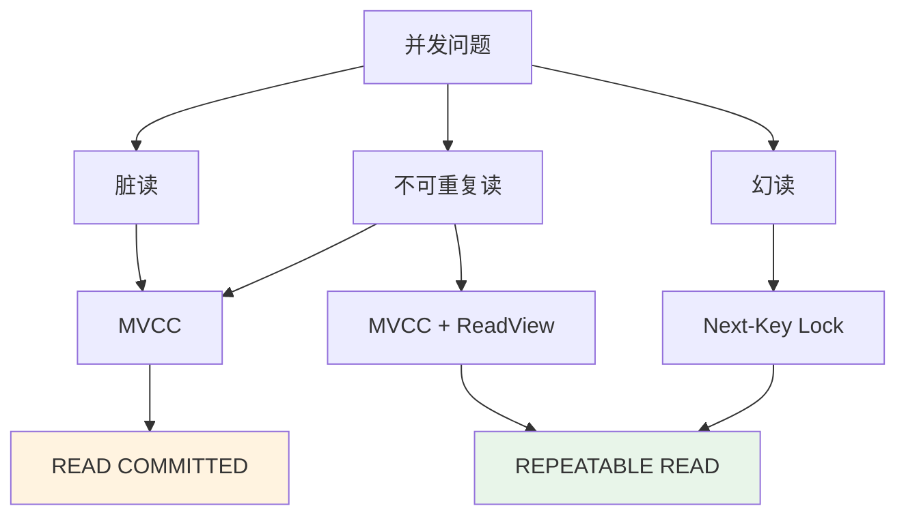

### InnoDB 解决方案一览

| 问题        | 隔离级别            | 解决方案                   |
| --------- | --------------- | ---------------------- |
| **脏读**    | READ COMMITTED+ | MVCC 读取已提交版本           |
| **不可重复读** | REPEATABLE READ | MVCC + 事务级 ReadView    |
| **幻读**    | REPEATABLE READ | Next-Key Lock（间隙锁+记录锁） |

***

## 参考资料

1. [MySQL 官方文档 - InnoDB Locking](https://dev.mysql.com/doc/refman/8.0/en/innodb-locking.html)
2. [MySQL 官方文档 - MVCC](https://dev.mysql.com/doc/refman/8.0/en/innodb-multi-versioning.html)
3. [MySQL 事务隔离级别](https://dev.mysql.com/doc/refman/8.0/en/set-transaction.html)

