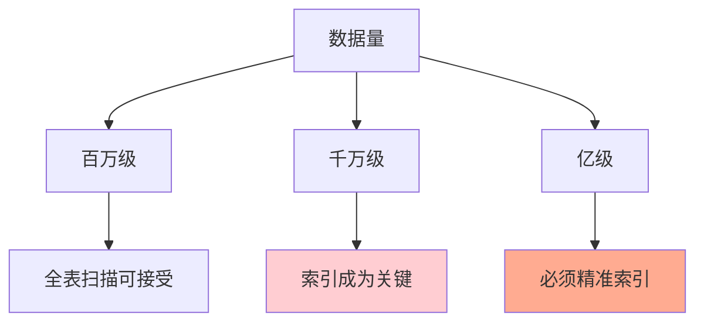
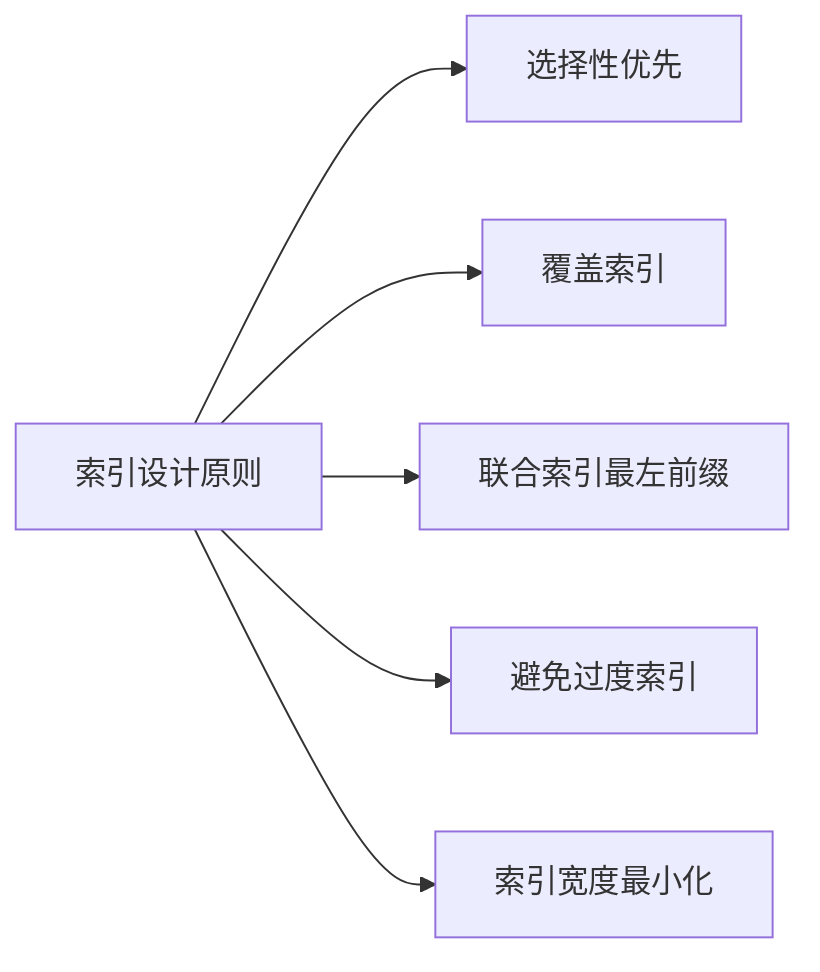
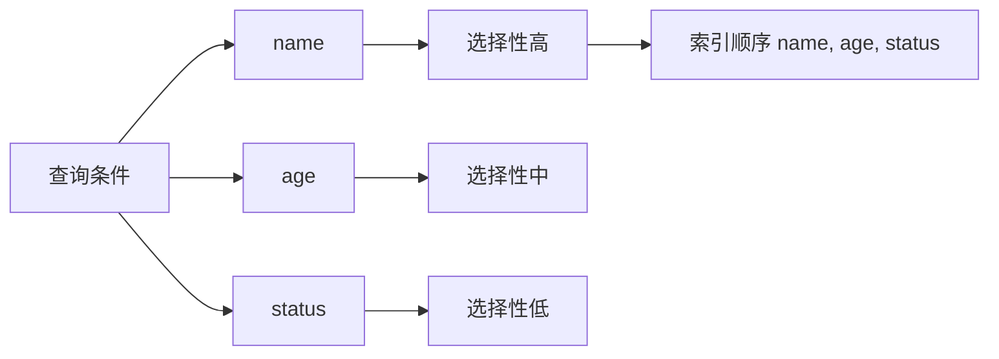
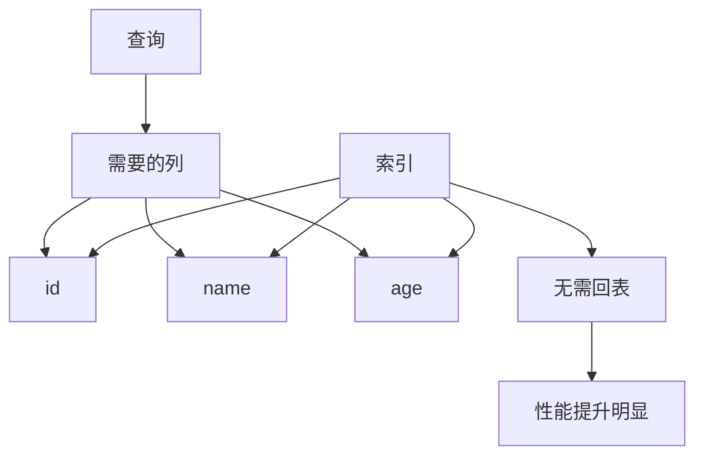
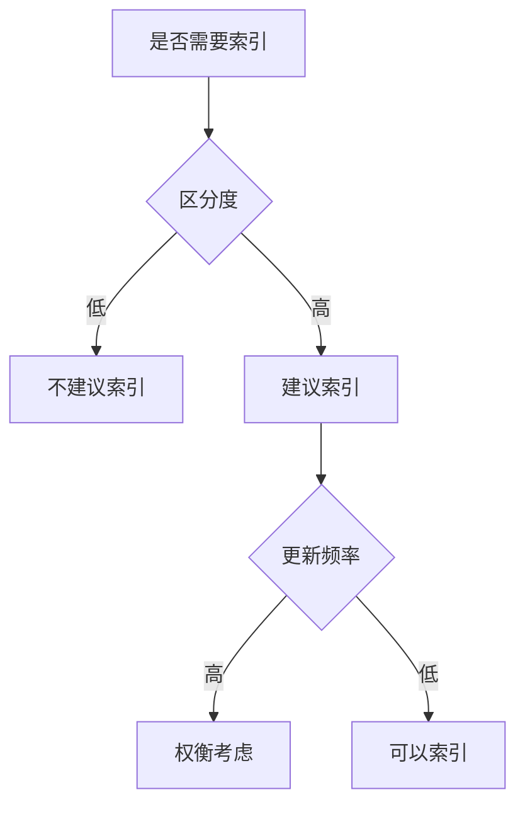
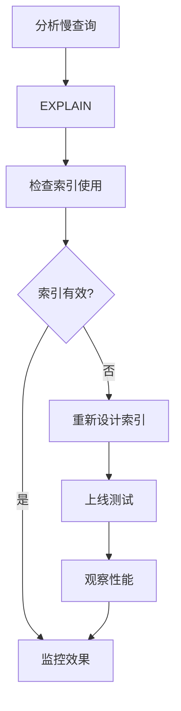
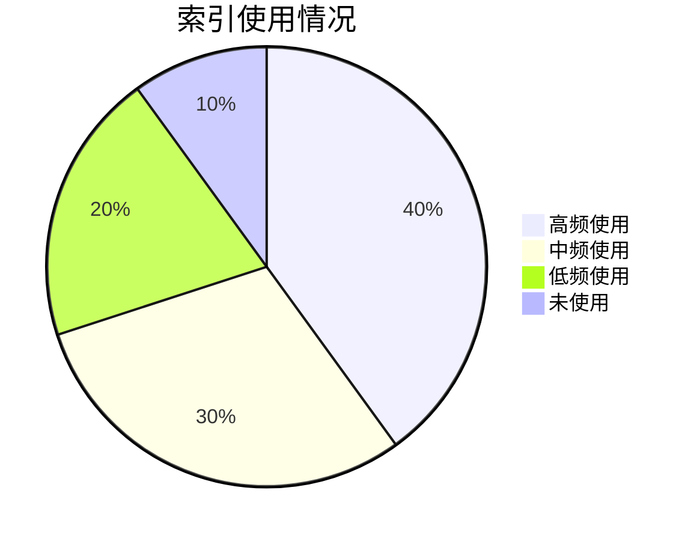
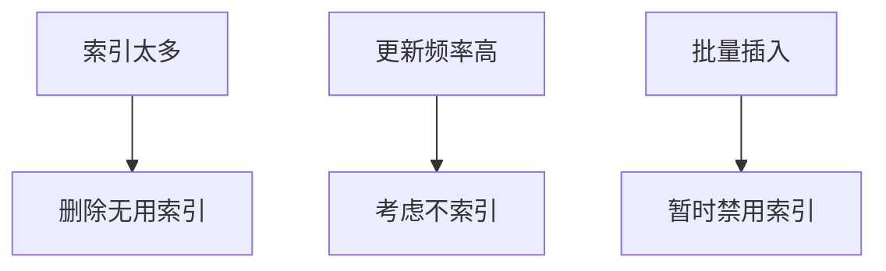
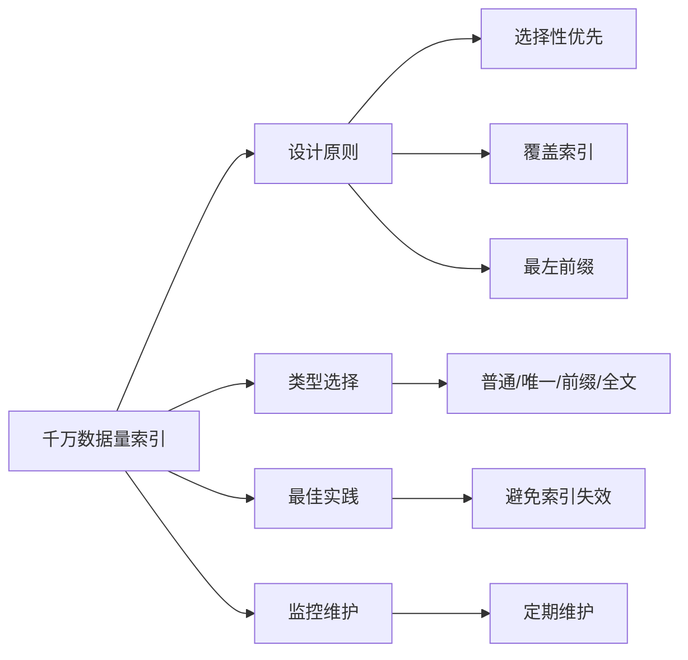

# InnoDB生产环境千万数据量如何加索引

## 目录

1. [索引设计原则](#1-索引设计原则)
2. [索引类型选择](#2-索引类型选择)
3. [索引最佳实践](#3-索引最佳实践)
4. [索引优化策略](#4-索引优化策略)
5. [监控与维护](#5-监控与维护)
6. [常见问题与解决方案](#6-常见问题与解决方案)

---

## 1. 索引设计原则

### 1.1 为什么千万数据量索引更重要



| 数据量级 | 索引重要性 |
|---------|-----------|
| 百万级 | 重要，建议加索引 |
| 千万级 | 关键，必须精心设计 |
| 亿级 | 核心，架构级设计 |

### 1.2 核心设计原则



| 原则 | 说明 |
|------|------|
| **选择性优先** | 高区分度的列在前 |
| **覆盖索引** | 查询所需列都在索引中 |
| **最左前缀** | 联合索引遵循最左匹配原则 |
| **避免过度索引** | 索引不是越多越好 |
| **宽度最小化** | 选择合适的数据类型 |

---

## 2. 索引类型选择

### 2.1 普通索引

```sql
-- 单列索引
CREATE INDEX idx_user_age ON users(age);

-- 联合索引
CREATE INDEX idx_user_name_age ON users(name, age);
```

**适用场景**：
- 经常在 WHERE 条件中使用的列
- 排序 ORDER BY
- 分组 GROUP BY

### 2.2 唯一索引

```sql
-- 唯一索引
CREATE UNIQUE INDEX idx_user_email ON users(email);

-- 主键索引（自动创建）
CREATE TABLE users (
    id INT PRIMARY KEY AUTO_INCREMENT,
    name VARCHAR(100)
);
```

**特点**：
- 保证列值唯一
- 检索效率更高
- 更新时需要检查唯一性（有一定开销）

### 2.3 前缀索引

```sql
-- 对字符串前N个字符建立索引
CREATE INDEX idx_user_name_prefix ON users(name(20));
```

**优势**：
- 减少索引存储空间
- 提高索引缓存效率
- 加快索引扫描速度

**使用建议**：
- 对于长文本字段
- 选择性足够高的前缀
- 建议长度：20-50 个字符

### 2.4 全文索引

```sql
-- 创建全文索引
CREATE FULLTEXT INDEX idx_article_content ON articles(content);

-- 使用全文索引
SELECT * FROM articles WHERE MATCH(content) AGAINST('搜索关键词');
```

**适用场景**：
- 文本搜索
- 分词检索
- 关键词匹配

---

## 3. 索引最佳实践

### 3.1 联合索引设计



**正确示例**：
```sql
-- 好的索引顺序
CREATE INDEX idx_user_query ON users(name, age, status);

-- 使用场景
SELECT * FROM users WHERE name = '张三' AND age = 25;
SELECT * FROM users WHERE name = '张三';
```

**错误示例**：
```sql
-- 索引未被使用（违反最左前缀）
CREATE INDEX idx_user_query ON users(name, age, status);
SELECT * FROM users WHERE age = 25; -- 索引失效！
```

### 3.2 覆盖索引



**示例**：
```sql
-- 创建覆盖索引
CREATE INDEX idx_user_name_age ON users(name, age);

-- 查询使用覆盖索引（无需回表）
SELECT id, name, age FROM users WHERE name = '张三';
```

### 3.3 索引选择法则



**选择参考表**：

| 列 | 区分度 | 更新频率 | 是否索引 |
|----|--------|---------|---------|
| 性别 | 低 | 低 | ❌ |
| 状态 | 低 | 中 | ⚠️ 视情况 |
| 年龄 | 中 | 中 | ⚠️ 视情况 |
| 姓名 | 高 | 中 | ✅ |
| ID | 高 | 低 | ✅ |

---

## 4. 索引优化策略

### 4.1 查询分析

```sql
-- 查看执行计划
EXPLAIN SELECT * FROM users WHERE name = '张三';

-- 查看执行计划详情（MySQL 8.0+）
EXPLAIN ANALYZE SELECT * FROM users WHERE name = '张三';
```

**执行计划关键指标**：

| 指标 | 说明 | 理想值 |
|------|------|--------|
| type | 访问类型 | ref, eq_ref |
| key | 使用的索引 | 目标索引 |
| rows | 扫描行数 | 越小越好 |
| Extra | 额外信息 | Using index |

### 4.2 索引优化步骤



### 4.3 索引使用注意事项

**避免索引失效的情况**：

```sql
-- 1. 使用函数或表达式
SELECT * FROM users WHERE YEAR(created_at) = 2023; -- 索引失效
-- 改为：
SELECT * FROM users WHERE created_at BETWEEN '2023-01-01' AND '2023-12-31'; -- 索引有效

-- 2. 隐式类型转换
SELECT * FROM users WHERE phone = 13800000000; -- 索引失效（phone是VARCHAR）
-- 改为：
SELECT * FROM users WHERE phone = '13800000000'; -- 索引有效

-- 3. 左侧使用通配符
SELECT * FROM users WHERE name LIKE '%张'; -- 索引失效
-- 改为：
SELECT * FROM users WHERE name LIKE '张%'; -- 索引有效（前缀索引）

-- 4. OR 条件中部分列无索引
SELECT * FROM users WHERE name = '张三' OR address = '北京'; -- 索引可能失效
-- 改为：
SELECT * FROM users WHERE name = '张三'
UNION ALL
SELECT * FROM users WHERE address = '北京';
```

---

## 5. 监控与维护

### 5.1 索引监控

```sql
-- 查看索引使用情况
SELECT * FROM sys.schema_unused_indexes;

-- 查看索引使用统计
SELECT * FROM sys.schema_index_statistics;

-- 查看表索引大小
SELECT 
    table_name,
    index_name,
    stat_value AS cardinality
FROM mysql.innodb_index_stats
WHERE table_name = 'users';
```

### 5.2 索引维护

```sql
-- 重建索引
ALTER TABLE users DROP INDEX idx_user_name;
ALTER TABLE users ADD INDEX idx_user_name(name);

-- 优化表
OPTIMIZE TABLE users;

-- 分析表
ANALYZE TABLE users;
```

**维护建议**：

| 操作 | 频率 | 说明 |
|------|------|------|
| 监控索引使用 | 每周 | 检查无用索引 |
| 分析表 | 每月 | 更新统计信息 |
| 优化表 | 季度 | 整理碎片 |
| 重建索引 | 半年/一年 | 提升索引效率 |

### 5.3 索引使用统计



---

## 6. 常见问题与解决方案

### 6.1 索引过大问题

**问题**：索引文件太大，占内存

**解决方案**：
```sql
-- 使用前缀索引
CREATE INDEX idx_user_name_prefix ON users(name(30));

-- 删除无用索引
ALTER TABLE users DROP INDEX idx_unused;

-- 优化数据类型
ALTER TABLE users MODIFY COLUMN age TINYINT UNSIGNED;
```

### 6.2 索引更新慢问题

**问题**：插入/更新太慢

**解决方案**：


```sql
-- 批量导入时临时禁用索引
ALTER TABLE users DISABLE KEYS;
-- 导入数据
ALTER TABLE users ENABLE KEYS;
```

### 6.3 死锁问题

**问题**：高并发下索引导致死锁

**解决方案**：
- 保证事务顺序一致
- 减少事务持有时间
- 使用合适的索引减少锁范围
- 监控和调优

---

## 实际案例

### 订单表索引设计

```sql
-- 订单表结构
CREATE TABLE orders (
    id BIGINT PRIMARY KEY,
    user_id BIGINT,
    order_no VARCHAR(32),
    status TINYINT,
    amount DECIMAL(10, 2),
    created_at DATETIME,
    updated_at DATETIME
);

-- 查询场景
-- 1. 按订单号查询
-- 2. 按用户ID查询订单列表
-- 3. 按订单状态查询
-- 4. 按创建时间范围查询

-- 最佳索引设计
CREATE UNIQUE INDEX idx_order_no ON orders(order_no);
CREATE INDEX idx_user_status_created ON orders(user_id, status, created_at);
CREATE INDEX idx_created ON orders(created_at);
```

---

## 总结



### 关键要点

1. 索引选择：高选择性、低更新频率优先
2. 索引设计：覆盖索引、联合索引最左前缀
3. 索引维护：定期监控、及时优化
4. 索引原则：够用就行，不要过度索引
5. 性能测试：上线前充分测试验证

---

## 参考资料

1. [MySQL 官方文档 - 优化和索引](https://dev.mysql.com/doc/refman/8.0/en/optimization-indexes.html)
2. [InnoDB 索引最佳实践](https://dev.mysql.com/doc/refman/8.0/en/innodb-indexes.html)
