# InnoDB 的一次更新操作是怎么执行的

## 目录

1. [概述](#1-概述)
2. [整体流程](#2-整体流程)
3. [详细执行步骤](#3-详细执行步骤)
4. [关键组件说明](#4-关键组件说明)
5. [崩溃恢复](#5-崩溃恢复)

---

## 1. 概述

InnoDB 的更新操作涉及多个核心组件的协作，包括：事务、锁、缓冲池、redo 日志、undo 日志等。

### 关键特性

| 特性 | 说明 |
|------|------|
| **事务支持** | ACID 特性完整 |
| **MVCC** | 多版本并发控制 |
| **行级锁** | 高并发写入性能 |
| **崩溃恢复** | 使用 redo 日志保证持久性 |
| **回滚** | 使用 undo 日志支持回滚 |

---

## 2. 整体流程

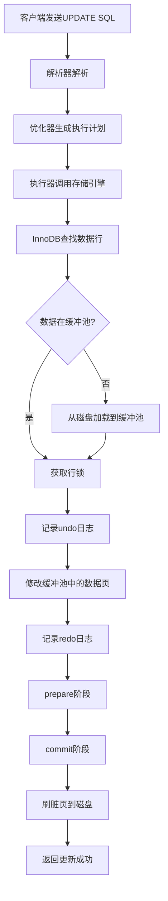

---

## 3. 详细执行步骤

### 示例 SQL

```sql
-- 假设已有 users 表
UPDATE users 
SET name = 'new_name', 
    age = age + 1 
WHERE id = 1;
```

### 步骤 1-4：SQL 层处理

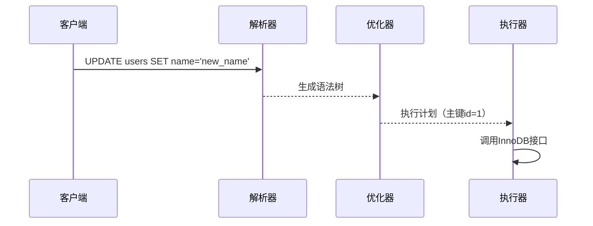

**关键点**：
- 解析器：语法检查、词法分析
- 优化器：选择索引（主键索引最优）
- 执行器：调用存储引擎接口

---

### 步骤 5：查找数据行

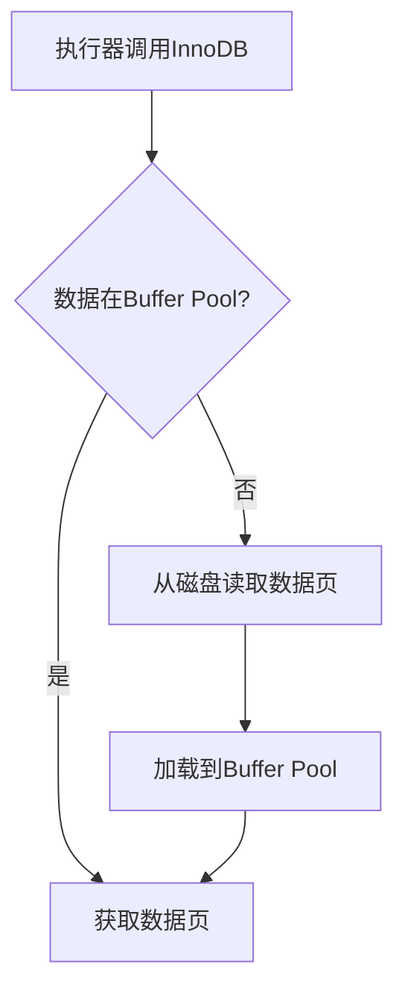

**查找过程**：
1. 先在 `Buffer Pool` 中查找 `id=1` 的数据页
2. 未命中则从磁盘的 `.ibd` 文件读取
3. 加载到 `Buffer Pool` 并建立映射关系

---

### 步骤 6：获取行锁

```mermaid
flowchart TD
    A[需要修改id=1] --> B{该行已被锁定?}
    B -->|否| C[加排他锁(X锁)]
    B -->|是| D[等待锁释放]
    D -->|超时| E[返回锁等待超时错误]
    D -->|释放| C
```

**锁的类型**：
- **X锁**：排他锁，其他事务不能读也不能写
- **锁粒度**：行级锁，并发性能好

---

### 步骤 7：记录 Undo 日志


**Undo 日志作用**：
1. **回滚**：事务失败时恢复数据
2. **MVCC**：其他事务读旧版本数据
3. **一致性读**：读已提交、可重复读隔离级别

---

### 步骤 8：修改缓冲池中的数据

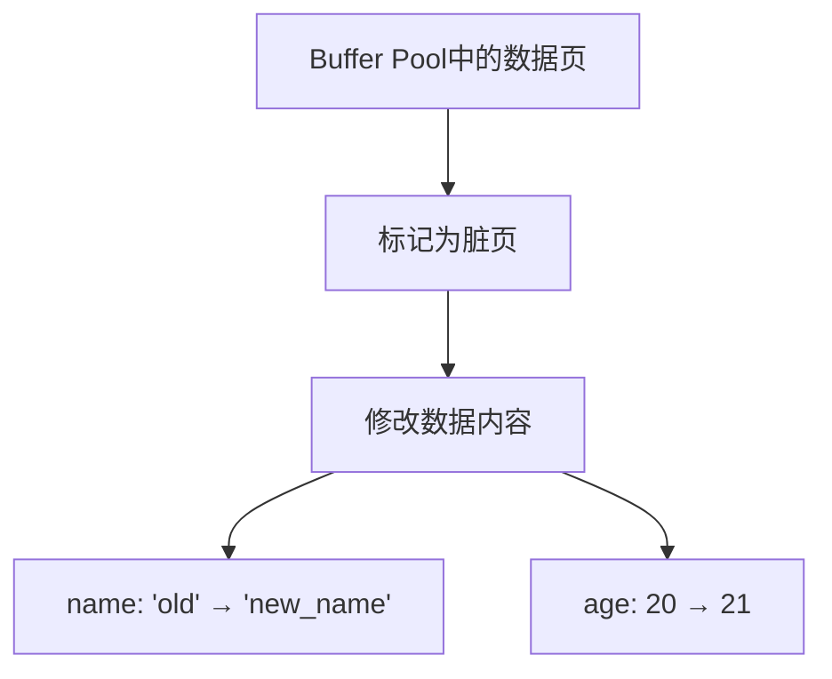

**关键**：
- 数据修改只在缓冲池中进行
- 页面标记为 **脏页**（Dirty Page）
- 后台线程负责异步刷脏

---

### 步骤 9：记录 Redo 日志


**Redo 日志特性**：
- **WAL（Write-Ahead Logging）**：先写日志，后写数据
- **顺序写入**：性能比随机写高
- **循环使用**：两个 redo 日志文件循环写入

---

### 步骤 10：事务提交（两阶段提交）

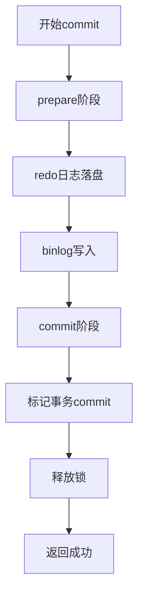

**两阶段提交详解**：

| 阶段 | 操作 | 目的 |
|------|------|------|
| **Prepare** | Redo 日志落盘 | 保证崩溃可恢复 |
| **Commit** | Binlog 落盘，标记事务完成 | 保证主从一致 |

---

### 步骤 11：后台刷脏页

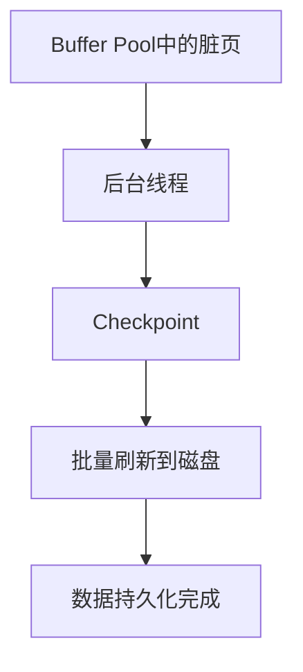

**刷脏策略**：
- **异步刷脏**：后台线程执行
- **批量刷写**：合并 IO，提高性能
- **Checkpoint**：标记恢复点，减少恢复时间

---

## 4. 关键组件说明

### 4.1 Buffer Pool（缓冲池）

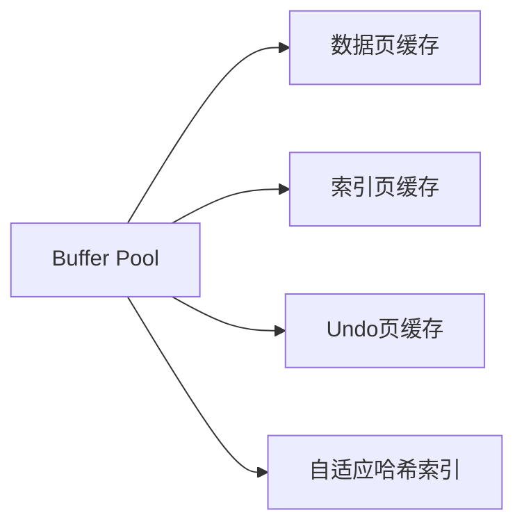

**配置**：
```ini
innodb_buffer_pool_size = 4G  # 建议物理内存的 60-80%
```

---

### 4.2 Undo Log（回滚日志）

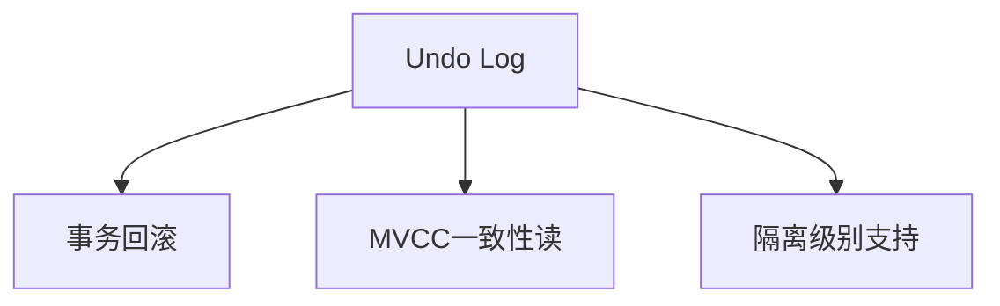

**特点**：
- **表空间**：Undo 存储在系统表空间或独立表空间
- **复用**：事务提交后可复用
- **Purge**：后台线程清理已不需要的 Undo

---

### 4.3 Redo Log（重做日志）

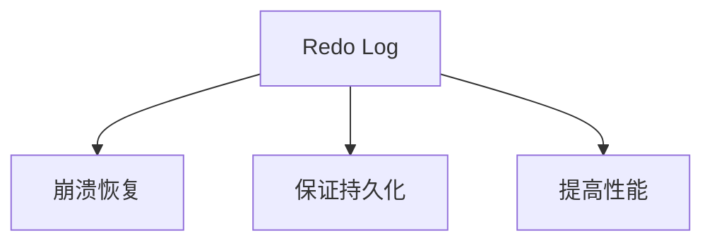

**配置**：
```ini
innodb_log_file_size = 1G       # Redo 日志文件大小
innodb_log_files_in_group = 2   # Redo 日志文件数量
innodb_flush_log_at_trx_commit = 1  # 每次commit刷盘
```

---

### 4.4 Double Write Buffer（双写缓冲）

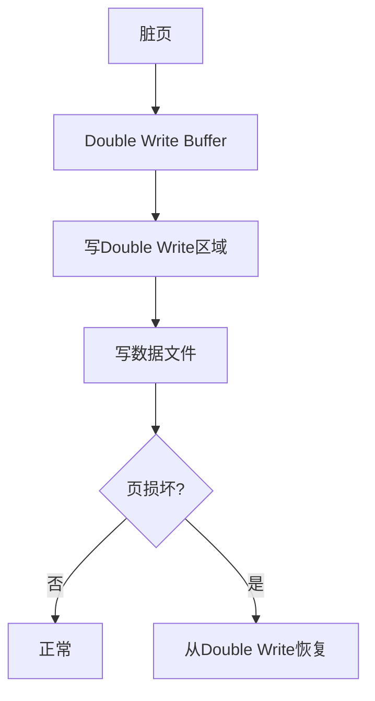

**作用**：防止页部分写入导致数据损坏

---

## 5. 崩溃恢复

### 5.1 崩溃场景

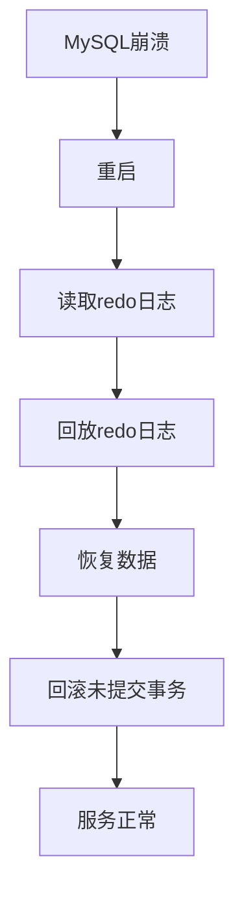

### 5.2 恢复流程

1. **Scan Redo**：从 Checkpoint 开始扫描 redo 日志
2. **Redo**：应用已提交的事务修改
3. **Undo**：回滚未提交的事务
4. **Purge**：清理不需要的 Undo 日志

---

### 5.3 事务状态判断

| Redo状态 | Binlog状态 | 处理方式 |
|----------|------------|---------|
| Prepare | 已写入 | Commit |
| Prepare | 未写入 | Rollback |
| Commit | 已写入 | 已提交，无需处理 |

---

## 总结：完整时序图

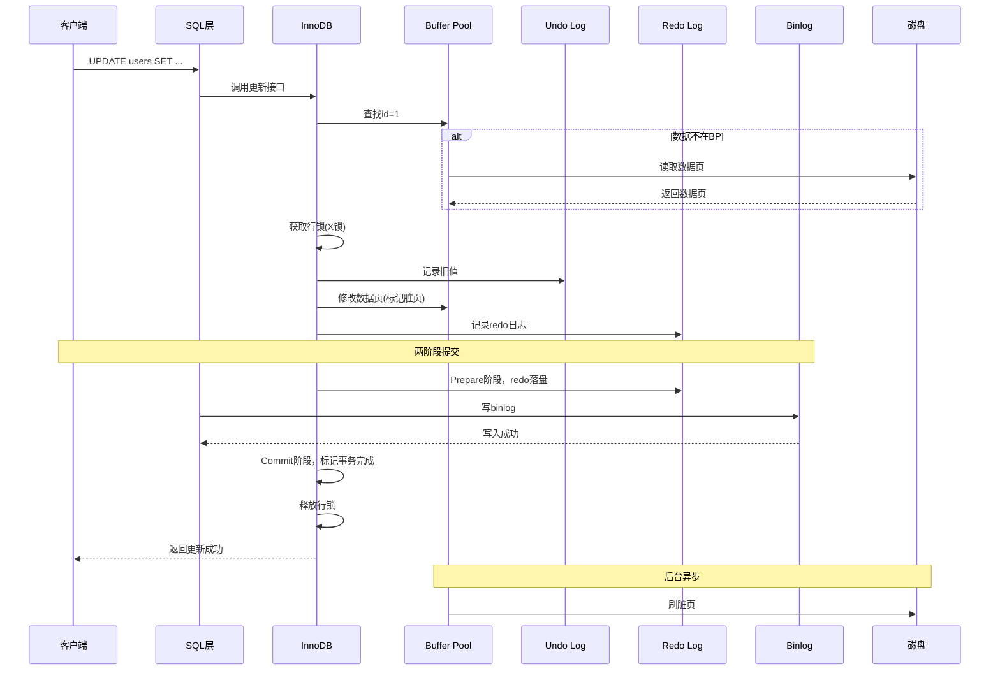

---

## 关键配置建议

```ini
# 缓冲池大小（物理内存60-80%）
innodb_buffer_pool_size = 4G

# Redo日志配置
innodb_log_file_size = 1G
innodb_log_files_in_group = 2
innodb_flush_log_at_trx_commit = 1

# Undo表空间
innodb_undo_tablespaces = 3
innodb_undo_logs = 128

# 双写缓冲
innodb_doublewrite = 1

# 刷脏策略
innodb_max_dirty_pages_pct = 75
innodb_io_capacity = 2000
```

---

## 参考资料

1. [MySQL 官方文档 - InnoDB Architecture](https://dev.mysql.com/doc/refman/8.0/en/innodb-architecture.html)
2. [MySQL Internals Manual](https://dev.mysql.com/doc/internals/en/)
3. [InnoDB Redo Log](https://dev.mysql.com/doc/refman/8.0/en/innodb-redo-log.html)
