# MySQL 中的锁

## 目录

1. [锁的概述](#1-锁的概述)
2. [锁的类型](#2-锁的类型)
3. [锁的粒度](#3-锁的粒度)
4. [InnoDB 锁机制](#4-innodb-锁机制)
5. [锁的兼容性](#5-锁的兼容性)
6. [死锁问题](#6-死锁问题)
7. [实战示例](#7-实战示例)

***

## 1. 锁的概述

### 1.1 什么是锁

**锁**是数据库用于控制并发访问的机制，确保数据的一致性和完整性。

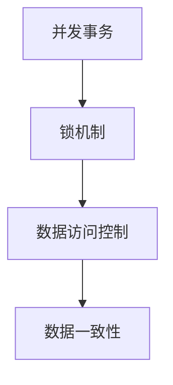

### 1.2 锁的作用

| 作用        | 说明               |
| --------- | ---------------- |
| **互斥访问**  | 防止多个事务同时修改同一数据   |
| **数据一致性** | 保证事务的原子性和隔离性     |
| **并发控制**  | 在保证一致性的前提下提高并发性能 |

***

## 2. 锁的类型

### 2.1 共享锁（Shared Lock，S锁）

**定义**：多个事务可以同时持有同一资源的共享锁。

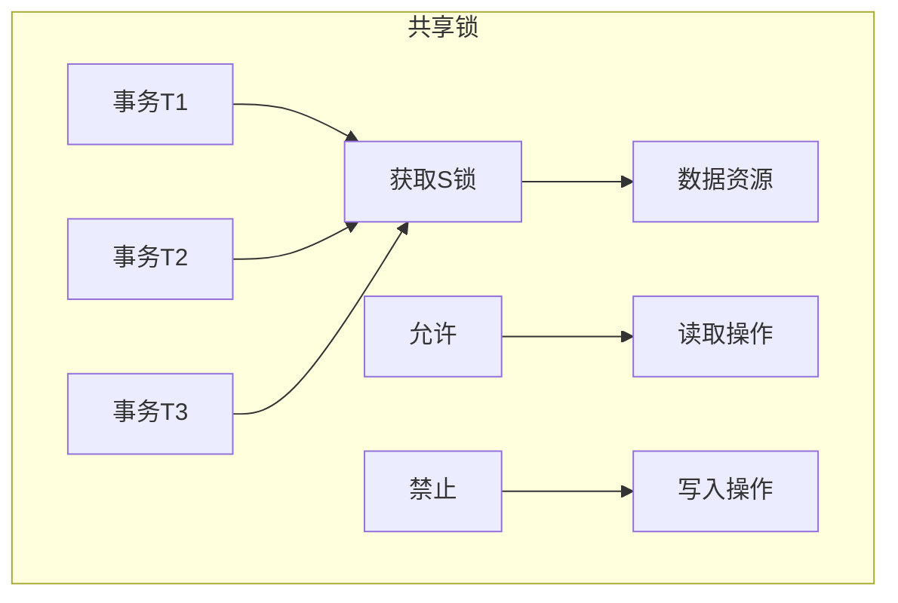

**语法**：

```sql
SELECT * FROM table_name WHERE ... LOCK IN SHARE MODE;
```

### 2.2 排他锁（Exclusive Lock，X锁）

**定义**：只有一个事务可以持有资源的排他锁。

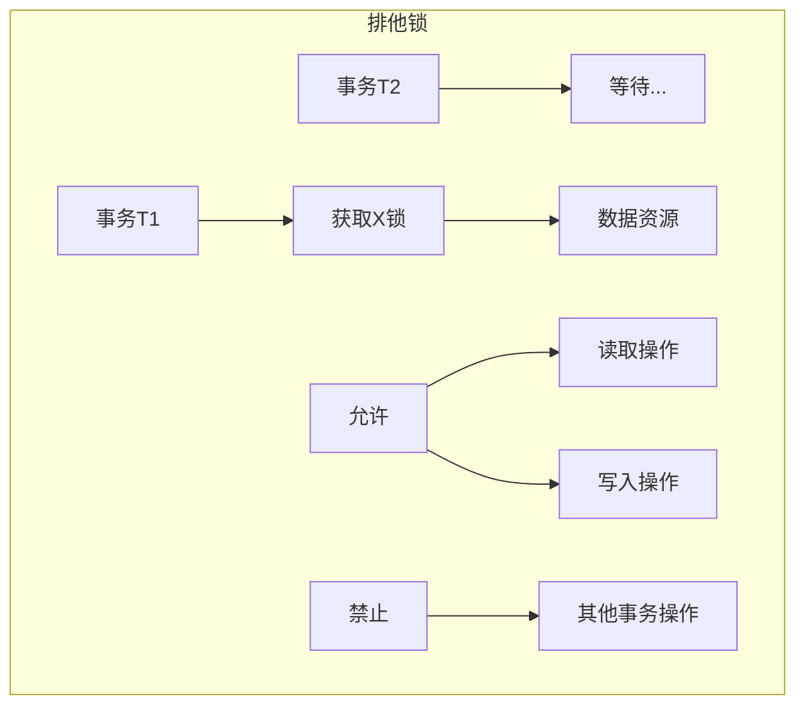

**语法**：

```sql
SELECT * FROM table_name WHERE ... FOR UPDATE;
UPDATE table_name SET ... WHERE ...;
DELETE FROM table_name WHERE ...;
INSERT INTO table_name ...;
```

***

## 3. 锁的粒度

### 3.1 表级锁（Table Lock）

**定义**：锁定整张表，粒度最大。

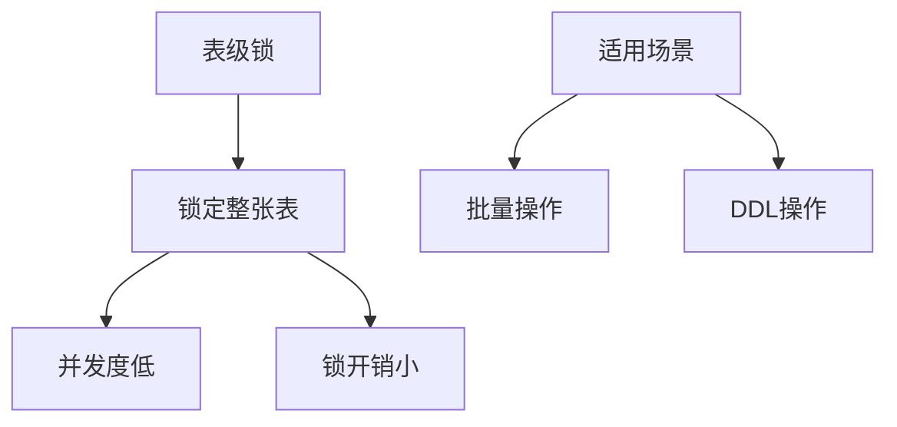

**特点**：

- **优点**：锁开销小，获取和释放快
- **缺点**：并发度低，容易发生锁等待

**示例**：

```sql
-- 手动加表锁
LOCK TABLES users READ;
LOCK TABLES users WRITE;

-- 解锁
UNLOCK TABLES;
```

### 3.2 行级锁（Row Lock）

**定义**：只锁定需要操作的行，粒度最小。

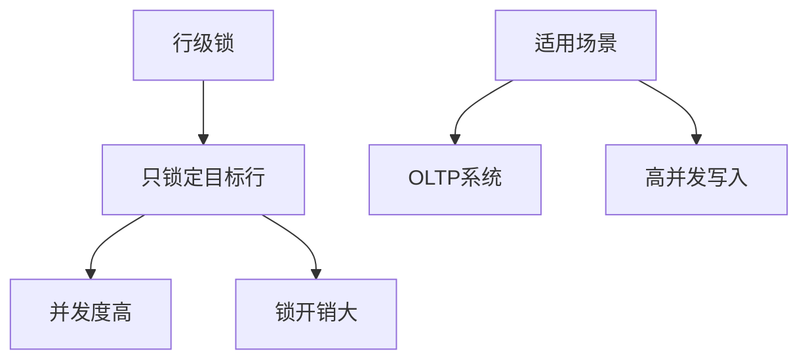

**特点**：

- **优点**：并发度高，不同行可以同时操作
- **缺点**：锁开销大，管理复杂

**示例**：

```sql
-- InnoDB 自动加行锁
UPDATE users SET name = 'new' WHERE id = 1;  -- 只锁 id=1 的行
```

### 3.3 页级锁（Page Lock）

**定义**：锁定数据页（16KB）。

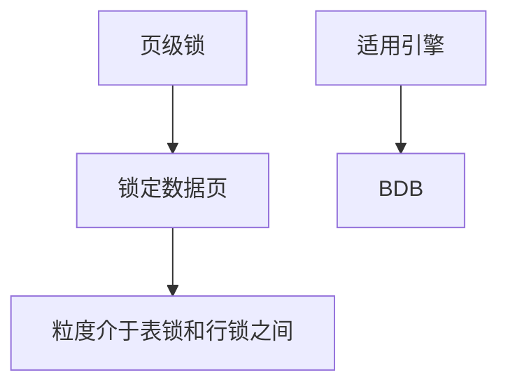

***

## 4. InnoDB 锁机制

### 4.1 InnoDB 锁类型

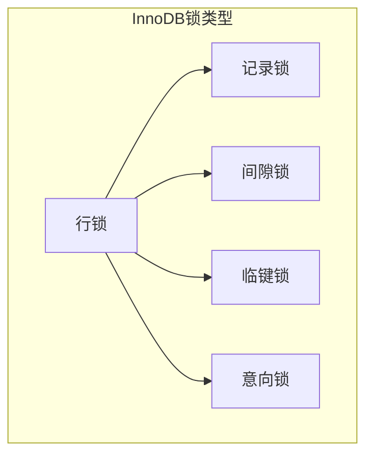

### 4.2 记录锁（Record Lock）

**定义**：锁定索引记录本身。

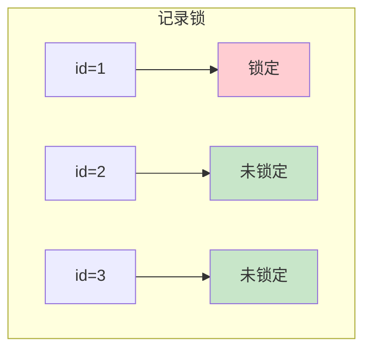

**示例**：

```sql
SELECT * FROM users WHERE id = 1 FOR UPDATE;
-- 只锁定 id=1 的行
```

### 4.3 间隙锁（Gap Lock）

**定义**：锁定索引之间的间隙，防止插入新记录。

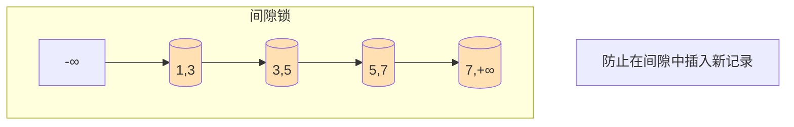

**示例**：

```sql
SELECT * FROM users WHERE id BETWEEN 1 AND 5 FOR UPDATE;
-- 锁定间隙：(-∞,1), (1,3), (3,5), (5,+∞)
```

### 4.4 临键锁（Next-Key Lock）

**定义**：记录锁 + 间隙锁的组合。

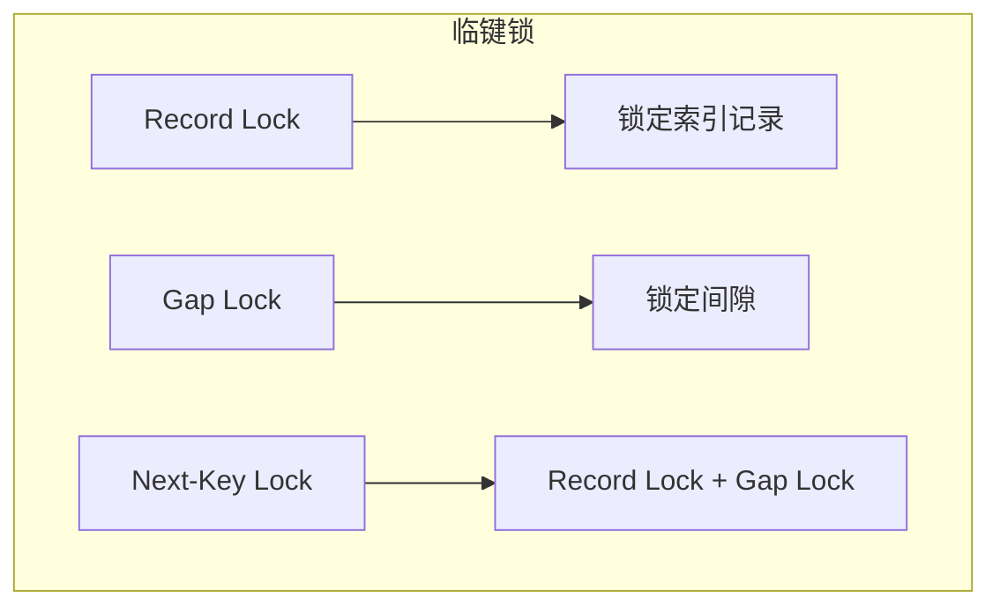

**工作原理**：

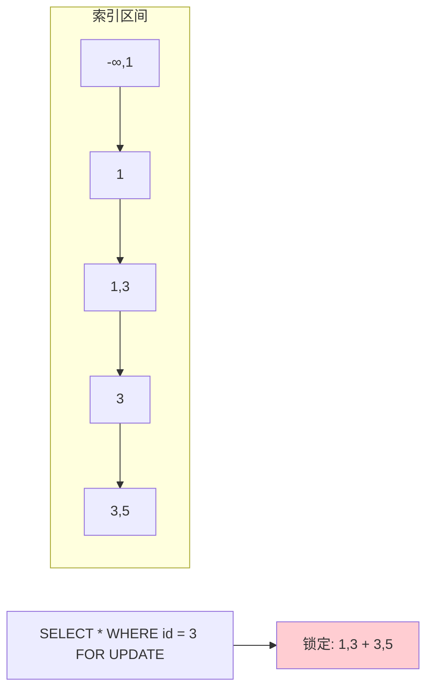

### 4.5 意向锁（Intention Lock）

**定义**：表明事务打算在表中的某行加锁。

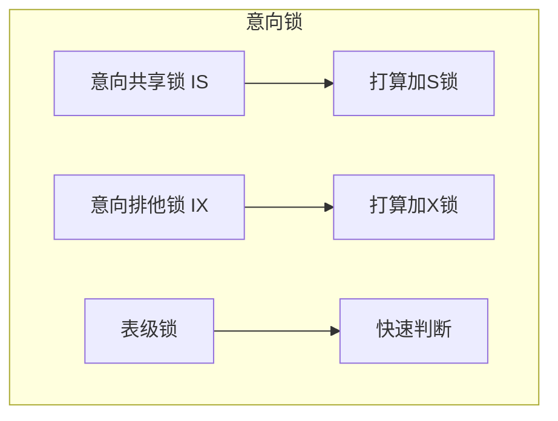

**作用**：

- **IS锁**：事务打算对表中的某些行加共享锁
- **IX锁**：事务打算对表中的某些行加排他锁

***

## 5. 锁的兼容性

### 5.1 锁兼容性矩阵

| 请求锁     | S锁 | X锁 | IS锁 | IX锁 |
| ------- | -- | -- | --- | --- |
| **S锁**  | 兼容 | 冲突 | 兼容  | 兼容  |
| **X锁**  | 冲突 | 冲突 | 冲突  | 冲突  |
| **IS锁** | 兼容 | 冲突 | 兼容  | 兼容  |
| **IX锁** | 兼容 | 冲突 | 兼容  | 兼容  |

### 5.2 兼容性图解

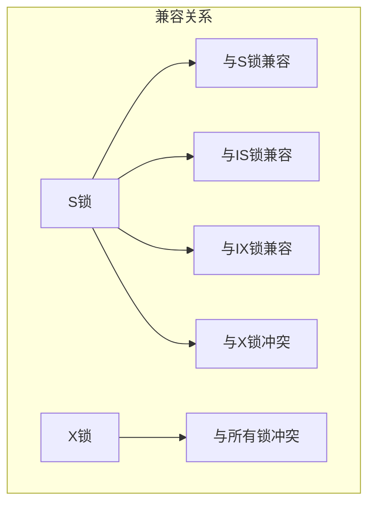

***

## 6. 死锁问题

### 6.1 死锁定义

**死锁**：两个或多个事务互相等待对方释放锁。

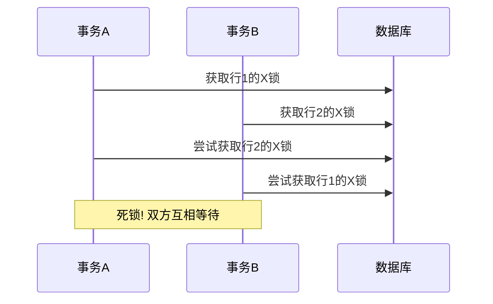

### 6.2 死锁产生条件

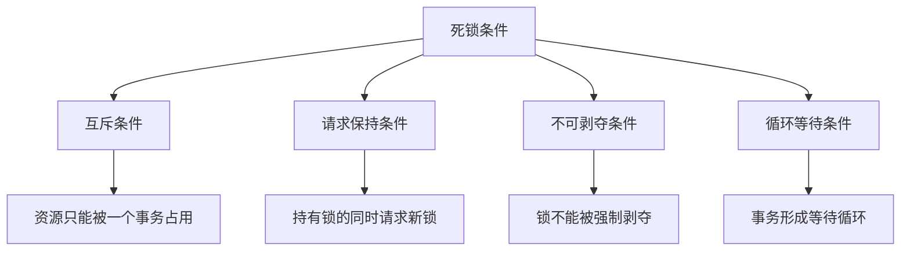

### 6.3 死锁检测与处理

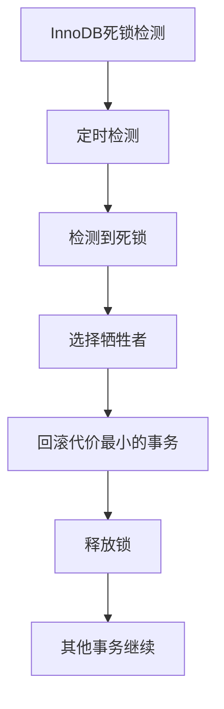

### 6.4 死锁预防策略

| 策略           | 说明                         |
| ------------ | -------------------------- |
| **固定加锁顺序**   | 所有事务按相同顺序获取锁               |
| **减少事务大小**   | 事务尽量短，减少锁持有时间              |
| **使用较低隔离级别** | 减少锁的范围                     |
| **设置锁等待超时**  | `innodb_lock_wait_timeout` |

***

## 7. 实战示例

### 7.1 共享锁与排他锁

```sql
-- 终端1：开启事务，获取共享锁
START TRANSACTION;
SELECT * FROM users WHERE id = 1 LOCK IN SHARE MODE;

-- 终端2：可以获取共享锁
START TRANSACTION;
SELECT * FROM users WHERE id = 1 LOCK IN SHARE MODE;  -- 成功

-- 终端3：尝试获取排他锁（等待）
START TRANSACTION;
SELECT * FROM users WHERE id = 1 FOR UPDATE;  -- 阻塞

-- 终端1：提交事务
COMMIT;

-- 终端3：获取锁成功
```

### 7.2 行级锁示例

```sql
-- 终端1：更新 id=1 的行
START TRANSACTION;
UPDATE users SET name = 'A' WHERE id = 1;

-- 终端2：更新 id=2 的行（不受影响）
START TRANSACTION;
UPDATE users SET name = 'B' WHERE id = 2;  -- 成功

-- 终端3：更新 id=1 的行（等待）
START TRANSACTION;
UPDATE users SET name = 'C' WHERE id = 1;  -- 阻塞

-- 终端1：提交
COMMIT;

-- 终端3：获取锁成功
```

### 7.3 间隙锁示例

```sql
-- 创建测试表
CREATE TABLE test (
    id INT PRIMARY KEY
);

-- 插入测试数据
INSERT INTO test VALUES (1), (3), (5);

-- 终端1：开启事务，使用范围查询
START TRANSACTION;
SELECT * FROM test WHERE id BETWEEN 1 AND 5 FOR UPDATE;
-- 锁定范围：(-∞,1], (1,3], (3,5], (5,+∞)

-- 终端2：尝试插入新记录（阻塞）
START TRANSACTION;
INSERT INTO test VALUES (2);  -- 阻塞！在间隙 (1,3) 中
INSERT INTO test VALUES (4);  -- 阻塞！在间隙 (3,5) 中
INSERT INTO test VALUES (6);  -- 阻塞！在间隙 (5,+∞) 中

-- 终端1：提交
COMMIT;

-- 终端2：插入成功
```

### 7.4 死锁示例

```sql
-- 终端1：开启事务，锁定行1
START TRANSACTION;
UPDATE users SET name = 'T1-1' WHERE id = 1;

-- 终端2：开启事务，锁定行2
START TRANSACTION;
UPDATE users SET name = 'T2-2' WHERE id = 2;

-- 终端1：尝试锁定行2（等待）
UPDATE users SET name = 'T1-2' WHERE id = 2;

-- 终端2：尝试锁定行1（死锁！）
UPDATE users SET name = 'T2-1' WHERE id = 1;

-- InnoDB检测到死锁，回滚其中一个事务
```

### 7.5 查看锁状态

```sql
-- 查看当前事务
SELECT * FROM INFORMATION_SCHEMA.INNODB_TRX;

-- 查看锁等待
SELECT * FROM INFORMATION_SCHEMA.INNODB_LOCK_WAITS;

-- 查看锁详情
SELECT * FROM INFORMATION_SCHEMA.INNODB_LOCKS;

-- 查看进程列表
SHOW PROCESSLIST;
```

***

## 总结

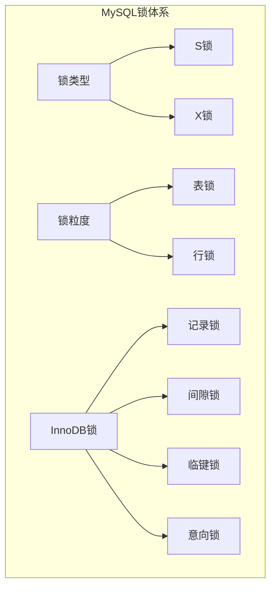

### 锁选择建议

| 场景       | 推荐锁类型          |
| -------- | -------------- |
| **读多写少** | 使用S锁或不加锁（MVCC） |
| **写操作**  | 使用X锁           |
| **批量更新** | 考虑表锁或分批处理      |
| **范围查询** | 注意间隙锁的影响       |

***

## 参考资料

1. [MySQL 官方文档 - InnoDB Locking](https://dev.mysql.com/doc/refman/8.0/en/innodb-locking.html)
2. [MySQL 官方文档 - Locking Reads](https://dev.mysql.com/doc/refman/8.0/en/innodb-locking-reads.html)
3. [MySQL 官方文档 - Deadlocks](https://dev.mysql.com/doc/refman/8.0/en/innodb-deadlocks.html)

