# MySQL 热点数据高效更新

## 目录

1. [热点数据问题概述](#1-热点数据问题概述)
2. [传统方案分析与问题](#2-传统方案分析与问题)
3. [高级优化方案](#3-高级优化方案)
4. [双十一秒杀扣减库存实战案例](#4-双十一秒杀扣减库存实战案例)
5. [方案对比](#5-方案对比)
6. [其他热点数据场景](#6-其他热点数据场景)
7. [最佳实践总结](#7-最佳实践总结)

---

## 1. 热点数据问题概述

### 1.1 什么是热点数据

**热点数据**指的是在短时间内被大量并发访问或更新的数据。典型场景包括：
- 双十一秒杀商品库存
- 热门商品库存
- 用户积分余额
- 排行榜数据

### 1.2 热点数据更新的性能问题

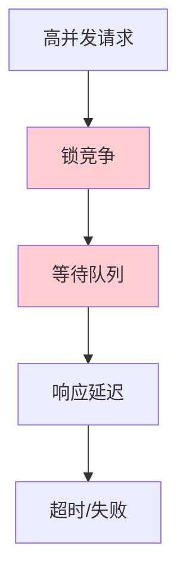

| 问题 | 说明 | 影响 |
|------|------|------|
| **锁竞争** | 大量请求竞争同一行锁 | 响应延迟增加 |
| **更新冲突** | 乐观锁 CAS 失败率高 | 用户体验差 |
| **单点瓶颈** | 单条记录成为瓶颈 | 无法水平扩展 |
| **数据不一致** | 并发更新导致超卖 | 业务损失 |

### 1.3 双十一秒杀场景分析

**场景特点**：
- **高并发**：瞬时 QPS 可达百万级
- **数据集中**：少数热门商品被大量访问
- **强一致性**：库存不能超卖
- **实时性要求**：用户需要即时反馈

---

## 2. 传统方案分析与问题

### 2.1 乐观锁更新（CAS）

**实现方式**：
```sql
UPDATE product_stock 
SET stock = stock - 1, version = version + 1
WHERE product_id = 1 AND stock > 0 AND version = 0;
```

**问题分析**：
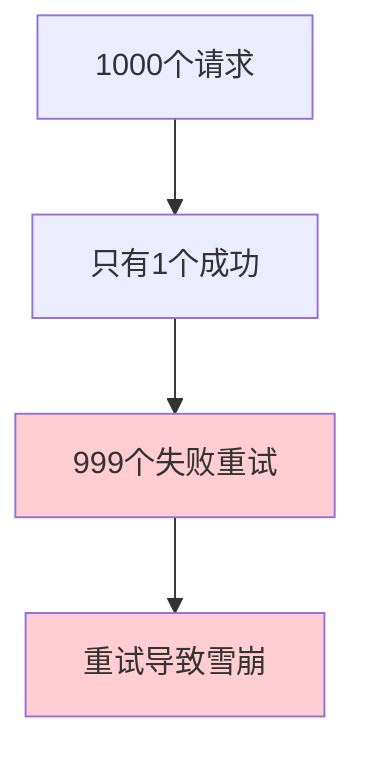

| 问题 | 原因 |
|------|------|
| **高失败率** | 版本号冲突频繁 |
| **重试雪崩** | 失败请求重试加剧压力 |
| **资源浪费** | CPU/网络资源浪费 |

### 2.2 悲观锁更新

**实现方式**：
```sql
BEGIN;
SELECT stock FROM product_stock WHERE product_id = 1 FOR UPDATE;
UPDATE product_stock SET stock = stock - 1 WHERE product_id = 1 AND stock > 0;
COMMIT;
```

**问题分析**：
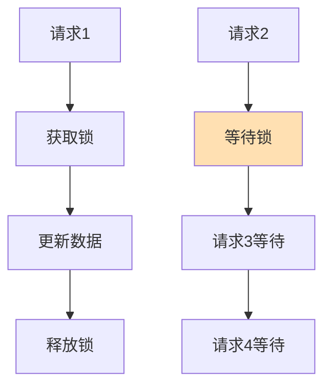

| 问题 | 原因 |
|------|------|
| **串行执行** | 所有请求排队等待 |
| **吞吐量低** | 每秒仅能处理几十次更新 |
| **连接耗尽** | 大量连接等待锁 |

### 2.3 为什么传统方案在高并发下会失效

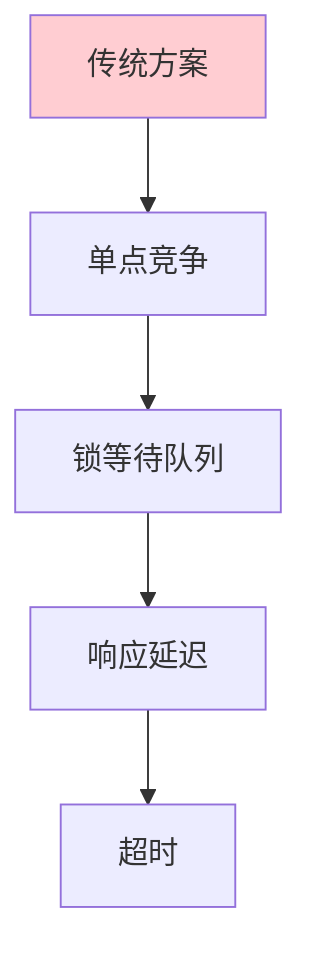

**核心问题**：所有请求都竞争同一行数据，无法水平扩展。

---

## 3. 高级优化方案

### 3.1 分桶算法（Bucket Algorithm）

#### 原理

**分桶算法**将库存分散到多个"桶"中，每个桶独立维护一部分库存，从而分散热点压力。

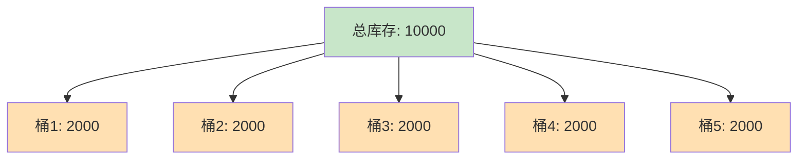

#### 分桶策略

| 策略 | 实现方式 | 优点 | 缺点 |
|------|---------|------|------|
| **用户ID哈希** | `bucketId = userId % bucketCount` | 均匀分布 | 用户固定到桶 |
| **随机分配** | `bucketId = random(0, bucketCount)` | 简单 | 可能分配不均 |
| **轮询** | 按顺序选择桶 | 均匀 | 需要状态管理 |

#### 数据结构

```sql
-- 主库存表（记录总库存）
CREATE TABLE product_stock (
    id BIGINT PRIMARY KEY,
    product_id BIGINT UNIQUE,
    total_stock INT,
    sold_stock INT,
    bucket_count INT DEFAULT 10,
    create_time DATETIME
);

-- 分桶库存表（分散热点）
CREATE TABLE product_stock_bucket (
    id BIGINT PRIMARY KEY AUTO_INCREMENT,
    product_id BIGINT,
    bucket_id INT,
    stock INT,
    version INT DEFAULT 0,
    INDEX idx_product_bucket (product_id, bucket_id)
);
```

#### 初始化分桶

```sql
-- 初始化10个桶，每个桶分配1000库存
INSERT INTO product_stock_bucket (product_id, bucket_id, stock)
SELECT 1, bucket_id, 1000
FROM (
    SELECT 0 AS bucket_id UNION ALL SELECT 1 UNION ALL SELECT 2
    UNION ALL SELECT 3 UNION ALL SELECT 4 UNION ALL SELECT 5
    UNION ALL SELECT 6 UNION ALL SELECT 7 UNION ALL SELECT 8 UNION ALL SELECT 9
) AS buckets;
```

### 3.2 缓冲记账（Buffered Accounting）

#### 原理

**缓冲记账**将高频更新先写入内存缓冲，然后批量刷入数据库，减少数据库压力。

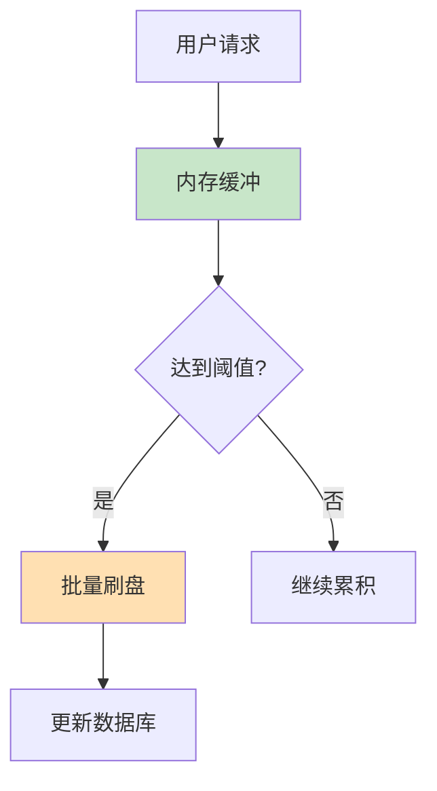

#### 缓冲策略

| 策略 | 触发条件 | 优点 |
|------|---------|------|
| **定时批量** | 每100ms执行一次 | 可控延迟 |
| **阈值触发** | 缓冲达到N条 | 保证延迟上限 |
| **事务合并** | 相同商品合并 | 减少写次数 |

#### 缓冲记录表设计

```sql
CREATE TABLE stock_buffer (
    id BIGINT PRIMARY KEY AUTO_INCREMENT,
    product_id BIGINT,
    bucket_id INT,
    buffer_count INT DEFAULT 0,
    flush_time DATETIME,
    INDEX idx_product_bucket (product_id, bucket_id)
);
```

### 3.3 流水机制（Transaction Log）

#### 原理

**流水机制**不直接扣减库存，而是记录每笔扣减流水，库存通过流水计算得出。

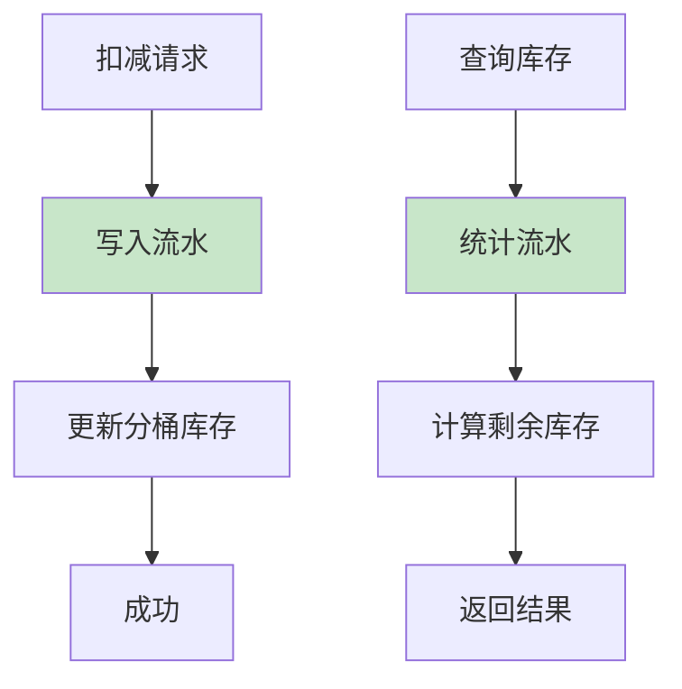

#### 流水表设计

```sql
CREATE TABLE stock_deduct_log (
    id BIGINT PRIMARY KEY AUTO_INCREMENT,
    product_id BIGINT,
    bucket_id INT,
    user_id BIGINT,
    order_id BIGINT UNIQUE,
    deduct_count INT,
    status TINYINT COMMENT '0:待处理, 1:成功, 2:失败',
    create_time DATETIME,
    update_time DATETIME,
    INDEX idx_product_status (product_id, status),
    INDEX idx_user_product (user_id, product_id)
);
```

#### 库存计算逻辑

```sql
-- 查询实时库存（考虑流水和缓冲）
SELECT 
    p.total_stock - COALESCE(s.sold_count, 0) - COALESCE(b.buffer_count, 0) AS remaining_stock
FROM product_stock p
LEFT JOIN (
    SELECT product_id, SUM(deduct_count) AS sold_count
    FROM stock_deduct_log
    WHERE product_id = 1 AND status = 1
) s ON p.product_id = s.product_id
LEFT JOIN (
    SELECT product_id, SUM(buffer_count) AS buffer_count
    FROM stock_buffer
    WHERE product_id = 1
) b ON p.product_id = b.product_id
WHERE p.product_id = 1;
```

### 3.4 组合方案

**分桶 + 缓冲 + 流水**三者结合，形成完整的高并发库存扣减方案。

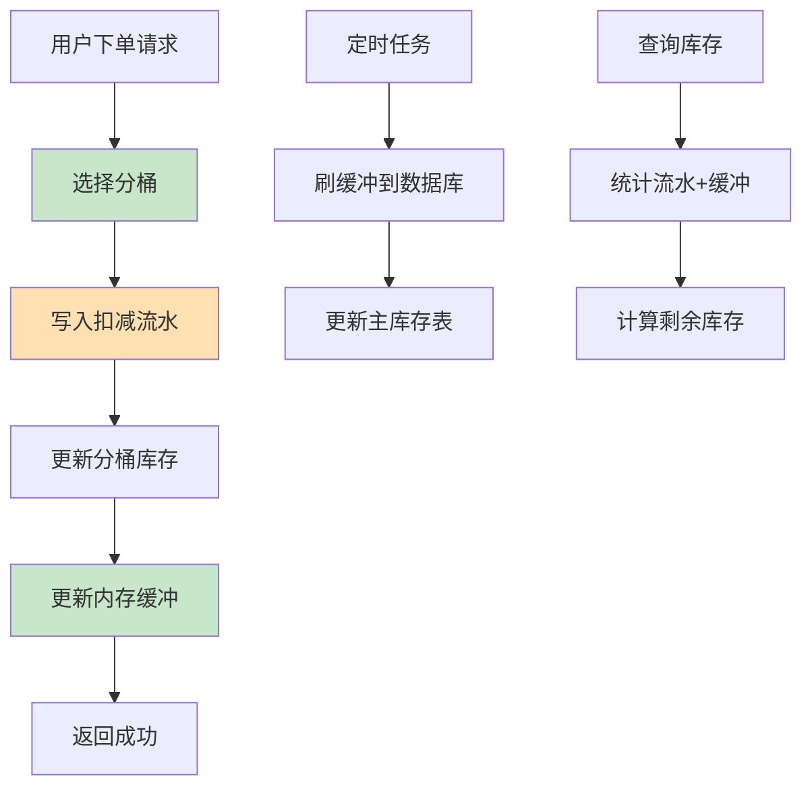

---

## 4. 双十一秒杀扣减库存实战案例

### 4.1 场景描述

| 参数 | 值 |
|------|-----|
| 商品库存 | 10万件 |
| 预计并发 | 100万 QPS |
| 分桶数量 | 100个 |
| 要求 | 数据一致性、防超卖、高可用 |

### 4.2 完整方案设计

#### 表结构设计

```sql
-- 主库存表
CREATE TABLE product_stock (
    id BIGINT PRIMARY KEY AUTO_INCREMENT,
    product_id BIGINT UNIQUE NOT NULL,
    total_stock INT NOT NULL DEFAULT 0,
    sold_stock INT NOT NULL DEFAULT 0,
    bucket_count INT NOT NULL DEFAULT 100,
    create_time DATETIME NOT NULL DEFAULT CURRENT_TIMESTAMP,
    update_time DATETIME NOT NULL DEFAULT CURRENT_TIMESTAMP ON UPDATE CURRENT_TIMESTAMP
);

-- 分桶库存表
CREATE TABLE product_stock_bucket (
    id BIGINT PRIMARY KEY AUTO_INCREMENT,
    product_id BIGINT NOT NULL,
    bucket_id INT NOT NULL,
    stock INT NOT NULL DEFAULT 0,
    version INT NOT NULL DEFAULT 0,
    create_time DATETIME NOT NULL DEFAULT CURRENT_TIMESTAMP,
    UNIQUE KEY uk_product_bucket (product_id, bucket_id)
);

-- 扣减流水表
CREATE TABLE stock_deduct_log (
    id BIGINT PRIMARY KEY AUTO_INCREMENT,
    product_id BIGINT NOT NULL,
    bucket_id INT NOT NULL,
    user_id BIGINT NOT NULL,
    order_id BIGINT UNIQUE NOT NULL,
    deduct_count INT NOT NULL DEFAULT 1,
    status TINYINT NOT NULL DEFAULT 0 COMMENT '0:待处理, 1:成功, 2:失败',
    create_time DATETIME NOT NULL DEFAULT CURRENT_TIMESTAMP,
    update_time DATETIME NOT NULL DEFAULT CURRENT_TIMESTAMP ON UPDATE CURRENT_TIMESTAMP,
    INDEX idx_product_status (product_id, status),
    INDEX idx_user_product (user_id, product_id)
);

-- 缓冲记录表
CREATE TABLE stock_buffer (
    id BIGINT PRIMARY KEY AUTO_INCREMENT,
    product_id BIGINT NOT NULL,
    bucket_id INT NOT NULL,
    buffer_count INT NOT NULL DEFAULT 0,
    flush_time DATETIME,
    create_time DATETIME NOT NULL DEFAULT CURRENT_TIMESTAMP,
    INDEX idx_product_bucket (product_id, bucket_id)
);
```

#### 扣减流程

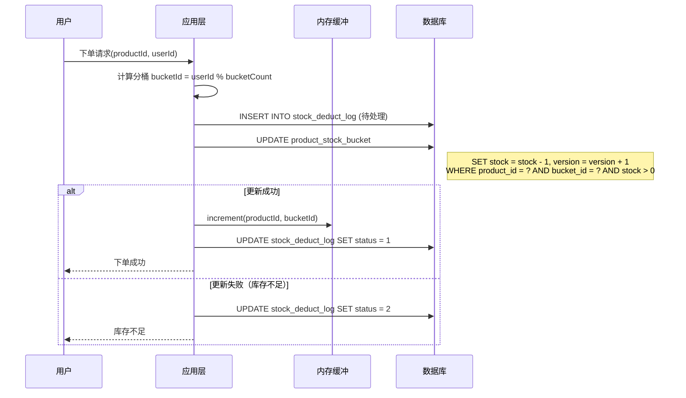

#### 库存扣减 SQL

```sql
-- 1. 写入扣减流水
INSERT INTO stock_deduct_log (
    product_id, bucket_id, user_id, order_id, deduct_count, status
) VALUES (1, 5, 1001, 202411110001, 1, 0);

-- 2. 乐观锁更新分桶库存
UPDATE product_stock_bucket 
SET stock = stock - 1, version = version + 1
WHERE product_id = 1 AND bucket_id = 5 AND stock > 0;

-- 3. 更新流水状态
UPDATE stock_deduct_log 
SET status = 1 
WHERE order_id = 202411110001;
```

#### 批量刷盘任务

```java
// 定时任务：每100ms执行一次
@Scheduled(fixedRate = 100)
public void flushBuffer() {
    // 1. 从内存缓冲获取待刷盘数据
    Map<String, Integer> bufferData = bufferService.collect();
    
    // 2. 批量更新缓冲记录表
    for (Map.Entry<String, Integer> entry : bufferData.entrySet()) {
        String key = entry.getKey(); // "productId:bucketId"
        Integer count = entry.getValue();
        
        String[] parts = key.split(":");
        Long productId = Long.parseLong(parts[0]);
        Integer bucketId = Integer.parseInt(parts[1]);
        
        // 更新缓冲记录表
        bufferMapper.increment(productId, bucketId, count);
    }
    
    // 3. 批量更新主库存表（每分钟一次）
    if (shouldUpdateMainStock()) {
        updateMainStock();
    }
}

private void updateMainStock() {
    // 统计所有流水
    List<StockStat> stats = logMapper.statisticsSoldStock();
    
    for (StockStat stat : stats) {
        stockMapper.updateSoldStock(stat.getProductId(), stat.getSoldCount());
    }
    
    // 清空已统计的流水
    logMapper.clearStatistics();
}
```

#### 库存查询逻辑

```sql
-- 查询商品实时库存
SELECT 
    ps.total_stock - COALESCE(sold.sold_count, 0) AS remaining_stock,
    COALESCE(sold.sold_count, 0) AS sold_count
FROM product_stock ps
LEFT JOIN (
    SELECT 
        product_id, 
        SUM(deduct_count) AS sold_count
    FROM stock_deduct_log
    WHERE product_id = 1 AND status = 1
) sold ON ps.product_id = sold.product_id
WHERE ps.product_id = 1;
```

### 4.3 防超卖保障

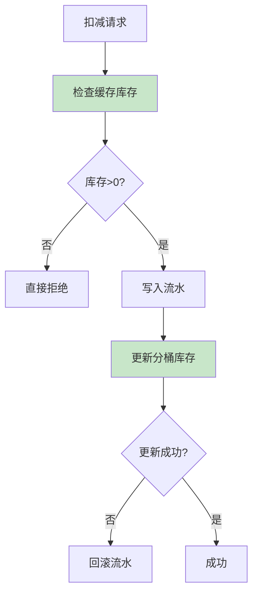

**多层保障**：
1. **缓存预检查**：Redis 缓存库存，快速拒绝无效请求
2. **分桶库存检查**：每个桶独立判断
3. **流水记录**：保证操作可追溯
4. **乐观锁**：保证并发安全

---

## 5. 方案对比

| 方案 | 优点 | 缺点 | 适用场景 | 吞吐量 |
|------|------|------|---------|--------|
| **乐观锁** | 简单、无锁竞争 | 高并发下失败率高 | 低并发场景 | ~100 QPS |
| **悲观锁** | 数据一致性强 | 性能瓶颈明显 | 写多读少 | ~50 QPS |
| **分桶算法** | 分散热点、高并发 | 实现复杂 | 超高并发 | ~10000 QPS |
| **缓冲记账** | 降低DB压力 | 有数据延迟 | 允许最终一致性 | ~50000 QPS |
| **流水机制** | 无锁更新、可追溯 | 需要额外计算 | 复杂业务场景 | ~50000 QPS |
| **组合方案** | 综合优势 | 实现复杂 | 双十一秒杀 | **~100万 QPS** |

---

## 6. 其他热点数据场景

### 6.1 用户积分更新

```sql
-- 用户积分分桶表
CREATE TABLE user_points_bucket (
    id BIGINT PRIMARY KEY AUTO_INCREMENT,
    user_id BIGINT NOT NULL,
    bucket_id INT NOT NULL,
    points INT NOT NULL DEFAULT 0,
    version INT NOT NULL DEFAULT 0,
    UNIQUE KEY uk_user_bucket (user_id, bucket_id)
);

-- 积分流水表
CREATE TABLE points_log (
    id BIGINT PRIMARY KEY AUTO_INCREMENT,
    user_id BIGINT NOT NULL,
    bucket_id INT NOT NULL,
    change_type TINYINT NOT NULL, -- 1:增加, 2:减少
    change_points INT NOT NULL,
    balance INT NOT NULL,
    create_time DATETIME NOT NULL DEFAULT CURRENT_TIMESTAMP
);
```

### 6.2 排行榜更新

```sql
-- 排行榜分桶表
CREATE TABLE leaderboard_bucket (
    id BIGINT PRIMARY KEY AUTO_INCREMENT,
    board_id BIGINT NOT NULL,
    bucket_id INT NOT NULL,
    user_id BIGINT NOT NULL,
    score INT NOT NULL DEFAULT 0,
    version INT NOT NULL DEFAULT 0,
    UNIQUE KEY uk_board_user (board_id, user_id)
);

-- 排行榜流水表
CREATE TABLE leaderboard_log (
    id BIGINT PRIMARY KEY AUTO_INCREMENT,
    board_id BIGINT NOT NULL,
    user_id BIGINT NOT NULL,
    score_change INT NOT NULL,
    create_time DATETIME NOT NULL DEFAULT CURRENT_TIMESTAMP,
    INDEX idx_board_user (board_id, user_id)
);
```

---

## 7. 最佳实践总结

### 7.1 设计原则

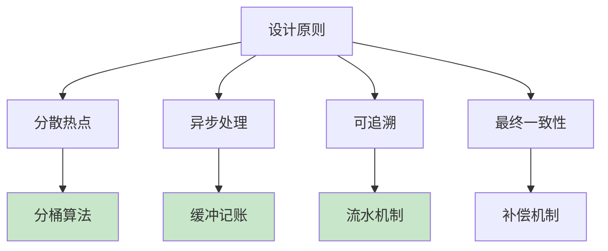

### 7.2 运维监控

| 监控指标 | 说明 | 告警阈值 |
|---------|------|---------|
| **扣减成功率** | 成功扣减/总请求 | <99% |
| **分桶库存差异** | 各桶库存偏差 | >10% |
| **缓冲积压** | 待刷盘记录数 | >10000 |
| **流水异常** | 待处理流水数 | >100 |

### 7.3 故障恢复

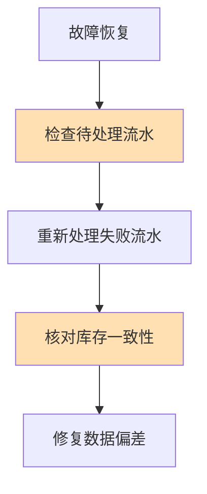

**恢复步骤**：
1. **暂停服务**：停止新的扣减请求
2. **检查流水**：查询状态为"待处理"的流水
3. **重新处理**：根据流水记录重新扣减或回滚
4. **核对库存**：对比流水统计与实际库存
5. **修复偏差**：如有差异，手动修正
6. **恢复服务**：确认一致后恢复服务

---

## 总结

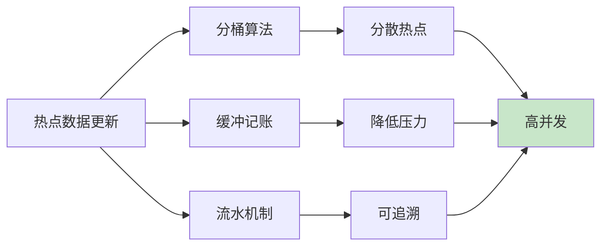

### 核心要点

1. **分桶算法**：将单点压力分散到多个桶，实现水平扩展
2. **缓冲记账**：减少数据库写入次数，提高吞吐量
3. **流水机制**：保证操作可追溯，支持故障恢复
4. **组合方案**：三者结合，应对双十一级别的高并发

### 适用场景

| 场景 | 推荐方案 |
|------|---------|
| 秒杀库存扣减 | 分桶 + 缓冲 + 流水 |
| 用户积分更新 | 分桶 + 流水 |
| 排行榜更新 | 分桶 + 缓冲 |
| 红包发放 | 流水机制 |

---

## 参考资料

1. [MySQL 官方文档 - Locking Reads](https://dev.mysql.com/doc/refman/8.0/en/innodb-locking-reads.html)
2. [Redis 官方文档 - Atomic Operations](https://redis.io/docs/interact/atomic-operations/)
3. [阿里巴巴秒杀系统架构分析](https://developer.aliyun.com/article/721669)
