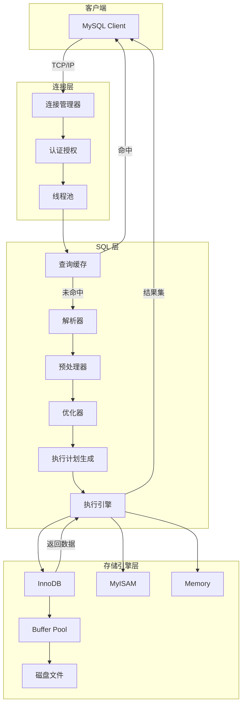
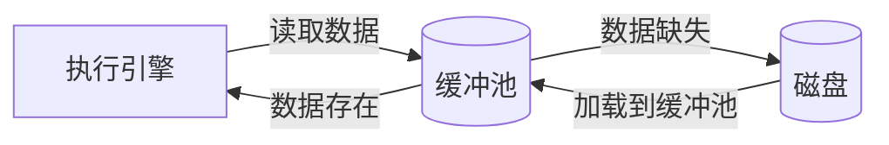
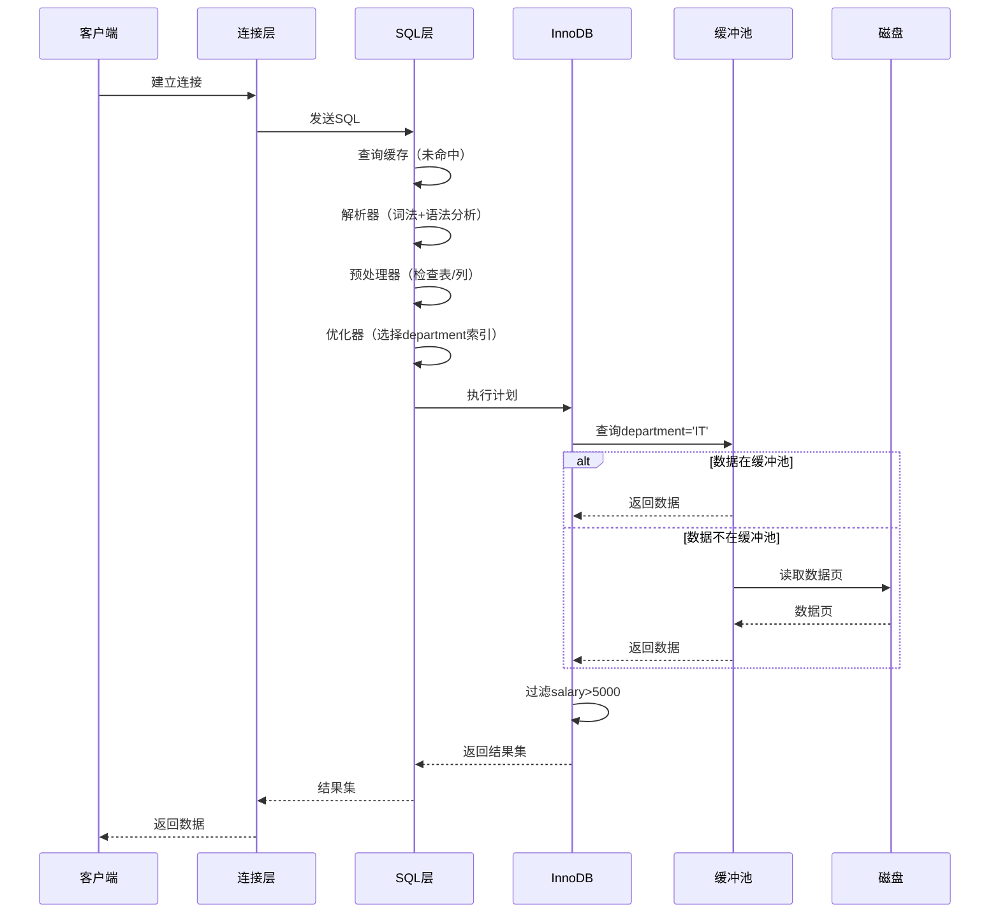

# MySQL 如何执行一条 SQL 查询

## 目录

1. [执行流程概述](#1-执行流程概述)
2. [执行引擎架构](#2-执行引擎架构)
3. [执行步骤详解](#3-执行步骤详解)
4. [SQL 执行示例](#4-sql执行示例)

---

## 1. 执行流程概述

MySQL 执行一条 SQL 查询主要分为 **8 个阶段**：

1. **客户端连接** → 2. **查询缓存** → 3. **SQL 解析** → 4. **预处理** → 5. **查询优化** → 6. **执行计划** → 7. **存储引擎执行** → 8. **返回结果**

---

## 2. 执行引擎架构



### 各层职责说明

| 层次 | 组件 | 职责 |
|------|------|------|
| **连接层** | 连接管理器、认证、线程池 | 处理客户端连接、身份验证、线程复用 |
| **SQL层** | 查询缓存、解析器、优化器、执行引擎 | SQL 解析、优化、执行调度 |
| **存储引擎层** | InnoDB、MyISAM 等 | 数据存储、索引管理、事务处理 |

---

## 3. 执行步骤详解

### 3.1 连接建立

```
客户端 → TCP 三次握手 → 认证授权 → 分配线程
```

### 3.2 查询缓存（MySQL 8.0 已移除）

```sql
-- 查询缓存配置（MySQL 5.x）
SHOW VARIABLES LIKE 'query_cache_type';
SHOW VARIABLES LIKE 'query_cache_size';
```

### 3.3 SQL 解析

**词法分析**：将 SQL 语句拆分为 tokens（关键字、表名、列名等）

**语法分析**：构建语法树（Parse Tree）

### 3.4 预处理

- 检查表和列是否存在
- 验证权限
- 解析视图

### 3.5 查询优化

优化器基于 **成本估算** 选择最优执行计划：

| 优化类型 | 说明 |
|---------|------|
| **索引选择** | 选择最优索引 |
| **JOIN 顺序** | 优化表连接顺序 |
| **条件下推** | 将条件推送到存储引擎 |
| **物化视图** | 预计算结果 |

### 3.6 执行计划

```sql
-- 查看执行计划
EXPLAIN SELECT * FROM users WHERE age > 18;

-- 查看详细执行计划
EXPLAIN ANALYZE SELECT * FROM users WHERE age > 18;
```

### 3.7 存储引擎执行



### 3.8 返回结果

```
存储引擎 → 执行引擎 → 结果集处理 → 网络传输 → 客户端
```

---

## 4. SQL 执行示例

### 示例 SQL

```sql
SELECT name, age FROM users WHERE department = 'IT' AND salary > 5000;
```

### 执行流程



### 执行计划输出示例

| id | select_type | table | type | key | rows | Extra |
|----|------------|-------|------|-----|------|-------|
| 1 | SIMPLE | users | ref | idx_department | 10 | Using where |

---

## 关键性能要点

1. **索引优化**：创建合适的索引
2. **避免全表扫描**：使用 `EXPLAIN` 分析
3. **缓冲池调优**：合理设置 `innodb_buffer_pool_size`
4. **避免 SELECT ***：只查询需要的列
5. **批量操作**：减少网络往返

---

## 参考资料

1. [MySQL 官方文档 - 查询执行计划](https://dev.mysql.com/doc/refman/8.0/en/execution-plan-information.html)
2. [MySQL Internals Manual](https://dev.mysql.com/doc/internals/en/)
