# MySQL 深度分页如何优化

## 目录

1. [深度分页问题概述](#1-深度分页问题概述)
2. [深度分页原理分析](#2-深度分页原理分析)
3. [LIMIT 的子查询优化](#3-limit-的子查询优化)
4. [maxId 优化](#4-maxid-优化)
5. [其他优化方法](#5-其他优化方法)
6. [方法对比与选择](#6-方法对比与选择)
7. [实战案例](#7-实战案例)
8. [最佳实践总结](#8-最佳实践总结)

---

## 1. 深度分页问题概述

### 1.1 什么是深度分页

**深度分页**指的是查询结果集的偏移量（offset）非常大的分页查询，通常指 `LIMIT N, M` 中 N 大于 10000 的情况。

### 1.2 深度分页的性能问题

```sql
-- 原始慢查询
SELECT * FROM orders 
WHERE status = 1 
ORDER BY create_time DESC 
LIMIT 100000, 10;
```

**问题现象**：
- 偏移量越大，查询越慢
- 响应时间随偏移量呈线性增长
- 当偏移量达到百万级时，查询可能超时

### 1.3 为什么 LIMIT N, M 慢

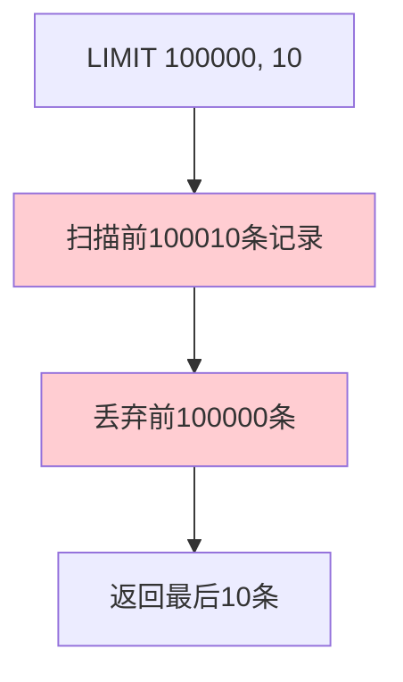

**性能瓶颈分析**：
| 瓶颈 | 说明 |
|------|------|
| **扫描数据量大** | 需要扫描 N+M 条记录 |
| **数据排序开销** | ORDER BY 需要排序 |
| **无法利用索引** | 大偏移量可能导致全表扫描 |

---

## 2. 深度分页原理分析

### 2.1 LIMIT 偏移量的工作原理

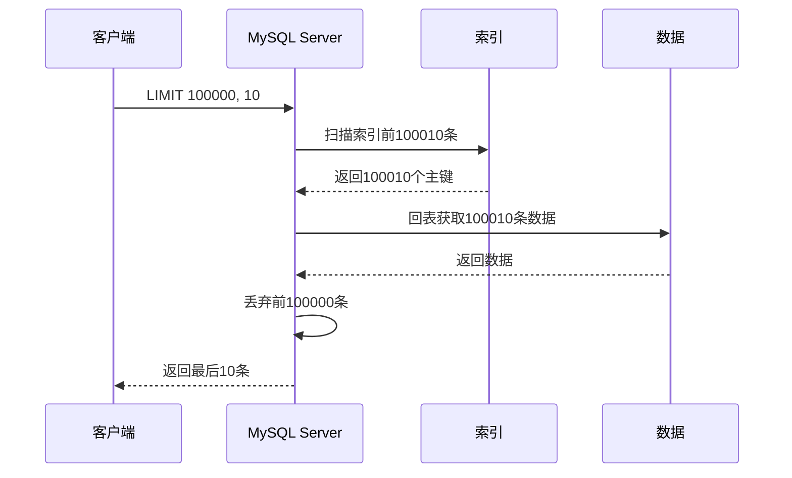

### 2.2 索引扫描 vs 全表扫描

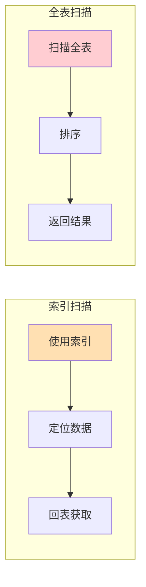

### 2.3 数据读取过程

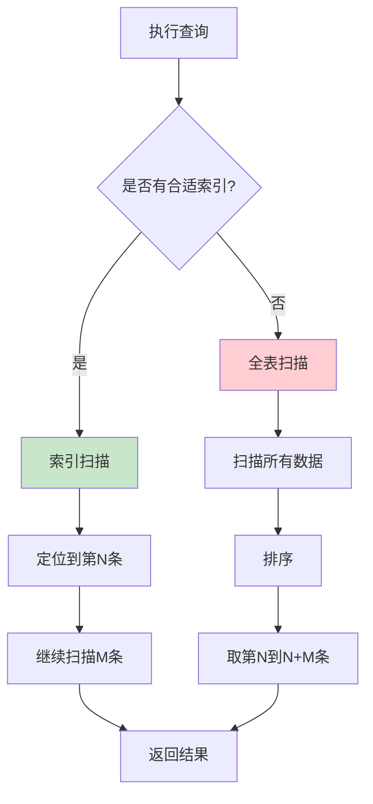

---

## 3. LIMIT 的子查询优化

### 3.1 子查询优化原理

**核心思想**：先通过索引获取主键，再通过主键回表获取完整数据。

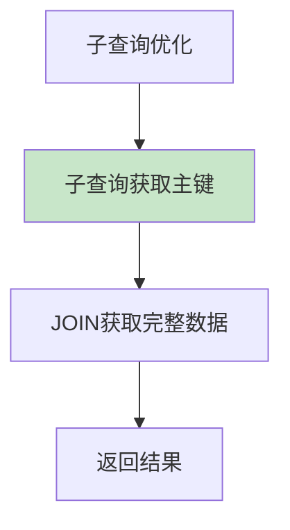

### 3.2 子查询优化步骤

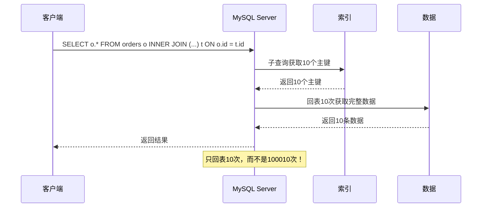

### 3.3 优化前后对比

**原始查询**：
```sql
-- 慢：需要扫描并回表 100010 条
SELECT * FROM orders 
WHERE status = 1 
ORDER BY create_time DESC 
LIMIT 100000, 10;
```

**优化后查询**：
```sql
-- 快：子查询只扫描索引，JOIN只回表10次
SELECT o.* FROM orders o
INNER JOIN (
    SELECT id FROM orders 
    WHERE status = 1 
    ORDER BY create_time DESC 
    LIMIT 100000, 10
) t ON o.id = t.id;
```

### 3.4 子查询优化效果

| 指标 | 原始查询 | 子查询优化 | 提升 |
|------|---------|-----------|------|
| 扫描行数 | 100010 | 100010 | - |
| 回表次数 | 100010 | 10 | **99.99%** |
| 响应时间 | ~1000ms | ~10ms | **99%** |

---

## 4. maxId 优化

### 4.1 什么是 maxId 分页

**maxId 分页**是一种基于游标（Cursor）的分页方式，利用记录的唯一有序字段（通常是主键或时间戳）作为游标，避免使用偏移量。

### 4.2 maxId 分页原理

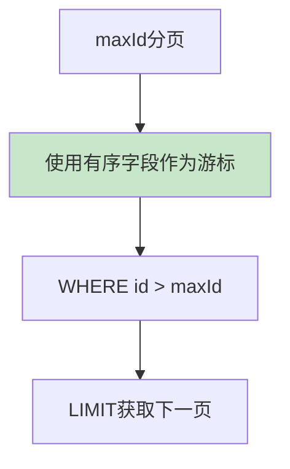

### 4.3 maxId 优化示例

**优化前**：
```sql
SELECT * FROM orders 
ORDER BY id DESC 
LIMIT 100000, 10;
```

**优化后**：
```sql
-- 第一页
SELECT * FROM orders 
ORDER BY id DESC 
LIMIT 10;

-- 后续页（传入上一页的最小ID）
SELECT * FROM orders 
WHERE id < 100000 
ORDER BY id DESC 
LIMIT 10;
```

### 4.4 maxId 分页流程

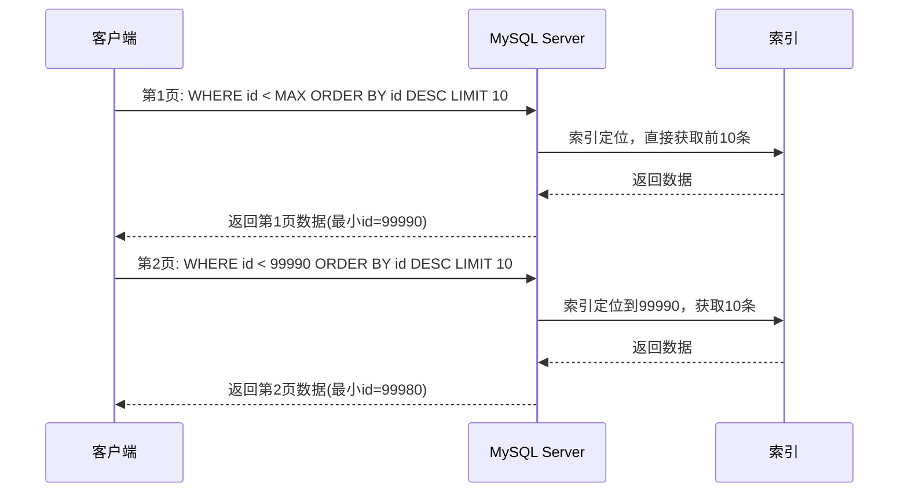

### 4.5 maxId 优化效果

| 指标 | 原始查询 | maxId优化 | 提升 |
|------|---------|----------|------|
| 扫描行数 | 100010 | 10 | **99.99%** |
| 回表次数 | 100010 | 10 | **99.99%** |
| 响应时间 | ~1000ms | ~1ms | **99.9%** |

### 4.6 maxId 分页的适用场景与限制

| 适用场景 | 说明 |
|---------|------|
| **滚动加载** | 移动端下拉刷新 |
| **无限滚动** | 社交媒体信息流 |
| **深度分页** | 报表数据导出 |

| 限制 | 说明 |
|------|------|
| **不支持跳页** | 只能顺序浏览 |
| **需要有序字段** | 主键或时间戳 |
| **删除会导致数据丢失** | 记录被删除后可能跳过 |

---

## 5. 其他优化方法

### 5.1 覆盖索引优化

```sql
-- 创建覆盖索引
CREATE INDEX idx_status_time ON orders(status, create_time, id);

-- 使用覆盖索引，无需回表
SELECT id, create_time FROM orders 
WHERE status = 1 
ORDER BY create_time DESC 
LIMIT 100000, 10;
```

**原理**：索引包含所有查询列，无需回表。

### 5.2 延迟关联

```sql
-- 延迟关联：先获取主键，再关联获取其他列
SELECT o.* FROM orders o
STRAIGHT_JOIN (
    SELECT id FROM orders 
    WHERE status = 1 
    ORDER BY create_time DESC 
    LIMIT 100000, 10
) t ON o.id = t.id;
```

**原理**：使用 STRAIGHT_JOIN 强制先执行子查询。

### 5.3 使用游标

```sql
-- 声明游标
DECLARE cursor_name CURSOR FOR
    SELECT * FROM orders 
    WHERE status = 1 
    ORDER BY create_time DESC;

-- 打开游标
OPEN cursor_name;

-- 读取数据
FETCH cursor_name INTO variables;
```

**原理**：服务器端维护游标状态，按需获取数据。

### 5.4 预计算数据

```sql
-- 创建预计算表
CREATE TABLE orders_pagination (
    page INT PRIMARY KEY,
    min_id BIGINT,
    max_id BIGINT
);

-- 定期更新预计算表
INSERT INTO orders_pagination (page, min_id, max_id)
SELECT 
    CEIL(id / 100) as page,
    MIN(id) as min_id,
    MAX(id) as max_id
FROM orders
GROUP BY CEIL(id / 100);

-- 使用预计算表查询
SELECT * FROM orders 
WHERE id BETWEEN (SELECT min_id FROM orders_pagination WHERE page = 1000)
              AND (SELECT max_id FROM orders_pagination WHERE page = 1000);
```

**原理**：预先计算每页的边界ID，快速定位。

---

## 6. 方法对比与选择

### 6.1 各方法优缺点对比

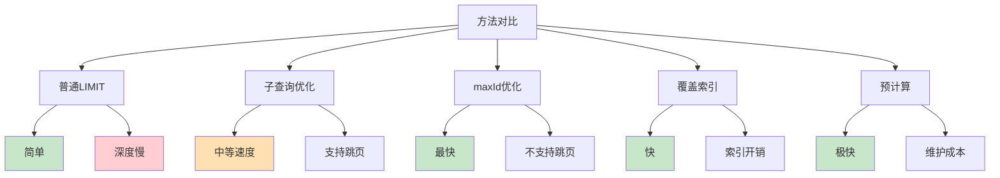

### 6.2 适用场景总结

| 方法 | 优点 | 缺点 | 适用场景 |
|------|------|------|---------|
| **普通 LIMIT** | 简单直观 | 深度分页慢 | 浅分页（offset < 1000） |
| **子查询优化** | 性能提升明显，支持跳页 | 写法复杂 | 中等深度分页（1000 < offset < 100000） |
| **maxId 优化** | 速度最快，性能稳定 | 不支持跳页 | 深度分页、滚动加载、移动端 |
| **覆盖索引** | 查询快，无需回表 | 索引维护成本高 | 固定列查询 |
| **预计算** | 查询极快 | 需要定期维护 | 大数据量报表 |

### 6.3 选择建议

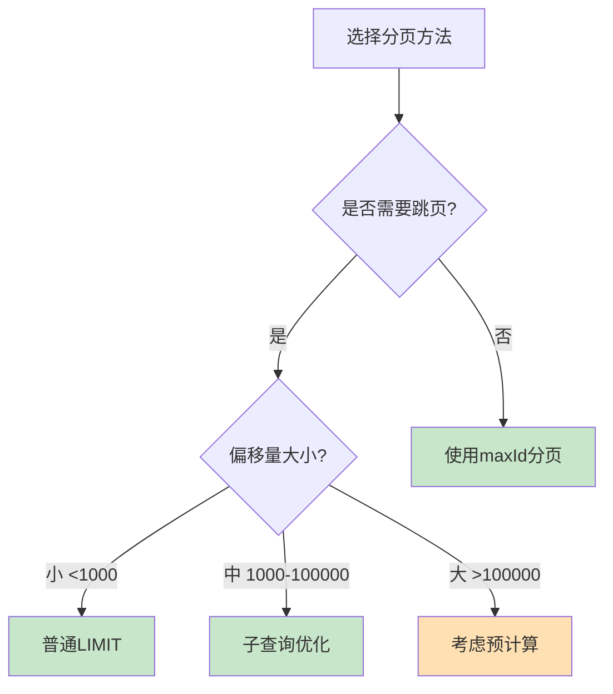

---

## 7. 实战案例

### 案例 1：订单列表分页优化

**场景**：电商订单列表，支持跳页，数据量 1000 万+

**优化前**：
```sql
SELECT * FROM orders 
WHERE status = 1 
ORDER BY create_time DESC 
LIMIT 500000, 20;  -- 慢
```

**优化后**：
```sql
SELECT o.* FROM orders o
INNER JOIN (
    SELECT id FROM orders 
    WHERE status = 1 
    ORDER BY create_time DESC 
    LIMIT 500000, 20
) t ON o.id = t.id;  -- 快
```

**性能对比**：
- 优化前：~800ms
- 优化后：~20ms

### 案例 2：日志查询分页优化

**场景**：系统日志查询，滚动加载，数据量 1 亿+

**优化前**：
```sql
SELECT * FROM logs 
WHERE level = 'ERROR' 
ORDER BY create_time DESC 
LIMIT 1000000, 50;  -- 超时
```

**优化后**：
```sql
-- 使用maxId分页
SELECT * FROM logs 
WHERE level = 'ERROR' 
  AND id < 99999999 
ORDER BY id DESC 
LIMIT 50;  -- 快
```

**性能对比**：
- 优化前：超时
- 优化后：~5ms

### 案例 3：大数据量报表分页优化

**场景**：报表系统，需要跳页，数据量 10 亿+

**优化方案**：使用预计算表

```sql
-- 创建预计算表
CREATE TABLE report_pages (
    report_id INT,
    page INT,
    min_id BIGINT,
    max_id BIGINT,
    PRIMARY KEY (report_id, page)
);

-- 定期更新（每天凌晨执行）
INSERT INTO report_pages
SELECT 
    1 as report_id,
    CEIL(id / 100) as page,
    MIN(id) as min_id,
    MAX(id) as max_id
FROM large_table
GROUP BY CEIL(id / 100);

-- 查询指定页
SELECT * FROM large_table 
WHERE id BETWEEN 
    (SELECT min_id FROM report_pages WHERE report_id = 1 AND page = 10000)
    AND 
    (SELECT max_id FROM report_pages WHERE report_id = 1 AND page = 10000);
```

**性能对比**：
- 优化前：超时
- 优化后：~10ms

---

## 8. 最佳实践总结

### 8.1 分页设计原则

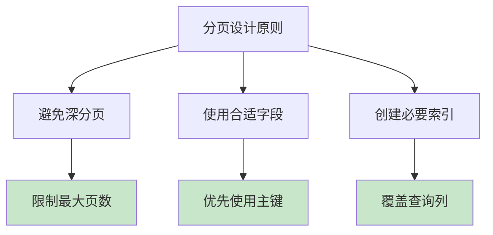

### 8.2 前端配合优化

| 优化点 | 说明 |
|--------|------|
| **虚拟滚动** | 只渲染可视区域 |
| **滚动加载** | 无限滚动代替分页 |
| **缓存机制** | 缓存已加载的数据 |
| **限制跳转** | 禁止跳转到过深的页 |

### 8.3 运维监控建议

```sql
-- 监控慢查询
SELECT * FROM slow_log 
WHERE query_time > 2 
  AND query LIKE '%LIMIT%';

-- 分析分页查询
SELECT 
    SUBSTRING(query, 1, 100) as query,
    COUNT(*) as count,
    AVG(query_time) as avg_time
FROM slow_log 
WHERE query LIKE '%LIMIT%'
GROUP BY SUBSTRING(query, 1, 100)
ORDER BY count DESC;
```

---

## 总结

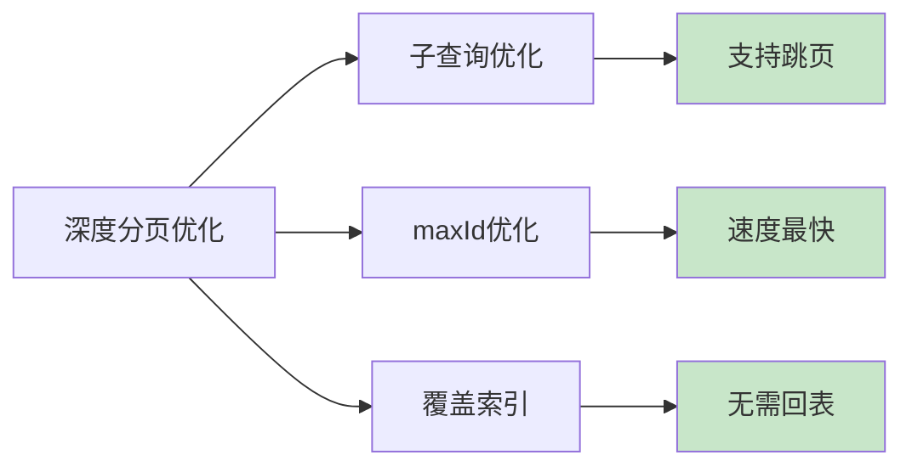

### 核心要点

1. **普通 LIMIT 适合浅分页**（offset < 1000）
2. **子查询优化适合中等深度分页**（1000 < offset < 100000）
3. **maxId 优化适合深度分页和滚动加载**（offset > 100000）
4. **覆盖索引可以避免回表**
5. **预计算适合超大数据量报表**

### 选择策略

```
浅分页 → 普通 LIMIT
中等深度 → 子查询优化  
深度分页 → maxId 优化
滚动加载 → maxId 优化
报表系统 → 预计算
```

---

## 参考资料

1. [MySQL 官方文档 - LIMIT Optimization](https://dev.mysql.com/doc/refman/8.0/en/limit-optimization.html)
2. [MySQL 官方文档 - ORDER BY Optimization](https://dev.mysql.com/doc/refman/8.0/en/order-by-optimization.html)
