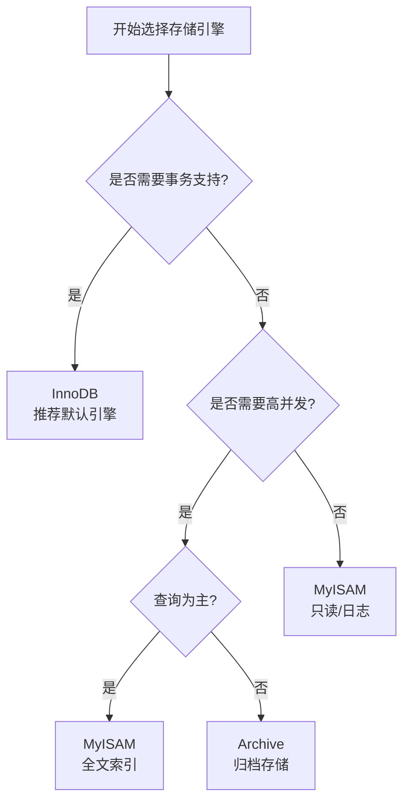

# MySQL 存储引擎

## 目录

1. [存储引擎概述](#1-存储引擎概述)
2. [MyISAM 存储引擎](#2-myisam-存储引擎)
3. [InnoDB 存储引擎](#3-innodb-存储引擎)
4. [Memory 存储引擎](#4-memory-存储引擎)
5. [Archive 存储引擎](#5-archive-存储引擎)
6. [常用存储引擎对比](#6-常用存储引擎对比)
7. [存储引擎选择建议](#7-存储引擎选择建议)

***

## 1. 存储引擎概述

### 1.1 什么是存储引擎

**存储引擎**是 MySQL 的核心组件，负责管理数据的存储、检索和完整性。MySQL 的插件式存储引擎架构允许用户根据不同场景选择最适合的存储引擎。

### 1.2 MySQL 支持的存储引擎

| 存储引擎      | 支持 | 说明               |
| --------- | -- | ---------------- |
| InnoDB    | ✅  | 默认存储引擎，支持事务和行级锁  |
| MyISAM    | ✅  | 早期默认引擎，不支持事务，表锁  |
| Memory    | ✅  | 数据存储在内存中，访问速度快   |
| Archive   | ✅  | 只支持插入和查询，用于归档    |
| CSV       | ✅  | 数据存储为 CSV 格式     |
| Federated | ✅  | 访问远程 MySQL 服务器数据 |
| Merge     | ✅  | 允许将多个 MyISAM 表合并 |
| NDB       | ✅  | MySQL 集群专用存储引擎   |

### 1.3 查看存储引擎

```sql
-- 查看 MySQL 支持的存储引擎
SHOW ENGINES;

-- 查看默认存储引擎
SHOW VARIABLES LIKE 'default_storage_engine';

-- 查看表的存储引擎
SHOW TABLE STATUS FROM database_name LIKE 'table_name';

-- 查看表创建语句（包含存储引擎信息）
SHOW CREATE TABLE table_name;
```

***

## 2. MyISAM 存储引擎

### 2.1 MyISAM 特性

MyISAM 是 MySQL 5.5 之前的默认存储引擎，以表为粒度进行管理。

| 特性        | 说明                   |
| --------- | -------------------- |
| **表级锁**   | 并发写入时锁整张表            |
| **不支持事务** | 不支持 ACID 事务特性        |
| **全文索引**  | 支持 FULLTEXT 全文索引     |
| **数据压缩**  | 支持静态表压缩              |
| **表修复**   | 支持手动修复（REPAIR TABLE） |
| **磁盘占用**  | 三个文件：.frm、.MYD、.MYI  |

### 2.2 MyISAM 文件结构

```
table_name.frm    -- 表结构定义文件
table_name.MYD    -- 数据文件（MyISAM Data）
table_name.MYI    -- 索引文件（MyISAM Index）
```

### 2.3 MyISAM 适用场景

| 场景        | 原因               |
| --------- | ---------------- |
| **只读场景**  | 数据很少修改，主要用于查询    |
| **读多写少**  | 查询操作远多于写入操作      |
| **全文搜索**  | 需要使用 FULLTEXT 索引 |
| **空间类数据** | 地理空间数据存储（GIS）    |
| **日志系统**  | 历史数据只追加不修改       |

### 2.4 MyISAM 配置参数

```ini
# my.cnf 配置
key_buffer_size = 256M        # 索引缓存大小
myisam_sort_buffer_size = 64M # 排序缓冲大小
myisam_max_sort_file_size = 10G # 重建索引时的临时文件大小
myisam_repair_threads = 1      # 修复线程数
```

***

## 3. InnoDB 存储引擎

### 3.1 InnoDB 特性

InnoDB 是 MySQL 5.5 及之后版本的默认存储引擎，是 MySQL 最重要的事务性存储引擎。

| 特性       | 说明         |
| -------- | ---------- |
| **事务支持** | 支持 ACID 事务 |
| **行级锁**  | 并发写入时只锁行   |
| **外键约束** | 支持外键约束     |
| **MVCC** | 多版本并发控制    |
| **崩溃恢复** | 自动崩溃恢复     |
| **聚簇索引** | 主键索引即数据    |
| **数据缓存** | 缓冲池缓存数据和索引 |

### 3.2 InnoDB 架构

```
┌─────────────────────────────────────────────────────────────────┐
│                        InnoDB 架构                              │
├─────────────────────────────────────────────────────────────────┤
│                                                                 │
│  ┌─────────────┐    ┌─────────────┐    ┌─────────────┐       │
│  │   缓冲池    │    │  写缓冲日志  │    │    行锁     │       │
│  │ (Buffer     │    │  (Change    │    │  (Row-level│       │
│  │   Pool)     │    │   Buffer)   │    │   Lock)    │       │
│  └──────┬──────┘    └──────┬──────┘    └─────────────┘       │
│         │                   │                                  │
│         ▼                   ▼                                  │
│  ┌─────────────────────────────────────┐                      │
│  │            InnoDB 存储引擎            │                      │
│  │  ┌───────────┐  ┌───────────┐       │                      │
│  │  │  表空间    │  │  索引    │       │                      │
│  │  │ (Tablespace)│ │ (B+Tree) │       │                      │
│  │  └───────────┘  └───────────┘       │                      │
│  └─────────────────────────────────────┘                      │
│                         │                                      │
│                         ▼                                      │
│  ┌─────────────────────────────────────┐                      │
│  │         物理存储 (磁盘文件)           │                      │
│  │  ibdata1, ib_logfile0, ib_logfile1  │                      │
│  └─────────────────────────────────────┘                      │
└─────────────────────────────────────────────────────────────────┘
```

### 3.3 InnoDB 关键特性详解

#### 3.3.1 MVCC（多版本并发控制）

```sql
-- InnoDB 通过 MVCC 实现读写并发
-- 读取操作分为快照读和当前读

-- 快照读（不加锁）
SELECT * FROM users WHERE id = 1;

-- 当前读（加锁）
SELECT * FROM users WHERE id = 1 LOCK IN SHARE MODE;
UPDATE users SET name = 'new_name' WHERE id = 1;
```

#### 3.3.2 行锁与表锁

```sql
-- 行锁示例
BEGIN;
SELECT * FROM users WHERE id = 1 FOR UPDATE;  -- 只锁 id=1 这行
UPDATE users SET name = 'test' WHERE id = 1;
COMMIT;

-- 表锁示例
BEGIN;
LOCK TABLES users WRITE;  -- 锁整张表
-- 执行操作
UNLOCK TABLES;
```

#### 3.3.3 事务隔离级别

| 隔离级别                   | 脏读  | 不可重复读 | 幻读  |
| ---------------------- | --- | ----- | --- |
| READ UNCOMMITTED（读未提交） | 可能  | 可能    | 可能  |
| READ COMMITTED（读已提交）   | 不可能 | 可能    | 可能  |
| REPEATABLE READ（可重复读）  | 不可能 | 不可能   | 可能  |
| SERIALIZABLE（串行）       | 不可能 | 不可能   | 不可能 |

### 3.4 InnoDB 配置参数

```ini
# my.cnf 配置
innodb_buffer_pool_size = 4G        # 缓冲池大小，通常设为物理内存的 60-80%
innodb_log_file_size = 1G           # 重做日志文件大小
innodb_log_buffer_size = 16M       # 日志缓冲区大小
innodb_flush_log_at_trx_commit = 1  # 事务提交时刷新日志（0/1/2）
innodb_lock_wait_timeout = 50       # 行锁等待超时时间（秒）
innodb_file_per_table = 1            # 每个表单独一个表空间文件
innodb_flush_method = O_DIRECT      # 刷新方式（Linux）
```

### 3.5 InnoDB 适用场景

| 场景          | 原因                    |
| ----------- | --------------------- |
| **OLTP 系统** | 需要事务支持的业务系统           |
| **高并发写入**   | 行级锁提供更好的并发性能          |
| **数据一致性**   | 事务和 MVCC 保证数据一致性      |
| **主从复制**    | 支持行级复制，复制效率高          |
| **大数据量**    | 独立表空间便于管理             |
| **频繁更新**    | 适合 UPDATE 和 DELETE 操作 |

***

## 4. Memory 存储引擎

### 4.1 Memory 特性

| 特性                | 说明          |
| ----------------- | ----------- |
| **数据存储位置**        | 数据存储在内存中    |
| **访问速度**          | 比磁盘存储快很多    |
| **表级锁**           | 并发写入时锁整张表   |
| **不支持事务**         | 不支持 ACID 事务 |
| **不支持 BLOB/TEXT** | 只能存储固定长度数据  |
| **数据易失**          | 服务重启后数据丢失   |
| **哈希索引**          | 默认使用哈希索引    |

### 4.2 Memory 文件结构

```
table_name.frm    -- 表结构定义文件
# 数据和索引存储在内存中，不产生磁盘文件
```

### 4.3 Memory 使用场景

| 场景       | 说明          |
| -------- | ----------- |
| **临时表**  | 存储中间计算结果    |
| **缓存表**  | 频繁访问的小数据量表  |
| **查找表**  | 地区、性别等枚举值映射 |
| **会话存储** | 存储用户会话信息    |
| **测试环境** | 功能测试和数据验证   |

### 4.4 Memory 配置参数

```ini
# my.cnf 配置
max_heap_table_size = 64M   # Memory 表最大大小
tmp_table_size = 64M        # 临时表最大大小（内存临时表）
```

***

## 5. Archive 存储引擎

### 5.1 Archive 特性

| 特性           | 说明          |
| ------------ | ----------- |
| **只支持插入和查询** | 不支持更新和删除    |
| **数据压缩**     | 自动压缩数据，节省空间 |
| **行级锁**      | 支持并发插入      |
| **不支持索引**    | 除主键外不支持其他索引 |
| **缓冲区**      | 使用缓冲写入后批量压缩 |

### 5.2 Archive 适用场景

| 场景       | 说明        |
| -------- | --------- |
| **归档存储** | 历史数据归档    |
| **日志存储** | 应用日志、审计日志 |
| **数据采集** | 传感器数据采集   |
| **报表存储** | 统计分析结果存储  |

### 5.3 Archive 文件结构

```
table_name.frm    -- 表结构定义文件
table_name.ARZ    -- 压缩后的数据文件
table_name.ARM    -- 元数据文件
```

***

## 6. 常用存储引擎对比

### 6.1 功能对比表

| 特性       | InnoDB  | MyISAM | Memory | Archive |
| -------- | ------- | ------ | ------ | ------- |
| **事务支持** | ✅       | ❌      | ❌      | ❌       |
| **外键约束** | ✅       | ❌      | ❌      | ❌       |
| **行级锁**  | ✅       | ❌      | ❌      | ❌       |
| **表级锁**  | ✅       | ✅      | ✅      | ❌       |
| **MVCC** | ✅       | ❌      | ❌      | ❌       |
| **全文索引** | ✅（5.6+） | ✅      | ❌      | ❌       |
| **数据压缩** | ✅       | ✅      | ❌      | ✅       |
| **主从复制** | ✅       | ✅      | ❌      | ✅       |
| **崩溃恢复** | ✅       | ❌      | N/A    | ✅       |
| **空间函数** | ✅       | ✅      | ❌      | ❌       |
| **内存存储** | ❌       | ❌      | ✅      | ❌       |

### 6.2 性能对比

| 维度       | InnoDB | MyISAM | Memory | Archive |
| -------- | ------ | ------ | ------ | ------- |
| **并发读**  | ⭐⭐⭐⭐⭐  | ⭐⭐⭐⭐   | ⭐⭐⭐⭐   | ⭐⭐⭐⭐    |
| **并发写**  | ⭐⭐⭐⭐   | ⭐⭐     | ⭐⭐     | ⭐⭐⭐     |
| **查询性能** | ⭐⭐⭐⭐   | ⭐⭐⭐⭐⭐  | ⭐⭐⭐⭐⭐  | ⭐⭐      |
| **插入性能** | ⭐⭐⭐⭐   | ⭐⭐⭐⭐   | ⭐⭐⭐⭐⭐  | ⭐⭐⭐⭐⭐   |
| **内存占用** | 高      | 中      | 中      | 低       |
| **磁盘占用** | 中      | 中      | 无      | 低（压缩）   |

### 6.3 存储文件对比

| 引擎          | 文件类型             | 说明             |
| ----------- | ---------------- | -------------- |
| **InnoDB**  | .ibd, .frm       | 共享表空间或独立表空间    |
| **MyISAM**  | .MYD, .MYI, .frm | 数据文件、索引文件、结构文件 |
| **Memory**  | .frm             | 只保留结构文件        |
| **Archive** | .ARZ, .ARM, .frm | 压缩数据、元数据、结构文件  |

### 6.4 详细对比

```
┌─────────────────────────────────────────────────────────────────────────┐
│                       存储引擎综合对比                                   │
├────────────────┬────────────┬────────────┬────────────┬──────────────┤
│      特性       │   InnoDB   │   MyISAM   │   Memory   │   Archive    │
├────────────────┼────────────┼────────────┼────────────┼──────────────┤
│    默认引擎     │     ✅      │     ❌      │     ❌      │      ❌       │
│    事务支持     │     ✅      │     ❌      │     ❌      │      ❌       │
│    行级锁       │     ✅      │     ❌      │     ❌      │      ❌       │
│    外键约束     │     ✅      │     ❌      │     ❌      │      ❌       │
│    MVCC        │     ✅      │     ❌      │     ❌      │      ❌       │
│    崩溃恢复     │     ✅      │     ❌      │    N/A     │      ✅       │
│    全文索引     │    5.6+    │     ✅      │     ❌      │      ❌       │
│    数据压缩     │     ✅      │     ✅      │     ❌      │      ✅       │
│    适用场景     │  OLTP      │  OLAP/只读  │  缓存/临时  │   归档      │
└────────────────┴────────────┴────────────┴────────────┴──────────────┘
```

***

## 7. 存储引擎选择建议

### 7.1 选择决策树



### 7.2 场景化选择

| 应用场景        | 推荐引擎           | 原因             |
| ----------- | -------------- | -------------- |
| **电商订单系统**  | InnoDB         | 需要事务、并发更新、高可靠性 |
| **用户管理系统**  | InnoDB         | 事务支持、数据一致性     |
| **博客/文章系统** | InnoDB/MyISAM  | 读多写少，可选 MyISAM |
| **论坛帖子系统**  | InnoDB         | 评论更新、事务支持      |
| **日志系统**    | Archive/MyISAM | 写入多、查询少        |
| **报表统计**    | MyISAM         | 查询为主、不需要事务     |
| **缓存数据**    | Memory         | 临时数据、访问速度快     |
| **全文搜索**    | MyISAM         | FULLTEXT 索引支持  |

### 7.3 引擎转换

```sql
-- 查看表引擎
SHOW TABLE STATUS FROM database_name;

-- 修改表引擎
ALTER TABLE table_name ENGINE = InnoDB;
ALTER TABLE table_name ENGINE = MyISAM;
ALTER TABLE table_name ENGINE = Memory;

-- 批量转换所有表
SELECT CONCAT('ALTER TABLE ', TABLE_SCHEMA, '.', TABLE_NAME, ' ENGINE=InnoDB;')
FROM information_schema.TABLES
WHERE TABLE_SCHEMA = 'database_name' 
  AND ENGINE = 'MyISAM';

-- 导出导入方式转换
mysqldump -u root -p database_name > backup.sql
mysql -u root -p database_name < backup.sql
```

### 7.4 最佳实践

#### 4.4.1 InnoDB 最佳实践

```sql
-- 1. 合理设置缓冲池大小
SET GLOBAL innodb_buffer_pool_size = 4294967296; -- 4GB

-- 2. 使用独立表空间
SET GLOBAL innodb_file_per_table = 1;

-- 3. 合理设置日志文件大小
SET GLOBAL innodb_log_file_size = 1073741824; -- 1GB

-- 4. 选择合适的事务隔离级别
SET SESSION transaction_isolation = 'REPEATABLE-READ';

-- 5. 批量插入优化
SET GLOBAL innodb_flush_log_at_trx_commit = 2;
```

#### 4.4.2 MyISAM 最佳实践

```sql
-- 1. 设置合适的键缓存大小
SET GLOBAL key_buffer_size = 268435456; -- 256MB

-- 2. 定期优化表
OPTIMIZE TABLE table_name;

-- 3. 修复损坏的表
REPAIR TABLE table_name;
```

### 7.5 存储引擎配置建议

```ini
# my.cnf 推荐配置

# InnoDB 配置
innodb_buffer_pool_size = 4G              # 设为物理内存的 60-80%
innodb_log_file_size = 1G                # 日志文件大小
innodb_flush_log_at_trx_commit = 1       # 保证数据安全
innodb_file_per_table = 1                # 独立表空间
innodb_flush_method = O_DIRECT           # Linux 下最高效

# MyISAM 配置
key_buffer_size = 256M                   # 索引缓存大小
myisam_sort_buffer_size = 64M           # 排序缓冲

# Memory 配置
max_heap_table_size = 64M               # Memory 表最大
tmp_table_size = 64M                    # 临时表最大

# 通用配置
default_storage_engine = InnoDB          # 默认存储引擎
```

***

## 附录：存储引擎相关命令

```sql
-- 1. 查看所有存储引擎状态
SHOW ENGINE InnoDB STATUS;
SHOW ENGINE MyISAM STATUS;

-- 2. 查看存储引擎变量
SHOW VARIABLES LIKE 'innodb%';
SHOW VARIABLES LIKE 'key_buffer%';

-- 3. 设置默认存储引擎
SET GLOBAL default_storage_engine = 'InnoDB';

-- 4. 创建表时指定存储引擎
CREATE TABLE table_name (
    id INT PRIMARY KEY
) ENGINE = InnoDB;

-- 5. 查看表使用的存储引擎
SELECT TABLE_NAME, ENGINE 
FROM information_schema.TABLES 
WHERE TABLE_SCHEMA = 'database_name';

-- 6. 查看表状态详细信息
SHOW TABLE STATUS FROM database_name LIKE 'table_name';
```

***

## 参考资料

1. [MySQL 官方文档 - 存储引擎](https://dev.mysql.com/doc/refman/8.0/en/storage-engines.html)
2. [InnoDB 存储引擎详解](https://dev.mysql.com/doc/refman/8.0/en/innodb-storage-engine.html)
3. [MyISAM 存储引擎详解](https://dev.mysql.com/doc/refman/8.0/en/myisam-storage-engine.html)

