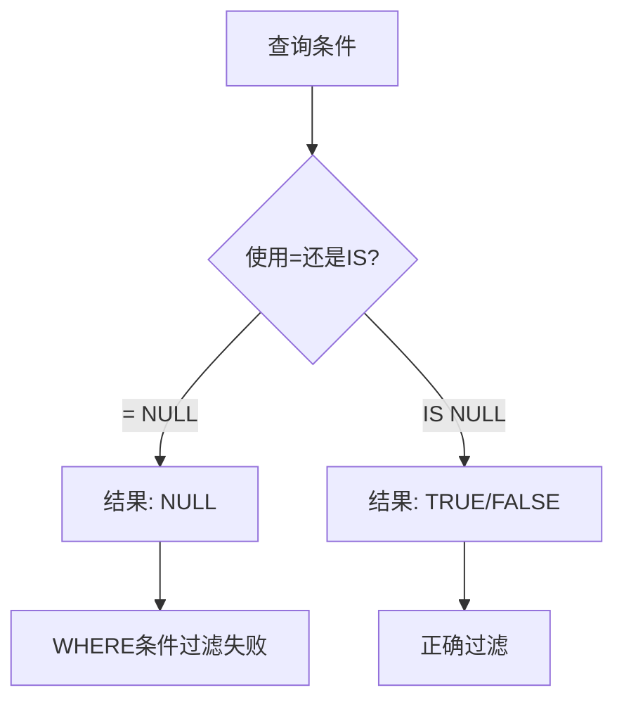
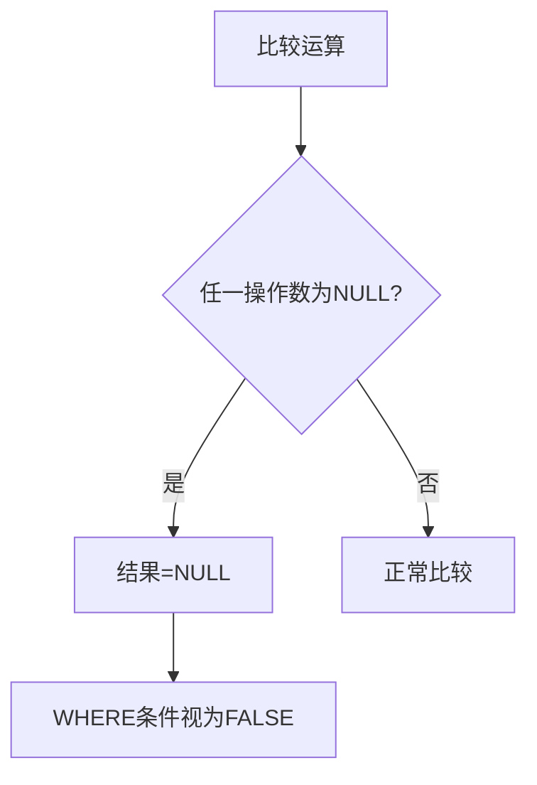
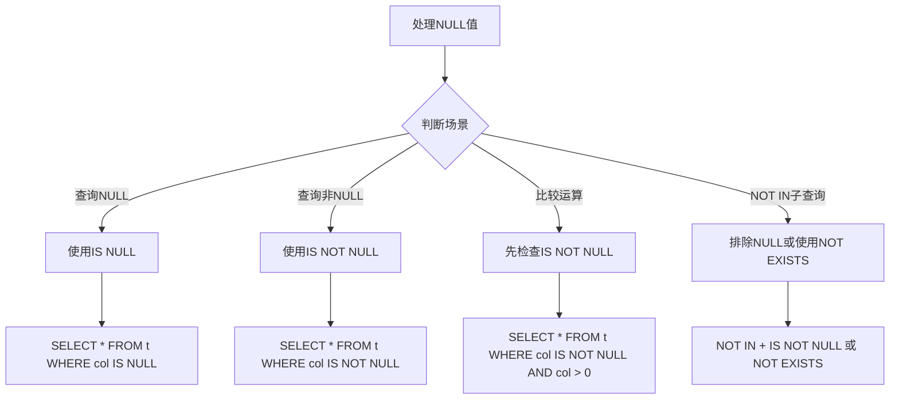

# MySQL踩坑 - NULL查询

## 一、NULL值的概念

### 1.1 什么是NULL

在MySQL中，`NULL`表示**缺少值**或**未知值**，它不是一个具体的值，而是一个标记。

### 1.2 NULL与空字符串、0的区别

| 值类型 | 说明 | 示例 |
|--------|------|------|
| **NULL** | 缺少值/未知值 | `SELECT NULL` |
| **空字符串''** | 长度为0的字符串 | `SELECT ''` |
| **0** | 数字零 | `SELECT 0` |

### 1.3 常见误区

```sql
-- ❌ 错误：NULL不等于任何值，包括它自己
SELECT NULL = NULL;  -- 结果：NULL（不是TRUE）

-- ✅ 正确：使用IS NULL判断
SELECT NULL IS NULL;  -- 结果：1（TRUE）
```

---

## 二、= NULL vs IS NULL

### 2.1 核心区别



### 2.2 对比表格

| 操作符 | 语法 | 结果类型 | 是否正确 |
|--------|------|----------|----------|
| `=` | `column = NULL` | NULL | ❌ 错误 |
| `<>` / `!=` | `column != NULL` | NULL | ❌ 错误 |
| `IS` | `column IS NULL` | TRUE/FALSE | ✅ 正确 |
| `IS NOT` | `column IS NOT NULL` | TRUE/FALSE | ✅ 正确 |

### 2.3 实际示例

```sql
-- 创建测试表
CREATE TABLE users (
    id INT PRIMARY KEY,
    name VARCHAR(50),
    email VARCHAR(100)
);

INSERT INTO users VALUES 
(1, '张三', 'zhangsan@example.com'),
(2, '李四', NULL),
(3, NULL, 'wangwu@example.com');

-- ❌ 错误写法：永远返回空结果
SELECT * FROM users WHERE email = NULL;  -- 返回空

-- ✅ 正确写法
SELECT * FROM users WHERE email IS NULL;  -- 返回李四
SELECT * FROM users WHERE email IS NOT NULL;  -- 返回张三、王五
```

---

## 三、NULL值的比较运算

### 3.1 三值逻辑

MySQL使用**三值逻辑**（Three-Valued Logic）：

| 逻辑值 | 含义 |
|--------|------|
| **TRUE** | 真 |
| **FALSE** | 假 |
| **NULL** | 未知 |

### 3.2 比较运算规则



### 3.3 运算结果表

| 表达式 | 结果 |
|--------|------|
| `NULL = 1` | NULL |
| `NULL != 1` | NULL |
| `NULL < 1` | NULL |
| `NULL > 1` | NULL |
| `NULL AND TRUE` | NULL |
| `NULL AND FALSE` | FALSE |
| `NULL OR TRUE` | TRUE |
| `NULL OR FALSE` | NULL |

---

## 四、NOT IN子查询包含NULL的陷阱

### 4.1 问题描述

当`NOT IN`子查询的结果集中包含`NULL`时，整个查询将返回**空结果**。

### 4.2 问题原因

```sql
-- 示例数据
CREATE TABLE orders (id INT, user_id INT);
INSERT INTO orders VALUES (1, 1), (2, 2), (3, 3);

CREATE TABLE banned_users (user_id INT);
INSERT INTO banned_users VALUES (1), (NULL);

-- ❌ 错误：返回空结果
SELECT * FROM orders 
WHERE user_id NOT IN (SELECT user_id FROM banned_users);
-- 结果：空集（因为包含NULL）
```

**原因分析**：
```sql
-- NOT IN等价于：
user_id != 1 AND user_id != NULL

-- 由于user_id != NULL的结果是NULL，整个表达式结果为NULL
-- WHERE条件中NULL被视为FALSE，所以没有记录被选中
```

### 4.3 解决方案

```sql
-- ✅ 方案1：排除NULL
SELECT * FROM orders 
WHERE user_id NOT IN (
    SELECT user_id FROM banned_users WHERE user_id IS NOT NULL
);

-- ✅ 方案2：使用NOT EXISTS
SELECT * FROM orders o
WHERE NOT EXISTS (
    SELECT 1 FROM banned_users bu 
    WHERE bu.user_id = o.user_id
);

-- ✅ 方案3：使用LEFT JOIN
SELECT o.* FROM orders o
LEFT JOIN banned_users bu ON o.user_id = bu.user_id
WHERE bu.user_id IS NULL;
```

---

## 五、踩坑案例分析

### 案例1：统计活跃用户数

```sql
-- 需求：统计有邮箱的用户数
SELECT COUNT(*) FROM users WHERE email != NULL;  -- ❌ 返回0
SELECT COUNT(*) FROM users WHERE email IS NOT NULL;  -- ✅ 正确
```

### 案例2：筛选非空字段

```sql
-- 需求：筛选姓名不为空的用户
SELECT * FROM users WHERE name = '' OR name != NULL;  -- ❌ 错误
SELECT * FROM users WHERE name IS NOT NULL;  -- ✅ 正确
```

### 案例3：关联查询中的NULL

```sql
-- 需求：查询没有订单的用户
SELECT u.* FROM users u
LEFT JOIN orders o ON u.id = o.user_id
WHERE o.id = NULL;  -- ❌ 返回空
WHERE o.id IS NULL;  -- ✅ 正确
```

---

## 六、最佳实践

### 6.1 NULL值处理流程图



### 6.2 最佳实践总结

| 场景 | 正确做法 | 错误做法 |
|------|----------|----------|
| 判断NULL | `col IS NULL` | `col = NULL` |
| 判断非NULL | `col IS NOT NULL` | `col != NULL` |
| 比较运算 | 先判断IS NOT NULL | 直接比较 |
| NOT IN子查询 | 排除NULL或用NOT EXISTS | 直接使用NOT IN |
| 默认值处理 | 使用COALESCE函数 | 依赖NULL判断 |

### 6.3 实用函数

```sql
-- COALESCE：返回第一个非NULL值
SELECT COALESCE(email, '未设置邮箱') FROM users;

-- IFNULL：如果为NULL则返回默认值
SELECT IFNULL(name, '匿名用户') FROM users;

-- NULLIF：如果两个值相等返回NULL，否则返回第一个值
SELECT NULLIF(status, 'deleted') FROM orders;
```

---

## 七、总结

MySQL中的NULL值处理有其特殊性，主要注意以下几点：

1. **`= NULL`永远返回NULL**，必须使用`IS NULL`
2. **三值逻辑**：TRUE、FALSE、NULL
3. **NOT IN包含NULL**会导致空结果
4. **WHERE条件中NULL视为FALSE**

遵循这些规则，可以避免大部分NULL相关的陷阱！
