# 如何减少回表操作

## 目录

1. [回表操作概述](#1-回表操作概述)
2. [回表原理详解](#2-回表原理详解)
3. [回表操作示例](#3-回表操作示例)
4. [如何减少回表操作](#4-如何减少回表操作)
5. [索引下推（ICP）](#5-索引下推icp)
6. [覆盖索引详解](#6-覆盖索引详解)
7. [回表与索引下推的关系](#7-回表与索引下推的关系)
8. [实战案例](#8-实战案例)
9. [最佳实践总结](#9-最佳实践总结)

---

## 1. 回表操作概述

### 1.1 什么是回表

**回表**是 MySQL InnoDB 存储引擎中，使用辅助索引（Secondary Index）查询数据时，需要根据索引记录中保存的主键值，再去聚簇索引中查找完整行数据的过程。


### 1.2 回表操作的过程

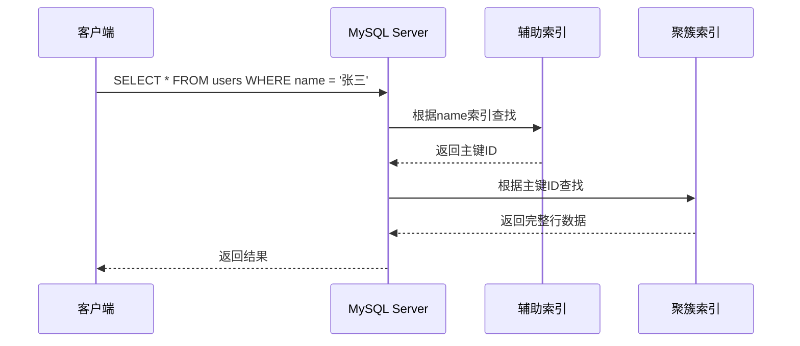

### 1.3 为什么回表会影响性能

| 影响 | 说明 |
|------|------|
| **额外的 IO** | 每个回表操作都需要一次磁盘 IO |
| **随机 IO** | 主键查找可能导致随机读取 |
| **查询延迟** | 回表次数越多，延迟越高 |

---

## 2. 回表原理详解

### 2.1 InnoDB 索引结构

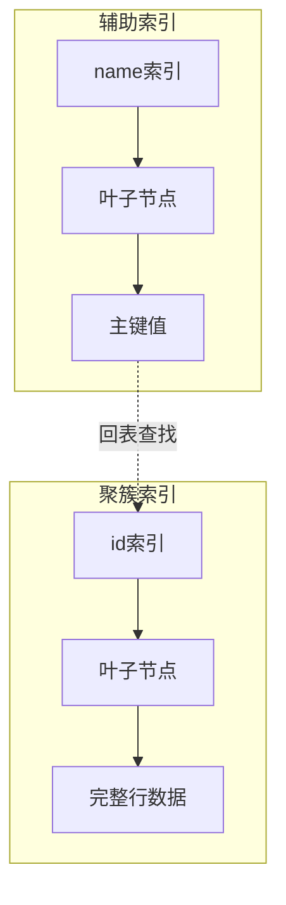

### 2.2 辅助索引与聚簇索引的关系

| 索引类型 | 存储内容 | 作用 |
|---------|---------|------|
| **辅助索引** | 索引列值 + 主键值 | 快速定位记录 |
| **聚簇索引** | 主键值 + 完整行数据 | 直接获取完整数据 |

### 2.3 回表查询的完整流程

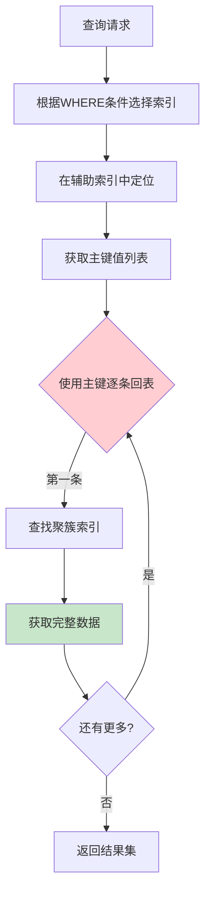

---

## 3. 回表操作示例

### 3.1 简单回表查询

**表结构**：
```sql
CREATE TABLE users (
    id BIGINT PRIMARY KEY,
    name VARCHAR(50),
    age INT,
    email VARCHAR(100),
    phone VARCHAR(20)
);
```

**查询语句**：
```sql
SELECT * FROM users WHERE name = '张三';
```

**执行过程**：
1. 根据 `name` 索引找到对应记录
2. 获取主键 `id = 1`
3. 根据 `id` 回表到聚簇索引
4. 获取完整行数据

### 3.2 使用 EXPLAIN 分析回表

```sql
EXPLAIN SELECT * FROM users WHERE name = '张三';
```

**结果分析**：

| 字段 | 值 | 说明 |
|------|-----|------|
| type | ref | 使用索引查找 |
| key | idx_name | 使用了 name 索引 |
| rows | 1 | 预计扫描 1 行 |
| Extra | Using index condition | 使用了索引条件下推 |

### 3.3 回表次数过多的性能问题

**问题场景**：
```sql
-- 查询所有姓张的用户
SELECT * FROM users WHERE name LIKE '张%';
```

**问题分析**：
- 如果有 10000 条姓张的记录
- 需要回表 10000 次
- 可能产生 10000 次随机 IO

---

## 4. 如何减少回表操作

### 4.1 减少回表的核心方法

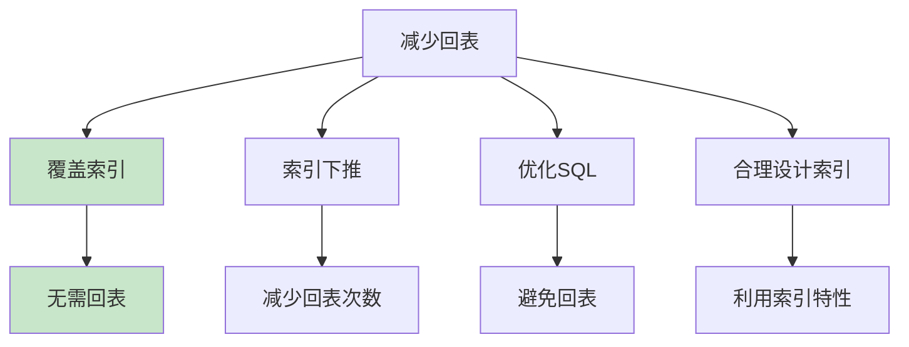

### 4.2 四种主要方法

| 方法 | 说明 | 适用场景 |
|------|------|---------|
| **覆盖索引** | 查询列都在索引中 | 只需要索引列的查询 |
| **索引下推** | WHERE 条件下推到索引层 | 多条件组合查询 |
| **优化 SQL** | 避免 SELECT * | 所有查询 |
| **合理索引设计** | 联合索引最左前缀 | 范围查询 |

---

## 5. 索引下推（ICP）

### 5.1 什么是索引下推

**索引下推（Index Condition Pushdown，ICP）** 是 MySQL 5.6+ 引入的优化特性。它可以将 WHERE 条件下推到存储引擎层，在索引层面直接过滤数据，减少回表次数。

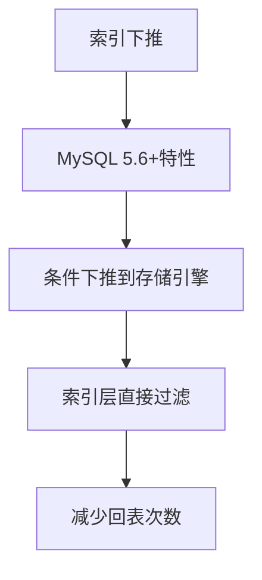

### 5.2 索引下推原理

#### 传统流程 vs ICP 流程

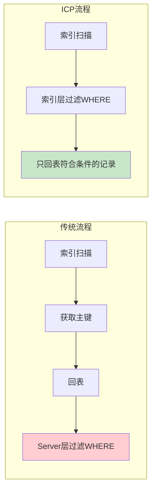

### 5.3 索引下推示例

**联合索引**：
```sql
CREATE INDEX idx_name_age ON users(name, age);
```

**查询语句**：
```sql
SELECT * FROM users WHERE name = '张三' AND age > 20;
```

#### 无 ICP（MySQL 5.6 之前）

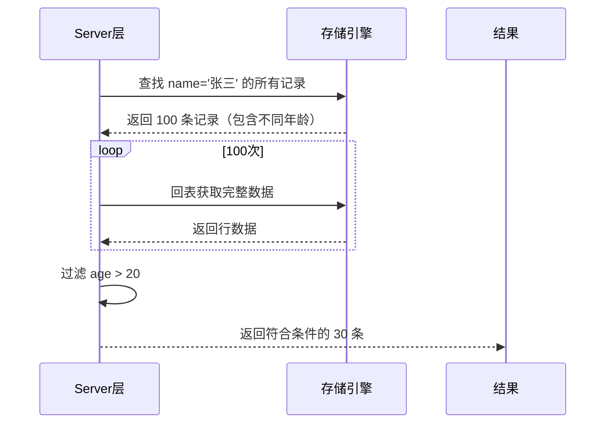

#### 有 ICP（MySQL 5.6+）

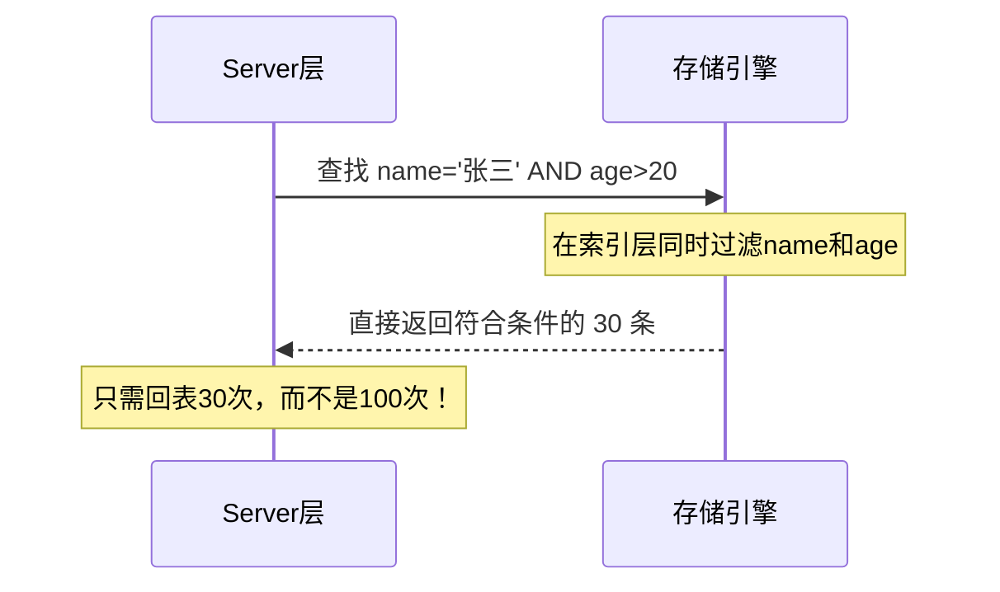

### 5.4 索引下推的判断

```sql
-- 查看是否使用 ICP
EXPLAIN SELECT * FROM users WHERE name = '张三' AND age > 20;
```

**EXPLAIN 结果分析**：

| Extra 信息 | 说明 |
|-----------|------|
| **Using index condition** | 使用了索引下推（ICP） |
| **Using index** | 使用了覆盖索引，无需回表 |
| **Using where** | 在 Server 层过滤数据 |

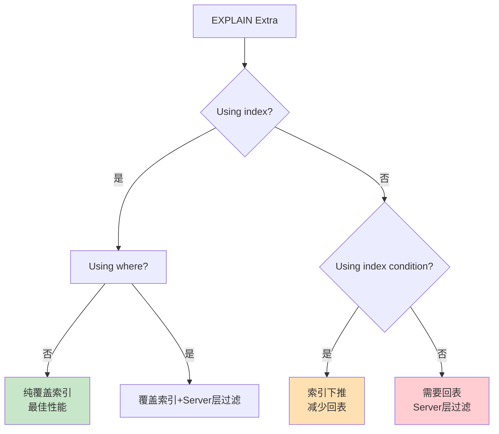

### 5.5 索引下推的限制

| 限制条件 | 说明 |
|---------|------|
| **只能用于辅助索引** | 聚簇索引不需要回表 |
| **支持 AND 条件** | OR 条件不能下推 |
| **索引列直接比较** | 不能是函数或表达式 |
| **存储引擎支持** | InnoDB 和 MyISAM 支持 |

---

## 6. 覆盖索引详解

### 6.1 什么是覆盖索引

**覆盖索引**是指一个索引包含了查询所需的所有列，使得查询无需回表即可获取完整数据。


### 6.2 覆盖索引的判断

```sql
-- 查看是否为覆盖索引
EXPLAIN SELECT name, age FROM users WHERE name = '张三' AND age > 20;
```

**覆盖索引特征**：
- `Extra` 列显示 `Using index`
- `key` 列显示使用的索引
- 不需要访问聚簇索引

### 6.3 覆盖索引示例

**创建覆盖索引**：
```sql
-- 为 name, age 创建联合索引
CREATE INDEX idx_name_age ON users(name, age);

-- 查询只需要索引列
SELECT name, age FROM users WHERE name = '张三';
```

**执行过程**：


### 6.4 覆盖索引的适用场景

| 场景 | 说明 |
|------|------|
| **只查询索引列** | SELECT 后的列都在索引中 |
| **高频查询** | 减少 IO 提高响应速度 |
| **分页查询** | 只需要索引列的分页 |
| **统计查询** | COUNT、SUM、AVG 等聚合 |

---

## 7. 回表与索引下推的关系

### 7.1 性能对比

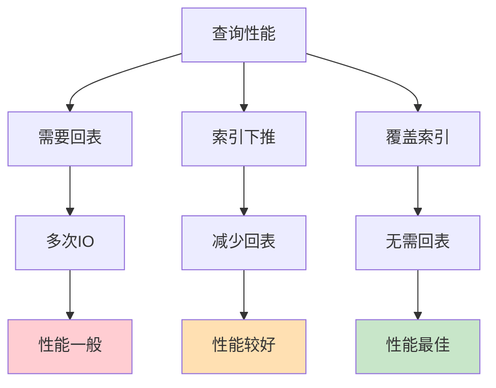

### 7.2 三种查询方式对比

| 查询方式 | 回表次数 | Extra 显示 | 性能 |
|---------|---------|-----------|------|
| **普通索引查询** | N 次 | Using index condition | ⭐⭐ |
| **索引下推** | M 次（M<N） | Using index condition | ⭐⭐⭐ |
| **覆盖索引** | 0 次 | Using index | ⭐⭐⭐⭐⭐ |

### 7.3 最佳实践

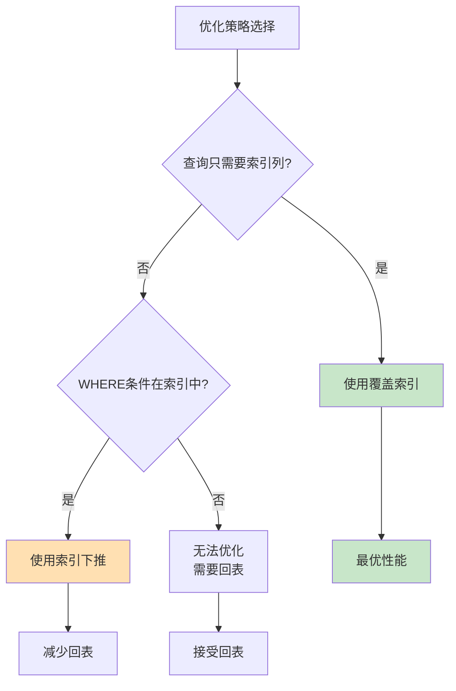

---

## 8. 实战案例

### 案例 1：用户表查询优化

**原始查询**：
```sql
-- 表结构
CREATE TABLE users (
    id BIGINT PRIMARY KEY,
    name VARCHAR(50),
    age INT,
    email VARCHAR(100),
    phone VARCHAR(20),
    create_time DATETIME
);

-- 查询所有成年用户
SELECT * FROM users WHERE age >= 18;
```

**问题**：需要回表获取所有列

**优化方案**：
```sql
-- 方案1：使用覆盖索引
CREATE INDEX idx_age ON users(age);

-- 如果只需要 age 和 id
SELECT age, id FROM users WHERE age >= 18;  -- 覆盖索引，无需回表

-- 方案2：索引下推优化
-- 假设需要 name, age, email
CREATE INDEX idx_age_name_email ON users(age, name, email);

SELECT name, email FROM users WHERE age >= 18;  -- 索引下推 + 覆盖
```

### 案例 2：订单表分页查询优化

**原始查询**：
```sql
SELECT * FROM orders 
WHERE status = 1 
ORDER BY create_time DESC 
LIMIT 100000, 10;
```

**问题分析**：
- 需要回表获取所有列
- 深分页性能差

**优化方案**：
```sql
-- 方案1：使用覆盖索引
CREATE INDEX idx_status_time ON orders(status, create_time);

-- 只查询索引列
SELECT id, status, create_time 
FROM orders 
WHERE status = 1 
ORDER BY create_time DESC 
LIMIT 100000, 10;

-- 方案2：延迟关联
SELECT * FROM orders o
INNER JOIN (
    SELECT id FROM orders 
    WHERE status = 1 
    ORDER BY create_time DESC 
    LIMIT 100000, 10
) t ON o.id = t.id;
```

### 案例 3：统计查询优化

**原始查询**：
```sql
SELECT COUNT(*) FROM orders WHERE status = 1;
```

**优化方案**：
```sql
-- 使用覆盖索引，COUNT 只需读索引
CREATE INDEX idx_status ON orders(status);

-- EXPLAIN 显示 Using index，无需回表
EXPLAIN SELECT COUNT(*) FROM orders WHERE status = 1;
```

---

## 9. 最佳实践总结

### 9.1 设计阶段

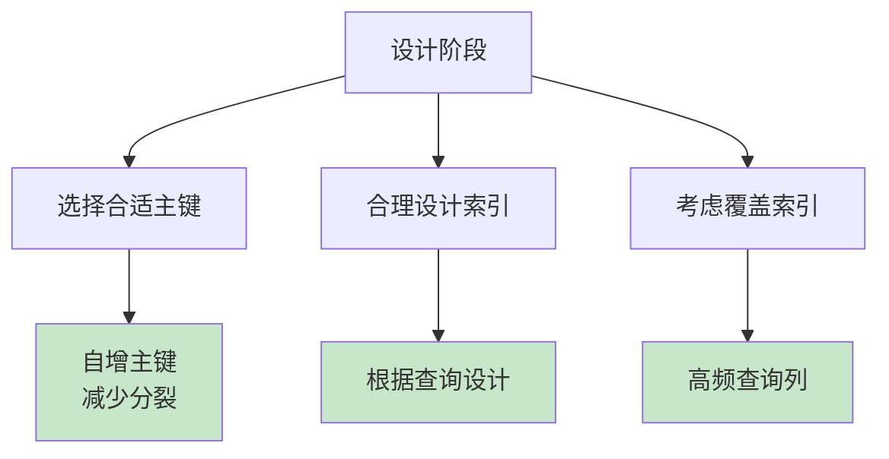

| 建议 | 说明 |
|------|------|
| **使用自增主键** | 插入性能好，减少页分裂 |
| **根据查询设计索引** | 避免过多索引 |
| **考虑覆盖索引** | 将高频查询列加入索引 |

### 9.2 开发阶段

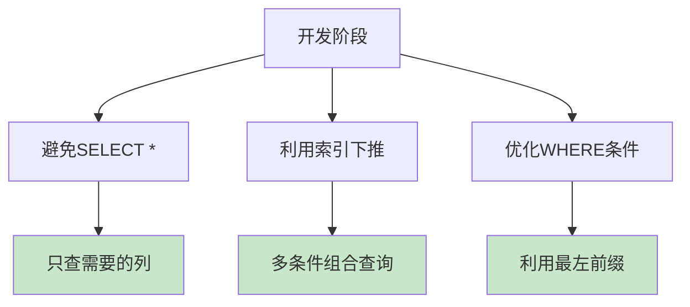

| 建议 | 说明 |
|------|------|
| **避免 SELECT *** | 只查询需要的列 |
| **利用索引下推** | 将条件放到索引层 |
| **优化 WHERE 条件** | 符合最左前缀原则 |

### 9.3 运维阶段

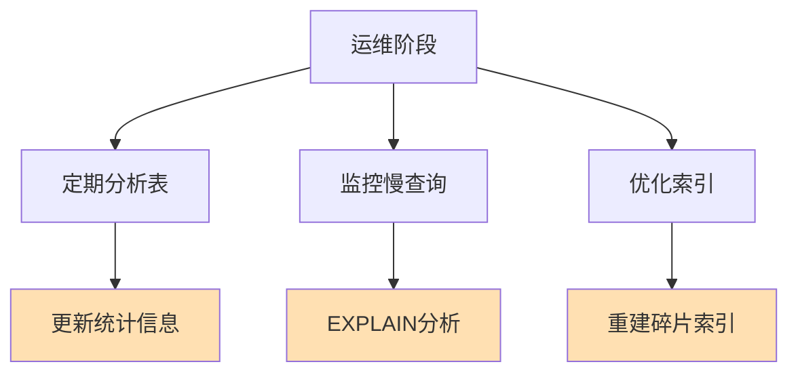

| 建议 | 说明 |
|------|------|
| **定期 ANALYZE TABLE** | 更新统计信息 |
| **监控慢查询** | 发现性能问题 |
| **优化索引** | 使用 OPTIMIZE TABLE |

---

## 总结

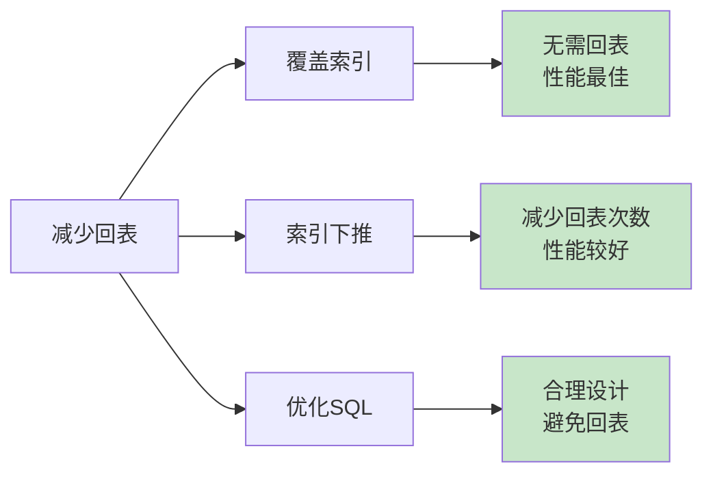

### 核心要点

1. **回表是性能开销的主要来源**
2. **覆盖索引可以完全避免回表**
3. **索引下推可以有效减少回表次数**
4. **避免 SELECT * 只查询需要的列**
5. **合理设计联合索引，利用最左前缀**
6. **使用 EXPLAIN 分析查询计划**

---

## 参考资料

1. [MySQL 官方文档 - Index Condition Pushdown](https://dev.mysql.com/doc/refman/8.0/en/index-condition-pushdown-optimization.html)
2. [MySQL 官方文档 - EXPLAIN Output Format](https://dev.mysql.com/doc/refman/8.0/en/explain-output.html)
3. [MySQL 官方文档 - Covering Indexes](https://dev.mysql.com/doc/refman/8.0/en/glossary.html#glos_covering_index)
