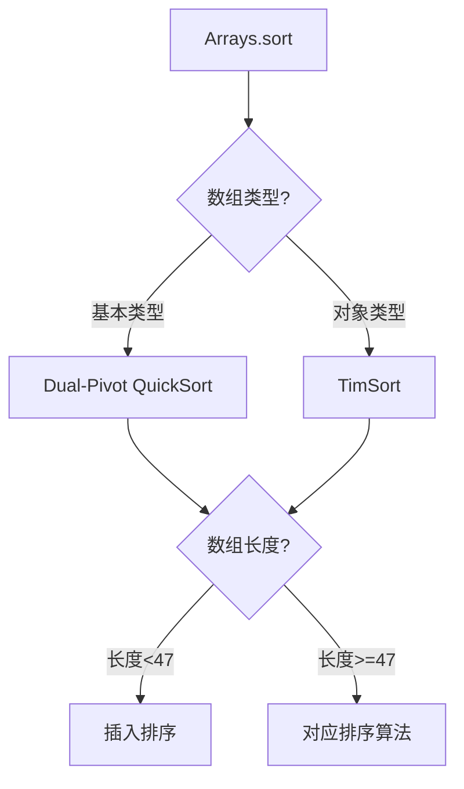
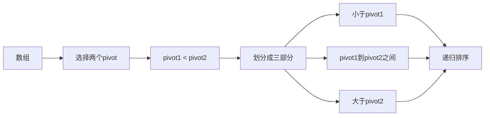
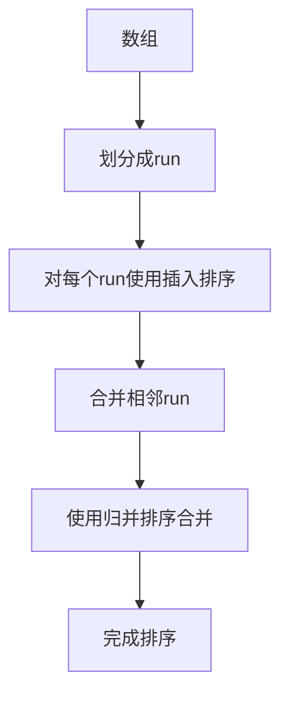
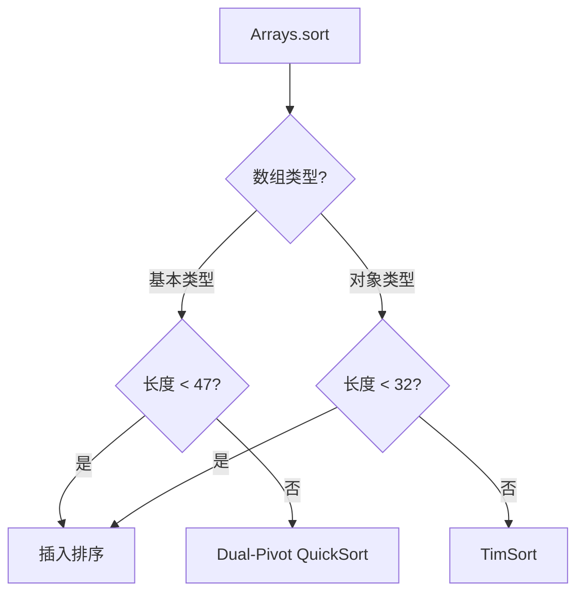
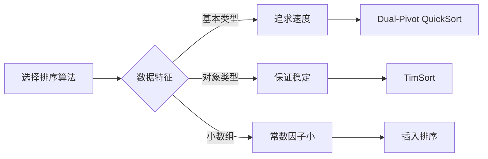

# Arrays.sort排序算法详解

## 一、Arrays.sort概述

### 1.1 基本概念

`Arrays.sort`是Java标准库中用于数组排序的静态方法，根据数组类型选择不同的排序算法：

| 数组类型                                  | 使用的排序算法                          | 时间复杂度      |
| ------------------------------------- | -------------------------------- | ---------- |
| **基本类型数组**（int\[], long\[], char\[]等） | **Dual-Pivot QuickSort**（双轴快速排序） | O(n log n) |
| **对象数组**（Object\[]）                   | **TimSort**（归并排序的优化版本）           | O(n log n) |
| **小数组**（长度 < 47）                      | **插入排序**                         | O(n²)      |

### 1.2 整体架构



***

## 二、基本类型数组排序 - Dual-Pivot QuickSort

### 2.1 算法原理

**双轴快速排序**是对传统快速排序的优化，使用两个基准元素（pivot）：



### 2.2 核心步骤

```java
// Dual-Pivot QuickSort核心逻辑
public static void sort(int[] a, int left, int right) {
    // 1. 选择两个pivot
    int pivot1 = a[left];
    int pivot2 = a[right];
    
    // 2. 确保pivot1 <= pivot2
    if (pivot1 > pivot2) {
        swap(a, left, right);
        pivot1 = a[left];
        pivot2 = a[right];
    }
    
    // 3. 划分指针
    int less = left + 1;
    int great = right - 1;
    int k = less;
    
    // 4. 遍历数组进行划分
    while (k <= great) {
        if (a[k] < pivot1) {
            swap(a, k++, less++);
        } else if (a[k] > pivot2) {
            swap(a, k, great--);
        } else {
            k++;
        }
    }
    
    // 5. 将pivot放到正确位置
    swap(a, left, --less);
    swap(a, right, ++great);
    
    // 6. 递归排序三部分
    sort(a, left, less - 1);
    sort(a, less + 1, great - 1);
    sort(a, great + 1, right);
}
```

### 2.3 算法优势

| 优势           | 说明                |
| ------------ | ----------------- |
| **减少递归深度**   | 双轴划分使每次递归处理更小的子数组 |
| **更好的缓存局部性** | 数据访问更连续           |
| **减少比较次数**   | 单次比较可以确定元素属于哪个区间  |

***

## 三、对象数组排序 - TimSort

### 3.1 算法原理

**TimSort**是一种混合排序算法，结合了归并排序和插入排序的优点：



### 3.2 Run的概念

**Run**是数组中已经有序的片段，TimSort会：

1. 扫描数组，识别自然有序的run
2. 对长度小于`MIN_MERGE`（默认32）的run使用插入排序
3. 使用归并排序合并相邻run

### 3.3 核心步骤

```java
// TimSort核心逻辑（简化版）
public static void sort(Object[] a) {
    int n = a.length;
    
    // 1. 最小run长度
    int minRun = minRunLength(n);
    
    // 2. 划分并排序每个run
    for (int i = 0; i < n; i += minRun) {
        int end = Math.min(i + minRun, n);
        // 对每个run使用插入排序
        binarySort(a, i, end);
    }
    
    // 3. 合并run
    // 使用栈管理待合并的run
    for (int size = minRun; size < n; size *= 2) {
        for (int left = 0; left < n; left += 2 * size) {
            int mid = left + size - 1;
            int right = Math.min(left + 2 * size - 1, n - 1);
            
            if (mid < right) {
                merge(a, left, mid, right);
            }
        }
    }
}
```

### 3.4 算法优势

| 优势           | 说明               |
| ------------ | ---------------- |
| **稳定性**      | 保持相等元素的相对顺序      |
| **处理部分有序数据** | 对于部分有序数组性能接近O(n) |
| **减少数据移动**   | 归并排序比快速排序移动次数少   |

***

## 四、小数组优化 - 插入排序

### 4.1 为什么使用插入排序

当数组长度较小时（小于47），插入排序的常数因子优势明显：

```java
// 小数组使用插入排序
if (length < INSERTIONSORT_THRESHOLD) {  // INSERTIONSORT_THRESHOLD = 47
    for (int i = left, j = i; i < right; j = ++i) {
        int ai = a[i + 1];
        while (ai < a[j]) {
            a[j + 1] = a[j];
            if (j-- == left) {
                break;
            }
        }
        a[j + 1] = ai;
    }
    return;
}
```

### 4.2 插入排序适用场景

| 场景            | 说明            |
| ------------- | ------------- |
| **小数组**（< 47） | 常数因子小         |
| **近乎有序数组**    | 性能接近O(n)      |
| **作为子排序算法**   | 配合快速排序/归并排序使用 |

***

## 五、排序算法对比

### 5.1 核心对比表

| 特性          | Dual-Pivot QuickSort | TimSort    | 插入排序   |
| ----------- | -------------------- | ---------- | ------ |
| **适用类型**    | 基本类型数组               | 对象数组       | 小数组    |
| **稳定性**     | 不稳定                  | 稳定         | 稳定     |
| **平均时间复杂度** | O(n log n)           | O(n log n) | O(n²)  |
| **最坏时间复杂度** | O(n²)                | O(n log n) | O(n²)  |
| **空间复杂度**   | O(log n)             | O(n)       | O(1)   |
| **特点**      | 快，缓存友好               | 稳定，处理有序数据好 | 简单，常数小 |

### 5.2 选择策略流程图



***

## 六、实际应用示例

### 6.1 基本类型数组排序

```java
int[] arr = {3, 1, 4, 1, 5, 9, 2, 6};
Arrays.sort(arr);
// 结果: [1, 1, 2, 3, 4, 5, 6, 9]
```

### 6.2 对象数组排序

```java
String[] arr = {"banana", "apple", "cherry", "date"};
Arrays.sort(arr);
// 结果: [apple, banana, cherry, date]
```

### 6.3 自定义比较器排序

```java
Person[] people = {
    new Person("张三", 25),
    new Person("李四", 20),
    new Person("王五", 30)
};

// 按年龄排序
Arrays.sort(people, Comparator.comparingInt(Person::getAge));
```

***

## 七、总结

### 7.1 核心要点

| 要点         | 说明                     |
| ---------- | ---------------------- |
| **基本类型数组** | 使用Dual-Pivot QuickSort |
| **对象数组**   | 使用TimSort              |
| **小数组优化**  | 长度<47使用插入排序            |
| **稳定性**    | 对象排序稳定，基本类型排序不稳定       |

### 7.2 设计思想



### 7.3 性能特点

| 数据特征     | 推荐算法                 | 原因     |
| -------- | -------------------- | ------ |
| **随机数据** | Dual-Pivot QuickSort | 平均性能好  |
| **部分有序** | TimSort              | 利用已有顺序 |
| **小数组**  | 插入排序                 | 常数因子小  |

