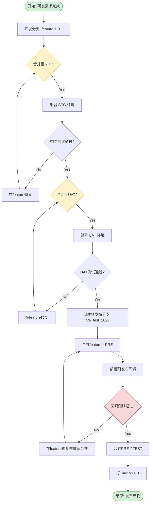
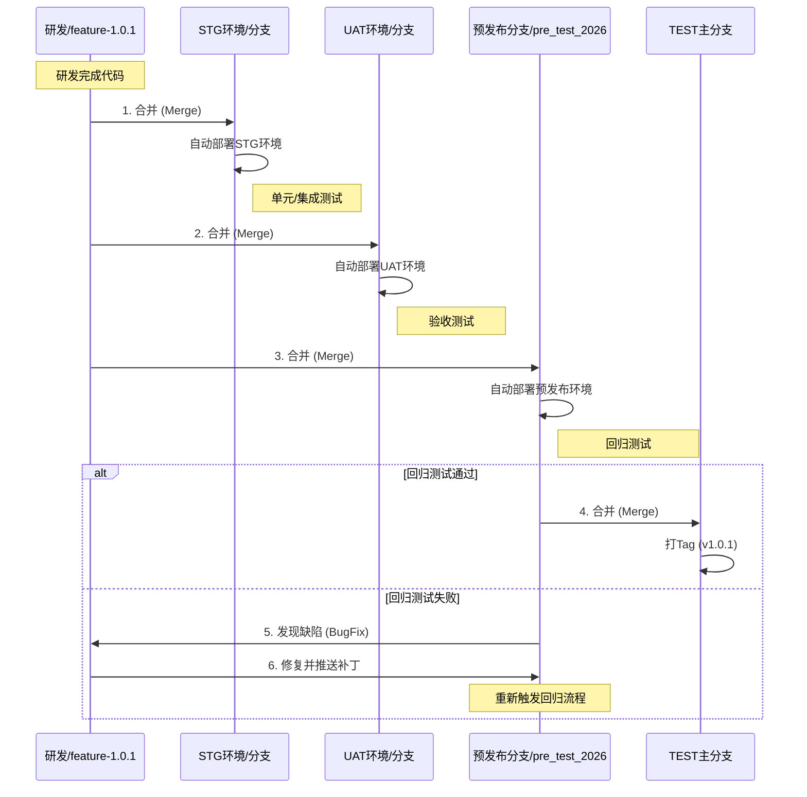
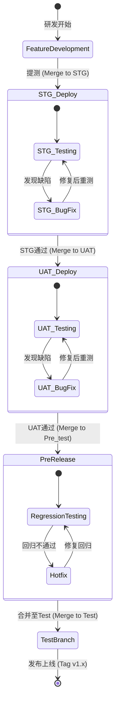
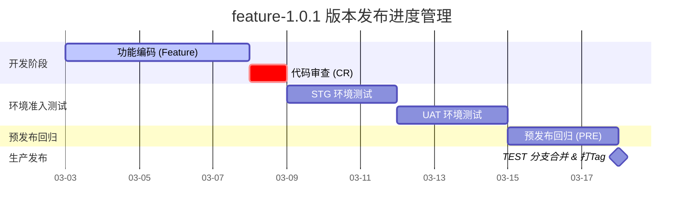
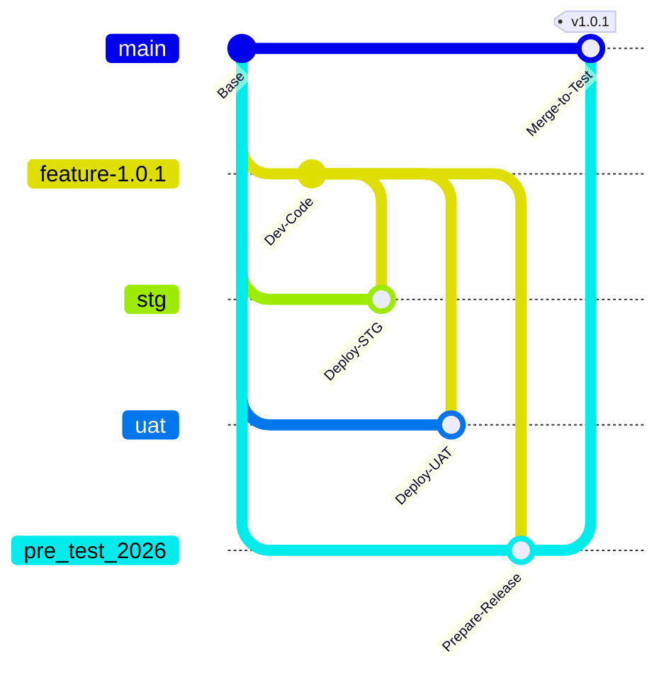
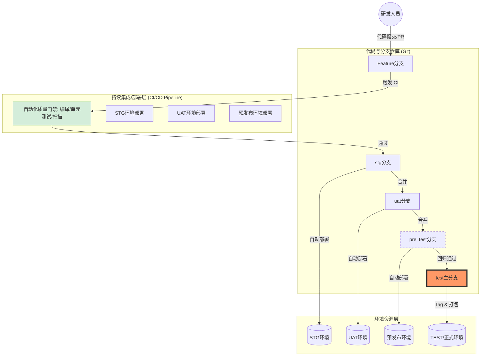

## Git分支管理

### 2.2.1 流程图

```mermaid
flowchart TD
    %% 开始节点
    Start([开始: 研发需求完成]) --> Dev[开发分支: feature-1.0.1]
    
    %% 阶段一：STG/UAT 测试
    Dev --> MergeSTG{合并至STG?}
    MergeSTG -- Yes --> DeploySTG[部署 STG 环境]
    DeploySTG --> TestSTG{STG测试通过?}
    TestSTG -- No --> FixSTG[在feature修复]
    FixSTG --> MergeSTG
    
    TestSTG -- Yes --> MergeUAT{合并至UAT?}
    MergeUAT -- Yes --> DeployUAT[部署 UAT 环境]
    DeployUAT --> TestUAT{UAT测试通过?}
    TestUAT -- No --> FixUAT[在feature修复]
    FixUAT --> MergeUAT
    
    %% 阶段二：预发布回归
    TestUAT -- Yes --> CreatePRE[创建预发布分支: pre_test_2026]
    CreatePRE --> MergePRE[合并feature至PRE]
    MergePRE --> DeployPRE[部署预发布环境]
    DeployPRE --> Regression{回归测试通过?}
    
    %% 阶段三：最终产出
    Regression -- No --> FixPRE[在feature修复并重新合并]
    FixPRE --> MergePRE
    
    Regression -- Yes --> MergeTEST[合并PRE至TEST]
    MergeTEST --> Tag[打 Tag: v1.0.1]
    Tag --> End([结束: 发布产物])

    %% 样式美化
    style Start fill:#d4edda,stroke:#28a745
    style End fill:#d4edda,stroke:#28a745
    style MergeSTG fill:#fff3cd,stroke:#ffc107
    style MergeUAT fill:#fff3cd,stroke:#ffc107
    style Regression fill:#f8d7da,stroke:#dc3545
```

#### 2.2.2 时序图

```mermaid
sequenceDiagram
    participant Dev as 研发/feature-1.0.1
    participant STG as STG环境/分支
    participant UAT as UAT环境/分支
    participant PRE as 预发布分支/pre_test_2026
    participant TST as TEST主分支

    Note over Dev: 研发完成代码
    Dev->>STG: 1. 合并 (Merge)
    STG->>STG: 自动部署STG环境
    Note right of STG: 单元/集成测试

    Dev->>UAT: 2. 合并 (Merge)
    UAT->>UAT: 自动部署UAT环境
    Note right of UAT: 验收测试

    Dev->>PRE: 3. 合并 (Merge)
    PRE->>PRE: 自动部署预发布环境
    Note right of PRE: 回归测试

    alt 回归测试通过
        PRE->>TST: 4. 合并 (Merge)
        TST->>TST: 打Tag (v1.0.1)
    else 回归测试失败
        PRE->>Dev: 5. 发现缺陷 (BugFix)
        Dev->>PRE: 6. 修复并推送补丁
        Note over PRE: 重新触发回归流程
    end
```

#### 2.2.3 状态图

```mermaid
stateDiagram-v2
    [*] --> FeatureDevelopment: 研发开始
    
    FeatureDevelopment --> STG_Deploy: 提测 (Merge to STG)
    
    state STG_Deploy {
        [*] --> STG_Testing
        STG_Testing --> STG_BugFix: 发现缺陷
        STG_BugFix --> STG_Testing: 修复后重测
    }
    
    STG_Deploy --> UAT_Deploy: STG通过 (Merge to UAT)
    
    state UAT_Deploy {
        [*] --> UAT_Testing
        UAT_Testing --> UAT_BugFix: 发现缺陷
        UAT_BugFix --> UAT_Testing: 修复后重测
    }
    
    UAT_Deploy --> PreRelease: UAT通过 (Merge to Pre_test)
    
    state PreRelease {
        [*] --> RegressionTesting
        RegressionTesting --> Hotfix: 回归不通过
        Hotfix --> RegressionTesting: 修复回归
    }
    
    PreRelease --> TestBranch: 合并至Test (Merge to Test)
    TestBranch --> [*]: 发布上线 (Tag v1.x)
```

#### 2.2.4 甘特图

```mermaid
gantt
    title feature-1.0.1 版本发布进度管理
    dateFormat  YYYY-MM-DD
    axisFormat  %m-%d
    
    section 开发阶段
    功能编码 (Feature)      :active, dev1, 2026-03-03, 5d
    代码审查 (CR)          :crit, cr1, after dev1, 1d
    
    section 环境准入测试
    STG 环境测试           :stg1, after cr1, 3d
    UAT 环境测试           :uat1, after stg1, 3d
    
    section 预发布回归
    预发布回归 (PRE)        :pre1, after uat1, 3d
    
    section 生产发布
    TEST 分支合并 & 打Tag  :milestone, m1, after pre1, 0d
```

#### 2.2.5 Git图

```mermaid
gitGraph
    commit id: "Base"
    branch feature-1.0.1
    checkout feature-1.0.1
    commit id: "Dev-Code"
    
    checkout main
    branch stg
    checkout stg
    merge feature-1.0.1 id: "Deploy-STG"
    
    checkout main
    branch uat
    checkout uat
    merge feature-1.0.1 id: "Deploy-UAT"
    
    checkout main
    branch pre_test_2026
    checkout pre_test_2026
    merge feature-1.0.1 id: "Prepare-Release"
    
    checkout main
    merge pre_test_2026 id: "Merge-to-Test" tag: "v1.0.1"
```

#### 2.2.7 架构图

```mermaid
graph TD
    %% 核心角色
    Dev((研发人员))
    
    subgraph "代码与分支仓库 (Git)"
        F[Feature分支]
        S[stg分支]
        U[uat分支]
        P[pre_test分支]
        T[test主分支]
    end
    
    subgraph "持续集成/部署层 (CI/CD Pipeline)"
        CI[自动化质量门禁: 编译/单元测试/扫描]
        Deploy_STG[STG环境部署]
        Deploy_UAT[UAT环境部署]
        Deploy_PRE[预发布环境部署]
    end
    
    subgraph "环境资源层"
        Env_STG[(STG环境)]
        Env_UAT[(UAT环境)]
        Env_PRE[(预发布环境)]
        Env_PROD[(TEST/正式环境)]
    end

    %% 交互路径
    Dev -->|代码提交/PR| F
    F -->|触发 CI| CI
    CI -->|通过| S
    S -->|自动部署| Env_STG
    S -->|合并| U
    U -->|自动部署| Env_UAT
    U -->|合并| P
    P -->|自动部署| Env_PRE
    P -->|回归通过| T
    T -->|Tag & 打包| Env_PROD

    %% 样式与关键约束
    style T fill:#f96,stroke:#333,stroke-width:4px
    style CI fill:#d4edda,stroke:#28a745
    style P stroke-dasharray: 5 5
```