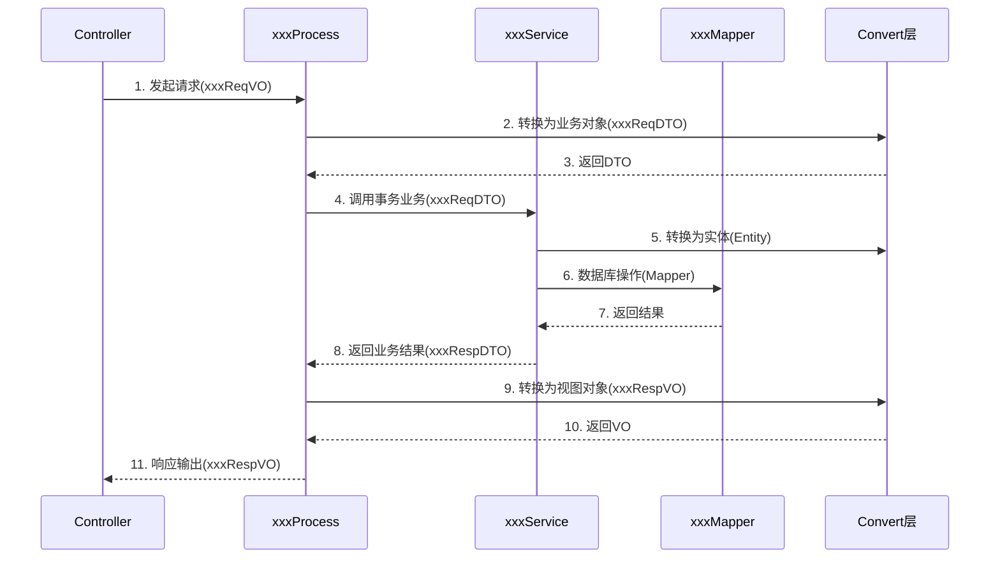
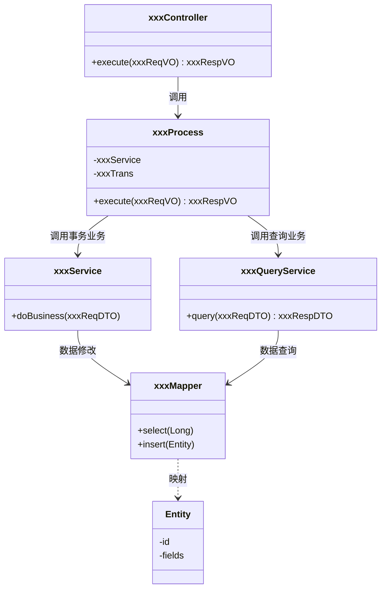

## 项目代码结构规范

## 一、关键分包

### api Module (对外提供微服务接口)

- data -- 数据对象层
  - req -- 请求参数对象
    - xxxReqVO -- 类命名
  - resp -- 响应参数对象
    - xxxRespVO -- 类命名
  - dto -- 公用数据体
- service -- api接口服务层

### client Module (对外提供微服务接口的客户端)

- service -- 微服务接口层

### provider Module

- config -- 启动自加载类（需审核后才能添加）
- annotation -- 自定义注解（需审核后才能添加）
- interceptor -- 自定义拦截器（需审核后才能添加）
- controller -- 业务控制层
  - xxx -- 按照业务功能分包(可选)
- process -- 业务聚合层
  - domain
    - xxx -- 按照业务功能分包(可选)
      - xxxProcess -- 类命名以Process结尾(不带事务)
      - xxxTrans -- 类命名以Trans结尾(带事务)
  - remote -- 外部远程调用
    - xxxCall -- 类命名
  - validator -- 数据校验处理层
    - xxxValidator -- 类命名
  - schedule -- 定时任务
    - xxxJob -- 类命名
  - mq -- 异步消息
    - consumer -- 消费者
      - xxxConsumer -- 类命名
    - producer -- 生产者
      - xxxProducer -- 类命名
- service -- 业务处理层
  - xxx -- 按照业务功能分包
    - xxxService -- 带事务service（增，删，改操作）
    - xxxQueryService -- 不带事务service（查询操作）
- mapper -- 数据处理层
- data -- 数据对象层
  - convert -- 不同层级对象转换
  - vo -- controller层对象
    - req -- 请求参数对象
      - xxxReqVO -- 类命名
    - resp -- 响应参数对象
      - xxxRespVO -- 类命名
  - bo -- 业务处理对象
    - xxxBO -- 类命名
  - entity -- 业务存储对象(与数据库表映射)
  - dto -- 数据传输对象
    - req -- 请求参数对象
      - xxxReqDTO -- 类命名
    - resp -- 响应参数对象
      - xxxRespDTO -- 类命名
- util -- 工具类
- constant -- 常量类（按照业务功能分多个类）
  - enums -- 枚举类（按照业务功能分多个类）

## 二、时序图/类图

## 三、总结

### 一、 整体架构评价：可行性与优势

**可行性评估：极高。** 该结构对于中大型微服务项目非常友好，优点显著：

1. **强职责切分：** 将查询（`QueryService`）与事务（`Service`）分离，这是一种非常高级的优化，能够有效避免长事务造成的数据库连接池锁定。
2. **业务聚合层（Process）与业务处理层（Service）的分层：** 这种设计为复杂的业务逻辑提供了良好的容器，防止 `Controller` 逻辑臃肿。
3. **清晰的防腐层设计：** `remote`（远程调用）与 `mq`（消息队列）的分层，为系统应对外部变动提供了很好的保护。

### 二、 禁止项

尽管结构清晰，但在落地执行中，你必须警惕以下**过度设计\**和\**逻辑耦合**的风险：

#### 1. “转换地狱”风险（Convert 类）

- **问题：** 定义了 `VO`, `BO`, `DTO`, `Model` 四层对象。在每一层流转时，手动编写转换代码会产生巨量、重复的样板代码。
- **修正建议：** 必须使用 `MapStruct` 或 `BeanUtils` 等工具进行自动转换，禁止在 `Convert` 层手动写 `get/set`。否则，维护成本将远超带来的系统灵活性。

#### 2. 查询与事务的分离

- **点赞：** 将 `xxxService` (事务) 和 `xxxQueryService` (非事务) 分开是极佳的实践。这在读写分离架构中能极大提升性能。
- **风险：** 确保开发人员严格遵守：`QueryService` **绝对禁止**出现任何修改数据库数据的逻辑。

### 注意

这并不是DDD领域驱动模型，这是一种**“业务分层架构”**，或者称为 **“基于微服务治理的事务脚本架构”**。

**它的定位非常准确：**

- **DDD 是重型武器：** 适用于业务逻辑复杂到极致，需要解决“业务建模”和“统一语言”的问题。

- **这个架构是手术刀：** 适用于**微服务环境下对工程质量、代码可读性、可维护性要求极高的场景**。牺牲了领域模型的复杂性，换取了团队开发的标准化和执行的低门槛。

  

这种架构在目前的互联网开发中实际上**比“纯粹的 DDD”更成功、更高效**。

- **优点：** 团队成员上手快，逻辑路径清晰，事务控制（`Trans` 类）非常显性，极大地减少了数据库死锁和事务回滚的诡异 Bug。
- **缺点：** 随着业务规模的无限扩大，由于业务逻辑分散在各个 `Service/Process` 中，可能会出现“业务代码散落”的问题。