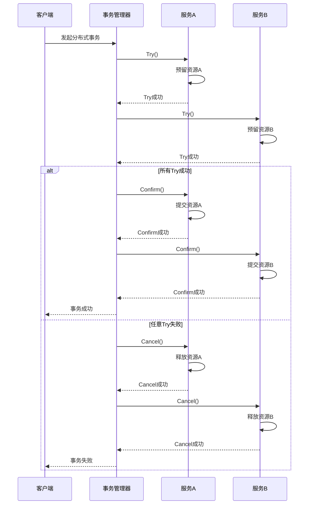
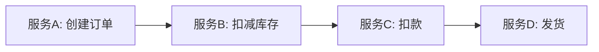
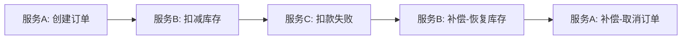
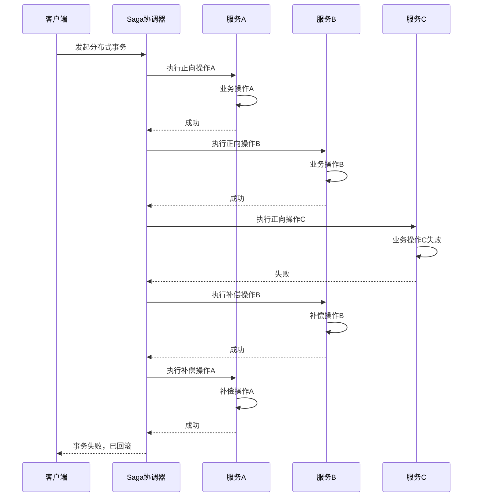
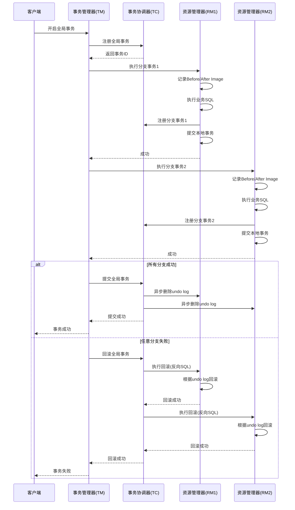
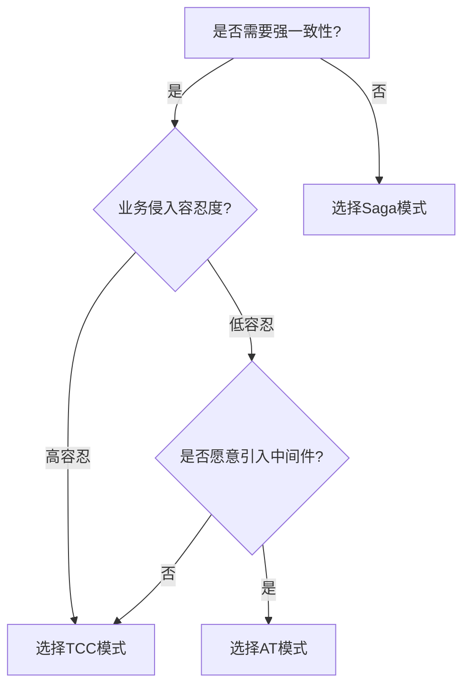

# 分布式事务

分布式事务是指跨越多个服务或数据源的事务，需要保证多个独立操作的原子性。在微服务架构中，分布式事务是一个核心难题。本文将介绍三种主流的分布式事务解决方案：TCC、Saga、AT模式。

---

## 一、TCC模式（Try-Confirm-Cancel）

### 1.1 概念与核心思想

TCC是一种基于业务层面的分布式事务解决方案，由Pat Helland在2007年提出。TCC将事务分为三个阶段：

- **Try（尝试）**：预留资源，检查业务条件，锁定数据
- **Confirm（确认）**：真正执行业务操作，提交事务
- **Cancel（取消）**：释放预留资源，回滚事务

### 1.2 三个阶段详解

#### Try阶段
- 执行所有业务检查（一致性校验）
- 预留业务资源（如冻结账户余额）
- 不提交事务，资源处于锁定状态

#### Confirm阶段
- 使用Try阶段预留的资源
- 真正执行业务操作
- 提交本地事务
- Confirm操作必须是幂等的

#### Cancel阶段
- 释放Try阶段预留的资源
- 回滚已执行的操作
- Cancel操作也必须是幂等的

### 1.3 TCC执行流程图

### 1.4 TCC模式优缺点

| 维度 | 优点 | 缺点 |
|------|------|------|
| **一致性** | 强一致性，资源锁定期间数据不会被其他事务修改 | 资源锁定时间长，可能导致性能问题 |
| **隔离性** | 高隔离性，通过资源预留实现 | 需要业务层实现锁定逻辑 |
| **性能** | 避免了两阶段提交的阻塞 | 每个服务需要实现三个方法，复杂度高 |
| **适用场景** | 需要强一致性的业务场景，如金融交易 | 不适合高并发场景 |

---

## 二、Saga模式

### 2.1 概念与核心思想

Saga模式由Garcia-Molina和Salem在1987年提出，是一种基于事件驱动的分布式事务解决方案。Saga将长事务分解为一系列短事务，每个短事务都有对应的补偿操作。

### 2.2 执行流程

Saga包含两种类型的操作：
- **正向操作**：正常执行业务逻辑
- **补偿操作**：撤销正向操作的影响

#### 正向执行

#### 失败回滚（假设服务C失败）

### 2.3 Saga执行流程图

### 2.4 Saga模式优缺点

| 维度 | 优点 | 缺点 |
|------|------|------|
| **一致性** | 最终一致性，通过补偿保证 | 无法保证强一致性，存在中间状态 |
| **隔离性** | 隔离性较低，可能出现脏读 | 没有资源锁定，数据可能被其他事务修改 |
| **性能** | 性能高，无锁等待 | 需要处理并发冲突和幂等性 |
| **适用场景** | 长事务、异步场景，如订单流程 | 不适合需要强一致性的场景 |

---

## 三、AT模式（Automatic Transaction）

### 3.1 概念与核心思想

AT模式是阿里巴巴Seata框架提出的一种分布式事务解决方案，它通过自动生成反向SQL来实现事务回滚，对业务代码无侵入。

### 3.2 核心机制

AT模式包含两个阶段：

#### 第一阶段（本地事务）
- 解析SQL，记录数据快照（Before Image和After Image）
- 执行业务SQL
- 注册分支事务到TC（事务协调器）
- 提交本地事务

#### 第二阶段（全局事务）
- **提交**：TC通知所有分支事务提交，Seata异步删除undo log
- **回滚**：TC通知所有分支事务回滚，Seata根据undo log生成反向SQL执行回滚

### 3.3 AT模式执行流程图

### 3.4 AT模式优缺点

| 维度 | 优点 | 缺点 |
|------|------|------|
| **一致性** | 强一致性，通过undo log保证 | 需要中间件支持，依赖Seata |
| **隔离性** | 高隔离性，通过全局锁实现 | 全局锁可能导致性能问题 |
| **性能** | 对业务无侵入，开发成本低 | 需要额外部署Seata服务 |
| **适用场景** | 需要强一致性且希望低侵入的场景 | 需要考虑Seata的可用性 |

---

## 四、三种模式对比分析

| 特性 | TCC模式 | Saga模式 | AT模式 |
|------|---------|----------|--------|
| **一致性** | 强一致性 | 最终一致性 | 强一致性 |
| **隔离性** | 高（资源锁定） | 低（无锁定） | 高（全局锁） |
| **性能** | 中等（有锁等待） | 高（无锁） | 中等（全局锁） |
| **业务侵入** | 高（需实现三个方法） | 中等（需实现补偿） | 低（无侵入） |
| **实现复杂度** | 高 | 中等 | 低 |
| **资源锁定时间** | 长（Try到Confirm完成） | 无 | 短（仅执行期间） |
| **适用场景** | 金融交易、强一致性要求 | 订单流程、长事务 | 通用场景、低侵入需求 |

---

## 五、选型建议

### 5.1 选择TCC模式的场景

- 需要强一致性和高隔离性的业务
- 金融交易场景（转账、支付）
- 资源需要严格锁定的场景

### 5.2 选择Saga模式的场景

- 长事务、异步流程
- 订单创建、库存扣减、发货等流程
- 可以接受最终一致性的场景
- 需要高并发、低延迟的场景

### 5.3 选择AT模式的场景

- 需要强一致性但希望低侵入
- 快速开发、降低学习成本
- 已有Seata生态的项目
- 通用业务场景

### 5.4 选型决策流程

---

## 总结

| 模式 | 一致性 | 性能 | 复杂度 | 推荐场景 |
|------|--------|------|--------|----------|
| TCC | 强 | 中等 | 高 | 金融交易、强一致性要求 |
| Saga | 最终 | 高 | 中等 | 订单流程、异步场景 |
| AT | 强 | 中等 | 低 | 通用场景、低侵入需求 |

选择哪种模式取决于业务对一致性的要求、性能需求以及开发成本的权衡。在实际项目中，可以根据具体场景灵活选择，甚至组合使用多种模式。
