# 分布式唯一ID怎么生成

## 目录

1. [分布式ID需求概述](#1-分布式id需求概述)
2. [常见ID生成方案](#2-常见id生成方案)
3. [雪花算法详解](#3-雪花算法详解)
4. [方案对比与选择](#4-方案对比与选择)
5. [最佳实践与注意事项](#5-最佳实践与注意事项)

---

## 1. 分布式ID需求概述

### 1.1 为什么需要分布式ID

在分布式系统中，多个节点需要生成全局唯一的标识符：

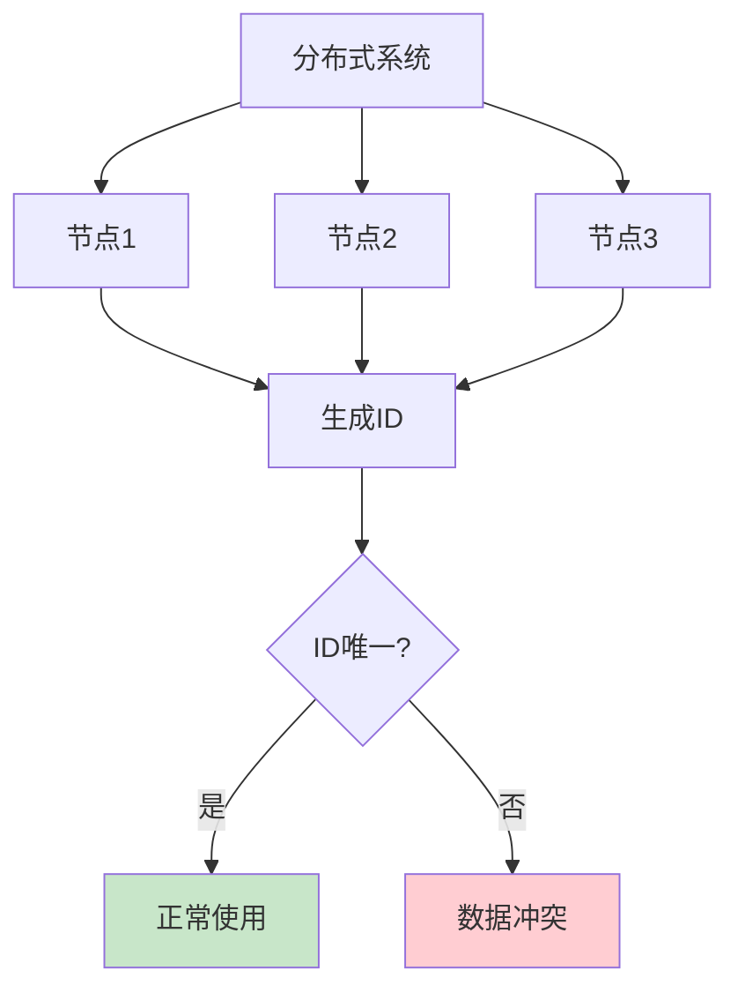

### 1.2 ID生成的核心要求

| 要求 | 说明 |
|------|------|
| **唯一性** | 全局唯一，不重复 |
| **有序性** | 按时间递增，便于排序和分页 |
| **高性能** | 高并发场景下的生成速度 |
| **高可用** | 服务不可中断 |
| **可扩展** | 支持水平扩展 |
| **安全性** | ID不能泄露业务信息 |

### 1.3 常见应用场景

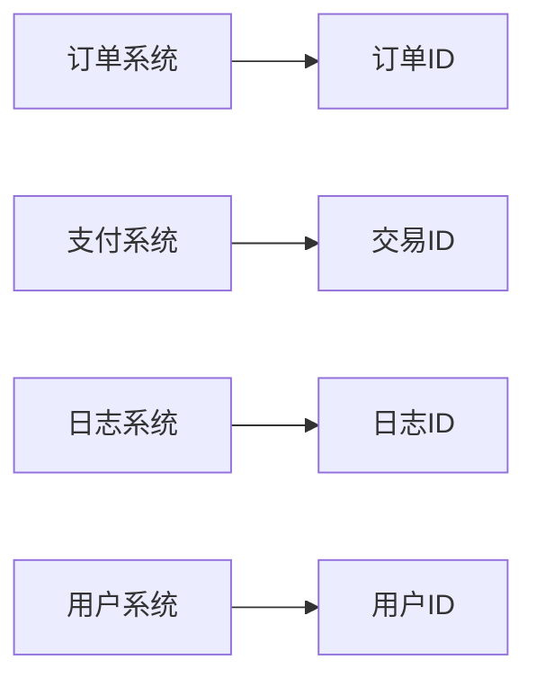

---

## 2. 常见ID生成方案

### 2.1 UUID

#### 原理

UUID（Universally Unique Identifier）是128位的全局唯一标识符：

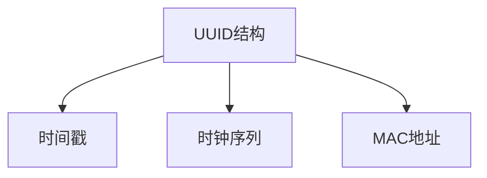

#### 代码示例

```java
// Java 生成 UUID
String uuid = UUID.randomUUID().toString();
// 输出: 550e8400-e29b-41d4-a716-446655440000
```

#### 优缺点

| 优点 | 缺点 |
|------|------|
| 本地生成，无需网络 | 无顺序，不利于数据库索引 |
| 高可用，无单点故障 | 字符串存储，空间占用大 |
| 实现简单 | 可读性差 |

### 2.2 数据库自增ID

#### 方案一：单一数据库

```sql
CREATE TABLE id_generator (
    id BIGINT PRIMARY KEY AUTO_INCREMENT
);
```

```java
// 获取自增ID
Statement stmt = connection.createStatement();
ResultSet rs = stmt.executeQuery("INSERT INTO id_generator VALUES ()");
long id = rs.getLong(1);
```

#### 方案二：分段ID（批量获取）

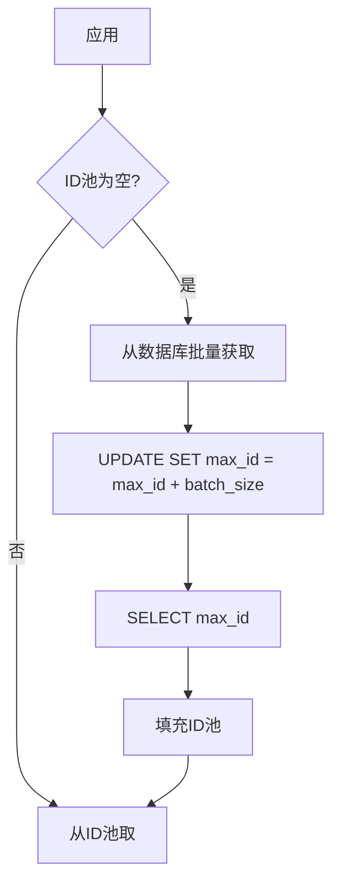

#### 优缺点

| 优点 | 缺点 |
|------|------|
| 有序递增 | 数据库单点故障风险 |
| 实现简单 | 性能受数据库限制 |
| 便于排序 | 水平扩展困难 |

### 2.3 Redis 生成器

#### 原理

利用 Redis 的原子操作 `INCR` 生成唯一ID：

```bash
# 生成ID
INCR user:id

# 设置初始值
SET user:id 100000
```

#### 代码示例

```java
// 使用 Jedis
Jedis jedis = new Jedis("localhost", 6379);
long id = jedis.incr("user:id");
```

#### 优缺点

| 优点 | 缺点 |
|------|------|
| 高性能，支持高并发 | 依赖Redis服务 |
| 有序递增 | 需要持久化保证 |
| 易于扩展 | 单点故障风险 |

### 2.4 雪花算法（Snowflake）

#### 原理

雪花算法生成64位的Long型ID，结构如下：

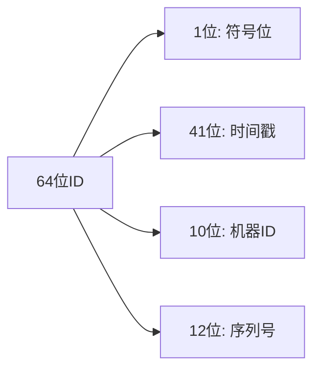

#### 代码示例

```java
public class SnowflakeIdGenerator {
    
    private final long epoch = 1609459200000L; // 2021-01-01 00:00:00
    private final long workerIdBits = 10L;
    private final long sequenceBits = 12L;
    
    private final long maxWorkerId = -1L ^ (-1L << workerIdBits);
    private final long maxSequence = -1L ^ (-1L << sequenceBits);
    
    private long workerId;
    private long sequence = 0L;
    private long lastTimestamp = -1L;
    
    public SnowflakeIdGenerator(long workerId) {
        if (workerId > maxWorkerId || workerId < 0) {
            throw new IllegalArgumentException("Worker ID out of range");
        }
        this.workerId = workerId;
    }
    
    public synchronized long nextId() {
        long timestamp = System.currentTimeMillis();
        
        if (timestamp < lastTimestamp) {
            throw new RuntimeException("Clock moved backwards");
        }
        
        if (timestamp == lastTimestamp) {
            sequence = (sequence + 1) & maxSequence;
            if (sequence == 0) {
                timestamp = waitNextMillis(lastTimestamp);
            }
        } else {
            sequence = 0L;
        }
        
        lastTimestamp = timestamp;
        
        return ((timestamp - epoch) << (workerIdBits + sequenceBits))
                | (workerId << sequenceBits)
                | sequence;
    }
    
    private long waitNextMillis(long lastTimestamp) {
        long timestamp = System.currentTimeMillis();
        while (timestamp <= lastTimestamp) {
            timestamp = System.currentTimeMillis();
        }
        return timestamp;
    }
}
```

#### 优缺点

| 优点 | 缺点 |
|------|------|
| 高性能，本地生成 | 需要协调机器ID |
| 有序递增 | 依赖系统时钟 |
| 高可用 | 时钟回拨问题 |
| 可扩展 | - |

### 2.5 美团 Leaf

#### 原理

美团 Leaf 结合了数据库分段和雪花算法：

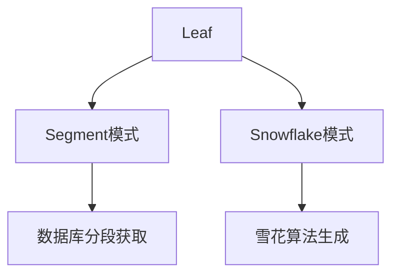

#### 特点

| 特性 | 说明 |
|------|------|
| **双模式** | 支持 Segment 和 Snowflake |
| **高可用** | 多节点部署 |
| **高性能** | 本地缓存分段 |
| **可监控** | 提供监控指标 |

---

## 3. 雪花算法详解

### 3.1 ID结构分析

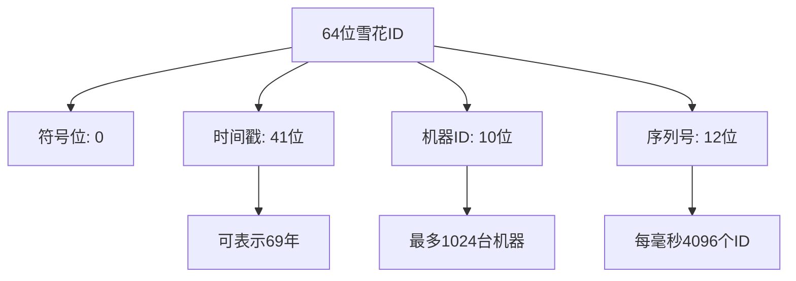

### 3.2 各部分含义

| 部分 | 位数 | 作用 |
|------|------|------|
| **符号位** | 1位 | 始终为0，表示正数 |
| **时间戳** | 41位 | 毫秒级时间戳，从epoch开始 |
| **机器ID** | 10位 | 标识不同机器，防止ID冲突 |
| **序列号** | 12位 | 同一毫秒内的序号 |

### 3.3 时间戳计算

```java
// 计算从epoch到现在的毫秒数
long timestamp = System.currentTimeMillis() - epoch;

// epoch 通常设置为项目开始时间
long epoch = 1609459200000L; // 2021-01-01 00:00:00
```

### 3.4 机器ID分配策略

#### 方案一：手动配置

```java
// 通过配置文件指定
long workerId = Long.parseLong(config.getProperty("worker.id"));
```

#### 方案二：自动分配（基于IP）

```java
// 根据IP地址生成机器ID
InetAddress addr = InetAddress.getLocalHost();
byte[] ip = addr.getAddress();
long workerId = (ip[2] & 0xFF) << 8 | (ip[3] & 0xFF);
workerId = workerId % 1024; // 取模保证在范围内
```

### 3.5 时钟回拨问题处理

```java
public synchronized long nextId() {
    long timestamp = System.currentTimeMillis();
    
    // 处理时钟回拨
    if (timestamp < lastTimestamp) {
        // 方案1: 抛出异常
        throw new RuntimeException("Clock moved backwards");
        
        // 方案2: 等待时钟恢复
        // while (timestamp < lastTimestamp) {
        //     timestamp = System.currentTimeMillis();
        // }
        
        // 方案3: 使用lastTimestamp
        // timestamp = lastTimestamp;
    }
    
    // ... 后续逻辑
}
```

---

## 4. 方案对比与选择

### 4.1 方案对比表格

| 方案 | 唯一性 | 有序性 | 性能 | 可用性 | 扩展性 | 复杂度 |
|------|--------|--------|------|--------|--------|--------|
| **UUID** | 高 | 无 | 极高 | 极高 | 极高 | 低 |
| **数据库自增** | 高 | 高 | 中 | 中 | 低 | 低 |
| **Redis生成器** | 高 | 高 | 高 | 中 | 中 | 中 |
| **雪花算法** | 高 | 高 | 极高 | 高 | 高 | 中 |
| **美团Leaf** | 高 | 高 | 高 | 高 | 高 | 高 |

### 4.2 适用场景分析

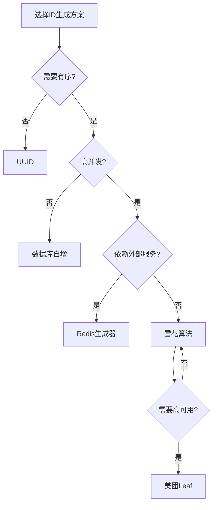

### 4.3 选择建议

| 场景 | 推荐方案 |
|------|---------|
| **低并发、无顺序要求** | UUID |
| **中小规模、简单场景** | 数据库自增 |
| **高并发、依赖Redis** | Redis生成器 |
| **高并发、独立部署** | 雪花算法 |
| **企业级、高可用** | 美团Leaf |

---

## 5. 最佳实践与注意事项

### 5.1 ID长度选择

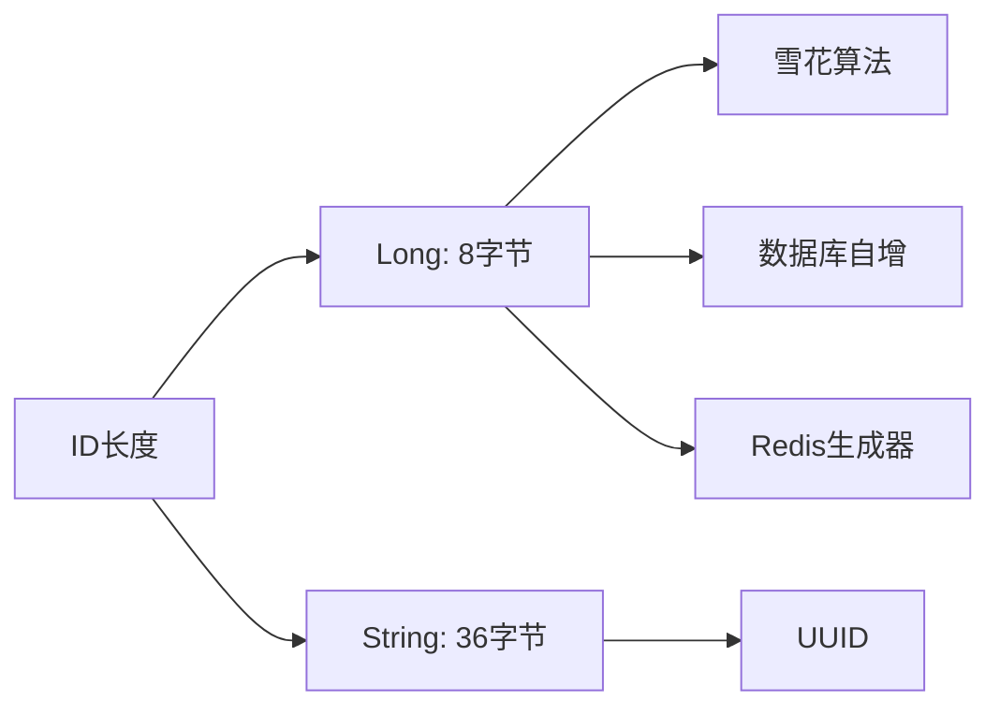

### 5.2 机器ID管理

```java
// 使用ZooKeeper自动分配机器ID
public class ZkWorkerIdAssigner {
    
    private static final String ZK_PATH = "/snowflake/worker_ids";
    
    public long assignWorkerId() {
        // 创建临时节点
        String path = zkClient.createEphemeralSequential(ZK_PATH + "/worker-", "");
        // 获取节点序号作为workerId
        String idStr = path.substring(path.lastIndexOf("-") + 1);
        return Long.parseLong(idStr) % 1024;
    }
}
```

### 5.3 时钟同步

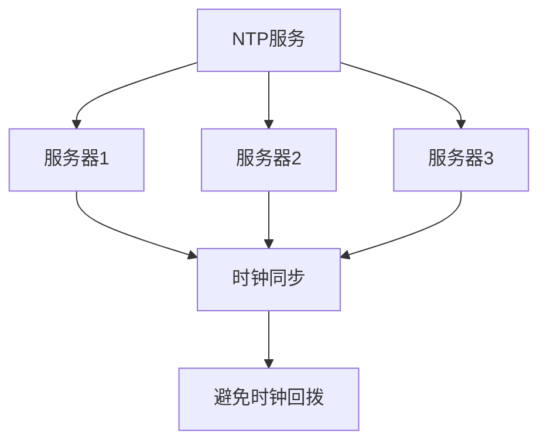

### 5.4 分布式部署注意事项

| 注意事项 | 说明 |
|----------|------|
| **机器ID唯一** | 确保每个节点的workerId不重复 |
| **时钟同步** | 使用NTP服务同步时间 |
| **持久化** | Redis方案需要开启持久化 |
| **监控告警** | 监控ID生成速率和异常 |

### 5.5 性能优化建议

```java
// 使用对象池减少锁竞争
public class SnowflakePool {
    
    private List<SnowflakeIdGenerator> generators = new ArrayList<>();
    private AtomicInteger index = new AtomicInteger(0);
    
    public SnowflakePool(int poolSize, long baseWorkerId) {
        for (int i = 0; i < poolSize; i++) {
            generators.add(new SnowflakeIdGenerator(baseWorkerId + i));
        }
    }
    
    public long nextId() {
        int idx = index.incrementAndGet() % generators.size();
        return generators.get(idx).nextId();
    }
}
```

---

## 总结

### ID生成方案选择流程

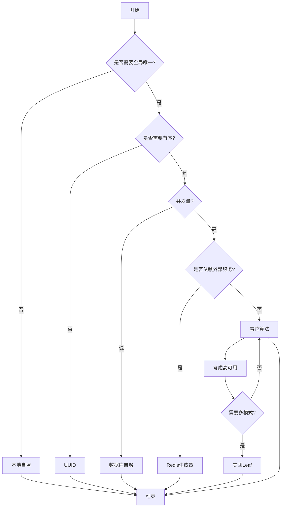

### 核心要点

1. **唯一性保障**：确保ID全局唯一是核心要求
2. **有序性**：有序ID便于数据库索引和排序
3. **性能**：高并发场景需要高性能的ID生成器
4. **高可用**：避免单点故障
5. **可扩展**：支持水平扩展

---

## 参考资料

1. [Twitter Snowflake](https://github.com/twitter-archive/snowflake)
2. [美团 Leaf](https://github.com/Meituan-Dianping/Leaf)
3. [UUID 规范](https://datatracker.ietf.org/doc/html/rfc4122)
