# HTTP 与 TCP

## 目录

1. [TCP/IP 协议栈概述](#1-tcpip-协议栈概述)
2. [TCP 协议详解](#2-tcp-协议详解)
3. [HTTP 协议详解](#3-http-协议详解)
4. [HTTPS 请求流程](#4-https-请求流程)
5. [HTTP vs HTTPS 对比](#5-http-vs-https-对比)
6. [实战案例](#6-实战案例)

---

## 1. TCP/IP 协议栈概述

### 1.1 OSI 七层模型

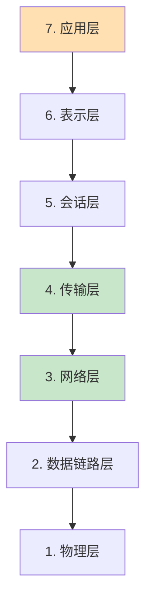

### 1.2 TCP/IP 四层模型

| 层级 | 协议 | 职责 |
|------|------|------|
| **应用层** | HTTP、HTTPS、FTP、DNS | 应用程序通信 |
| **传输层** | TCP、UDP | 端到端传输 |
| **网络层** | IP、ICMP、ARP | 路由和寻址 |
| **链路层** | Ethernet、Wi-Fi | 物理介质传输 |

### 1.3 各层协议职责

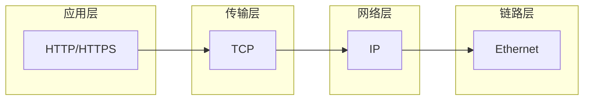

---

## 2. TCP 协议详解

### 2.1 TCP 特性

| 特性 | 说明 |
|------|------|
| **面向连接** | 建立连接后才传输数据 |
| **可靠传输** | 确认重传、序列号、校验和 |
| **面向字节流** | 无边界的字节序列 |
| **流量控制** | 滑动窗口机制 |
| **拥塞控制** | 慢启动、拥塞避免 |

### 2.2 TCP 三次握手（Three-way Handshake）

#### 三次握手流程

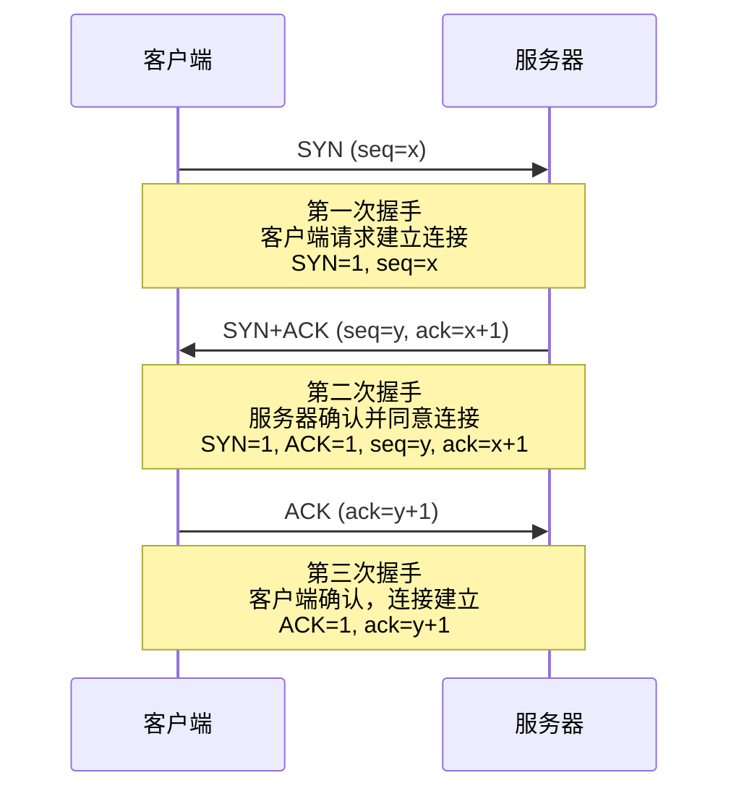

#### 标志位说明

| 标志位 | 含义 |
|--------|------|
| **SYN** | Synchronize，请求同步 |
| **ACK** | Acknowledgment，确认 |
| **FIN** | Finish，结束连接 |

#### 为什么需要三次握手？

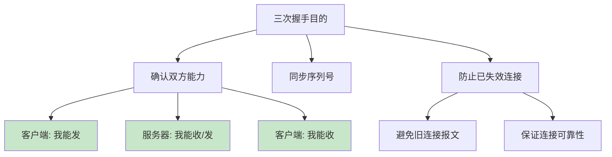

#### 状态转换

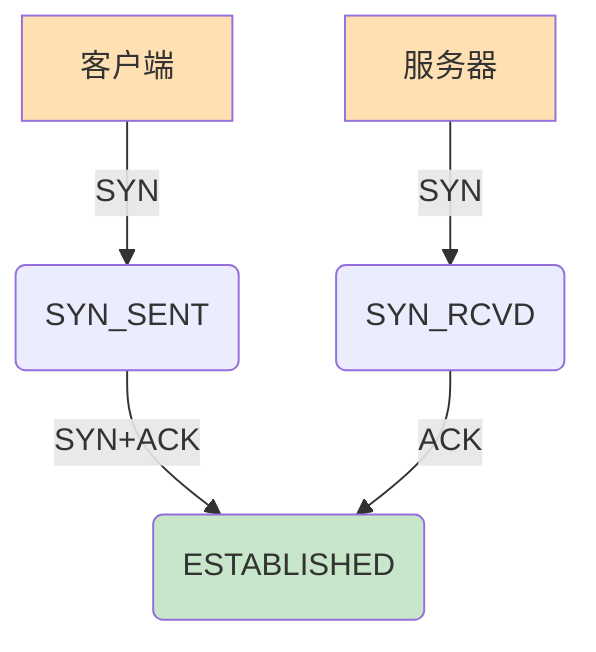

### 2.3 TCP 四次挥手（Four-way Handshake）

#### 四次挥手流程

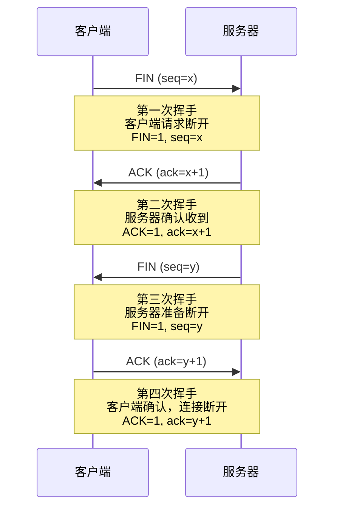

#### 为什么需要四次挥手？

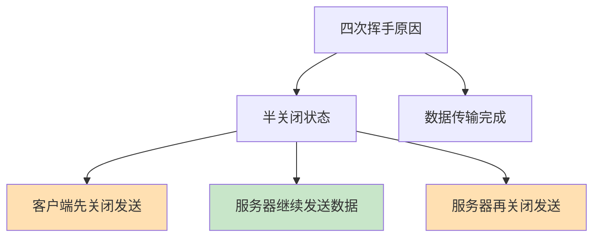

#### TIME_WAIT 状态详解

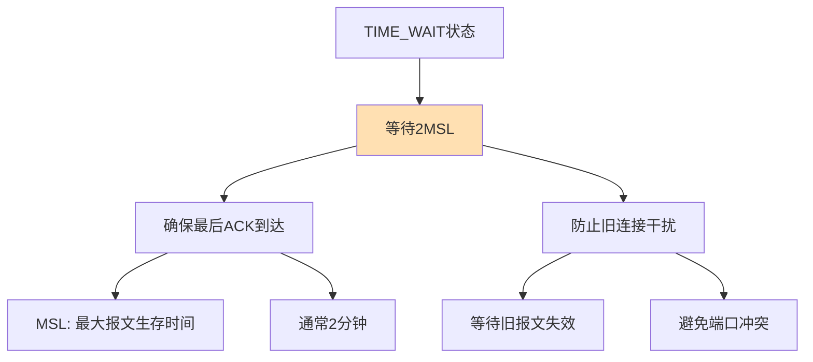

### 2.4 TCP 状态机

#### 11 种状态转换

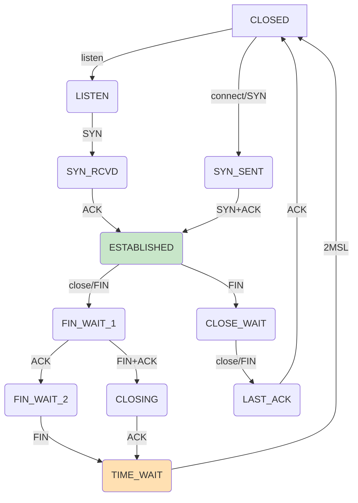

#### 状态转换表

| 状态 | 说明 |
|------|------|
| **CLOSED** | 初始状态 |
| **LISTEN** | 监听连接 |
| **SYN_SENT** | 已发送 SYN |
| **SYN_RCVD** | 已收到 SYN |
| **ESTABLISHED** | 连接建立 |
| **FIN_WAIT_1** | 等待对方 FIN |
| **FIN_WAIT_2** | 等待对方 FIN |
| **CLOSE_WAIT** | 等待关闭 |
| **CLOSING** | 双方同时关闭 |
| **LAST_ACK** | 等待最后 ACK |
| **TIME_WAIT** | 等待 2MSL |

---

## 3. HTTP 协议详解

### 3.1 HTTP 特点

| 特点 | 说明 |
|------|------|
| **无状态** | 不保存会话状态 |
| **基于请求-响应** | 客户端发起请求，服务器响应 |
| **明文传输** | 数据不加密 |
| **灵活** | 支持多种方法和头部 |

### 3.2 HTTP 请求结构

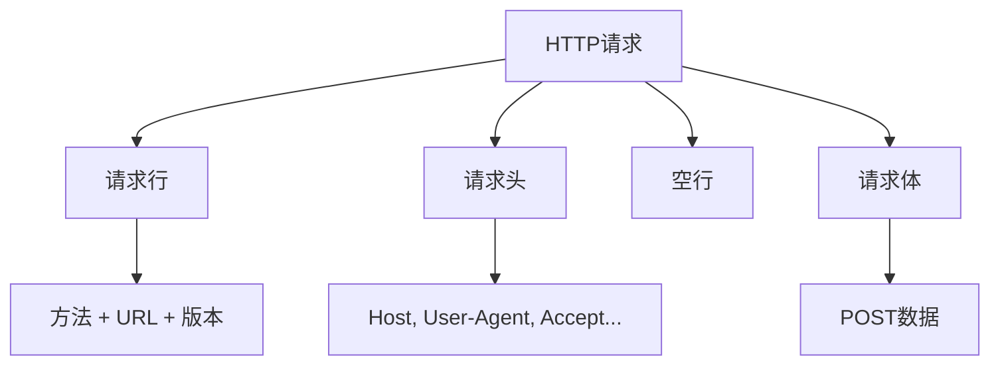

#### 请求行示例

```
GET /index.html HTTP/1.1
```

#### 请求头示例

```http
Host: www.example.com
User-Agent: Mozilla/5.0 (Windows NT 10.0; Win64; x64)
Accept: text/html,application/xhtml+xml
Accept-Language: zh-CN,zh;q=0.9
```

### 3.3 HTTP 响应结构

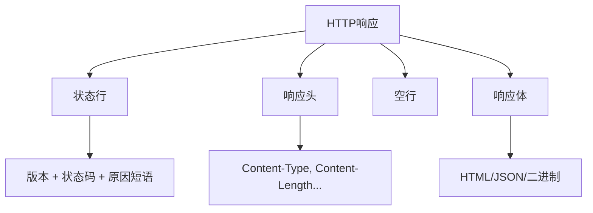

#### 状态行示例

```
HTTP/1.1 200 OK
```

#### 常见状态码

| 状态码 | 含义 |
|--------|------|
| **200** | 请求成功 |
| **301** | 永久重定向 |
| **302** | 临时重定向 |
| **400** | 请求错误 |
| **401** | 未授权 |
| **403** | 禁止访问 |
| **404** | 资源未找到 |
| **500** | 服务器错误 |
| **503** | 服务不可用 |

### 3.4 HTTP 方法

| 方法 | 含义 | 是否幂等 |
|------|------|---------|
| **GET** | 获取资源 | 是 |
| **POST** | 创建资源 | 否 |
| **PUT** | 更新资源 | 是 |
| **DELETE** | 删除资源 | 是 |
| **HEAD** | 获取响应头 | 是 |
| **OPTIONS** | 获取支持的方法 | 是 |
| **PATCH** | 部分更新 | 否 |

---

## 4. HTTPS 请求流程

### 4.1 HTTPS 原理

#### SSL/TLS 协议

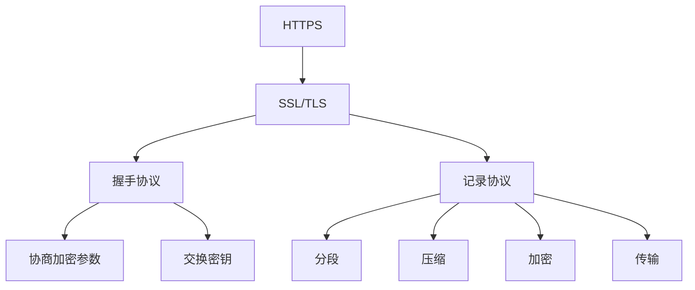

#### 对称加密与非对称加密

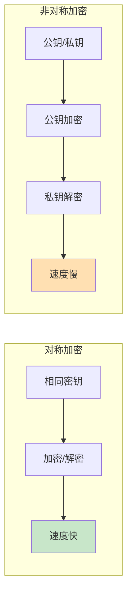

#### 数字证书

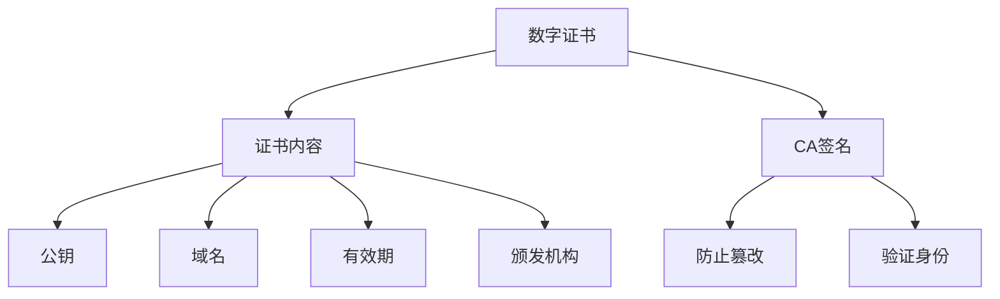

### 4.2 HTTPS 完整请求流程

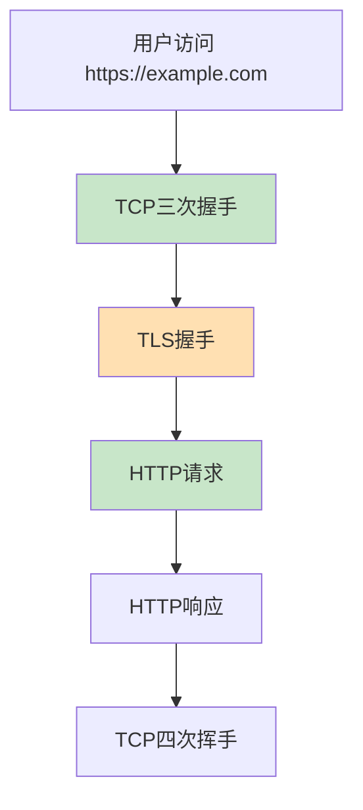

### 4.3 TLS 握手详解

#### 完整 TLS 1.2 握手流程

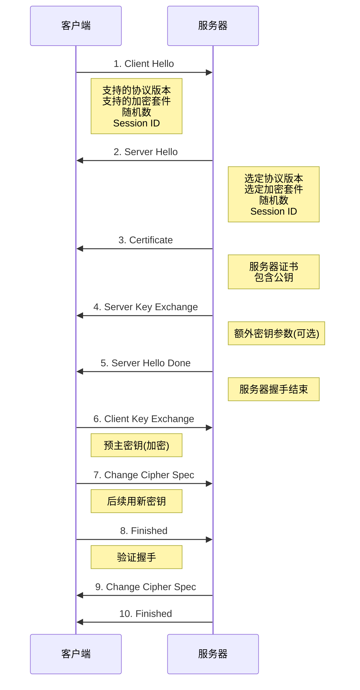

#### TLS 握手阶段总结

| 阶段 | 客户端操作 | 服务器操作 |
|------|-----------|-----------|
| **1-2** | 发送支持的套件 | 选择加密套件 |
| **3-5** | - | 发送证书 |
| **6-8** | 发送预主密钥 | - |
| **9-10** | - | 确认加密 |

---

## 5. HTTP vs HTTPS 对比

### 对比表格

| 特性 | HTTP | HTTPS |
|------|------|-------|
| **安全性** | 明文传输，不安全 | 加密传输，安全 |
| **端口** | 80 | 443 |
| **证书** | 不需要 | 需要 CA 证书 |
| **性能** | 较快（无加密开销） | 较慢（加密开销） |
| **搜索引擎** | 不影响排名 | 优先收录 |
| **SEO** | 一般 | 更好 |
| **缓存** | 简单 | 需要配置 |
| **CDN支持** | 简单 | 需要特殊配置 |

### 性能对比

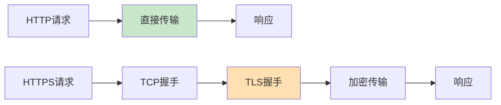

---

## 6. 实战案例

### 6.1 使用 Wireshark 抓包分析

#### 抓包步骤

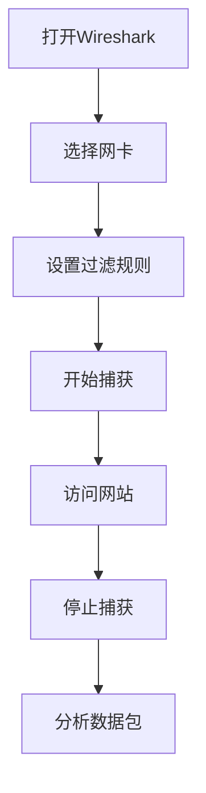

#### 过滤规则

```
tcp.port == 443 && tls
```

#### 分析 TCP 握手

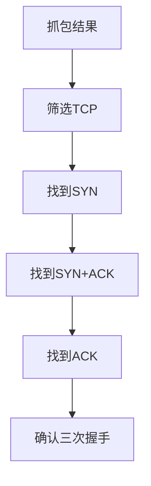

### 6.2 使用 curl 测试

#### HTTP 请求示例

```bash
curl http://example.com
```

#### HTTPS 请求示例

```bash
curl https://example.com
```

#### 详细输出

```bash
curl -v https://example.com
```

---

## 总结

### TCP 核心要点

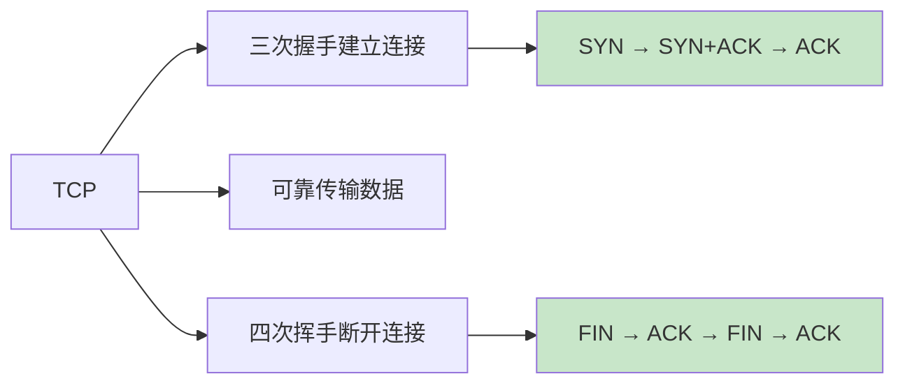

### HTTPS 核心要点

```mermaid
flowchart LR
    HTTPS_SUM_A[HTTPS] --> HTTPS_SUM_B[TCP握手]
    HTTPS_SUM_A --> HTTPS_SUM_C[TLS握手]
    HTTPS_SUM_A --> HTTPS_SUM_D[加密传输]
    
    HTTPS_SUM_B --> HTTPS_SUM_B1[建立连接]
    HTTPS_SUM_C --> HTTPS_SUM_C1[协商密钥]
    HTTPS_SUM_D --> HTTPS_SUM_D1[安全通信]
    
    style HTTPS_SUM_B1 fill:#c8e6c9
    style HTTPS_SUM_C1 fill:#ffe0b2
    style HTTPS_SUM_D1 fill:#c8e6c9
```

### 一次 HTTPS 请求完整流程

1. **DNS 解析**：将域名转换为 IP
2. **TCP 三次握手**：建立连接
3. **TLS 握手**：协商加密参数、交换密钥
4. **发送 HTTP 请求**：加密后的请求数据
5. **接收 HTTP 响应**：加密后的响应数据
6. **TCP 四次挥手**：断开连接

---

## 参考资料

1. [TCP/IP 详解 卷1：协议](https://www.amazon.com/TCP-Illustrated-Vol-1-Protocols/dp/0201633469)
2. [HTTP 权威指南](https://www.amazon.com/HTTP-Definitive-Guide-Guides/dp/1565925092)
3. [TLS 1.3 规范](https://datatracker.ietf.org/doc/html/rfc8446)
