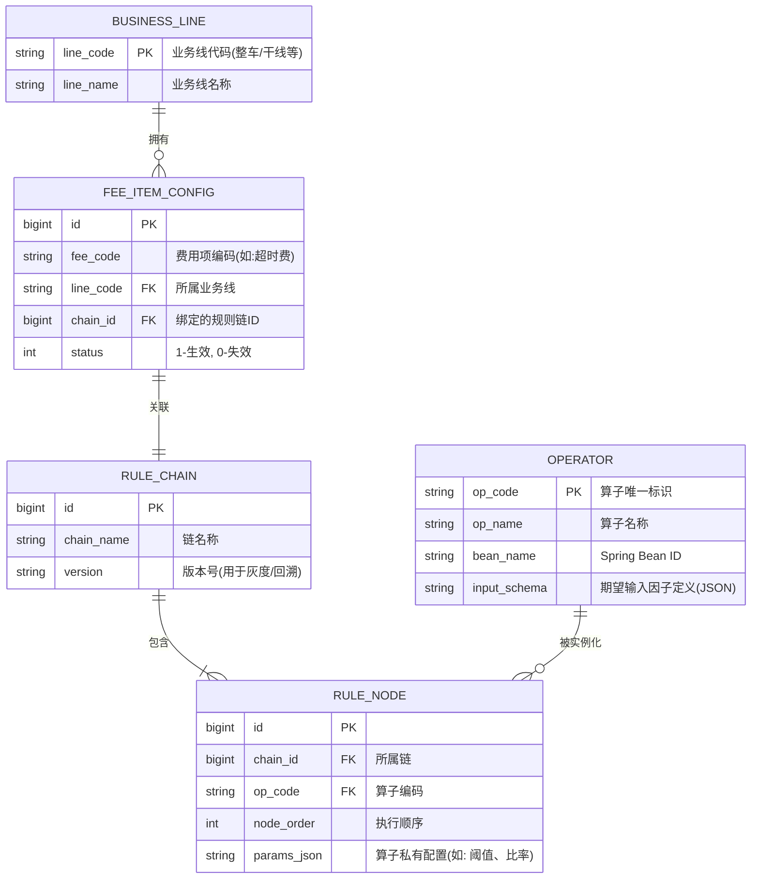

# 费用项计算系统

## 由浅入深

场景：有一个比较复杂的业务场景，系统属于物流系统，有一票货订单，订单在承运过程中会因为时效或者相关违规等异常操作，在某一些时间生成扣款费用项，并且费用项需要由业务人员后台审核，司机也可以申诉。订单量大概月几十万订单，支持的费用项有近100个，各个费用项走独立配置。运输过程的基础数据可能存在微服务的多个库表内，计算费用项需要去各个业务系统拿计算因子，实时计算，并且审批人员也需要看计算因子。需要搭建一个费用项系统，微服务框架，有一张应付汇总订单主表，所有的费用项都会挂在应付订单上，审批完增减的费用项，会有付给司机的总费用，由订单一笔笔支付。帮我设计明确的库表设计，服务架构采用springboot微服务，rocketMQ，redis，数据库仅仅有MYSQL。我希望的是有一张计算因子存储表，有费用项记录表，有工单表等关键信息记录

| **方案**                | **核心思想**           | **优势**                                           | **劣势**                                            | **适用场景**                                     |
| ----------------------- | ---------------------- | -------------------------------------------------- | --------------------------------------------------- | ------------------------------------------------ |
| **1. SpEL表达式**       | 动态解析字符串公式     | 极其轻量；无需停机即可修改数学公式。               | 难以处理逻辑分支（If-Else）；有注入风险；调试困难。 | 简单的加减乘除（如：单价 × 数量）。              |
| **2. 策略模式 + 配置**  | Java类硬编码业务逻辑   | 性能最高；利用Java全特性处理极复杂逻辑；易于调试。 | 类数量随业务爆炸增长（N * M）；逻辑变更需发布代码。 | 业务线少、费用项固定、逻辑极其复杂的场景。       |
| **3. 原子算子注册中心** | 逻辑碎片化、配置化编排 | 消除重复代码；支持业务线快速横向扩展；配置即开发。 | 架构设计成本高；JSON编排链路长时，性能有轻微损耗。  | **推荐方案**。多业务线、多费用项、逻辑高度重叠。 |
| **4. Drools规则引擎**   | 声明式规则与推理       | 业务逻辑与代码彻底分离；支持热加载；自动处理冲突。 | 学习曲线陡峭；黑盒执行难以排查；维护成本极高。      | 规则存在大量交叉、优先级判断且由业务人员维护。   |

### 深度利弊分析

#### 方案一：SpEL 表达式（轻量级动态计算）

- **利**：通过数据库存储字符串公式，实现“零代码”调整计费单价或简单折扣。
- **弊**：当涉及“取多个时间的最早值”这种逻辑判断时，SpEL会变得臃肿不堪，且一旦公式写错，只能在运行时抛出异常。

#### 方案二：策略模式 + 规则配置（工业级稳健）

- **利**：每一个费用项都是一个独立的 Java 类，支持复杂的数据库查询、多系统交互。
- **弊**：针对 7 个业务线和 100 个费用项，如果你不进行抽象，最终会维护上百个策略类，代码冗余度极高，维护成本随业务线增长呈线性上升。

#### 方案三：原子算子注册中心（架构师首选）

- **利**：通过“适配器”统一因子，将逻辑拆解为“比对、计算、过滤、封顶”等原子，通过 JSON 动态拼装逻辑链路。它兼顾了**开发的灵活性**与**代码的可维护性**。
- **弊**：需要开发一套成熟的“算子执行引擎”，初期投入较大。

#### 方案四：Drools 规则引擎（领域专家级）

- **利**：它能处理“如果 A 满足且 B 不满足，则执行 C，但如果 D 存在则覆盖 C”这种极度纠缠的规则。
- **弊**：对于物流结算而言，往往逻辑是线性的，使用 Drools 有“杀鸡用牛刀”之嫌，且团队中若无 Drools 专家，后续规则排查将成为灾难。

------

### 最终建议：混合动力方案

对于你目前的物流系统（7业务线、100费用项），我不建议孤立地选择某种模式，而是采用**“组合拳”**：

1. **基础层**：采用**方案三（原子算子中心）**，将时间比对、车长过滤、上限控制等做成标准化算子。
2. **运算层**：在原子算子里嵌套**方案一（SpEL）**，处理最后的金额计算公式。
3. **接入层**：针对 7 个业务线，利用**适配器模式**归一化计算因子，确保同一套算子能跑在不同业务线上。

#### 兜底方案

在任何涉及金钱计算的系统中，必须设计以下**三层隔离兜底**：

- **第一层：数据镜像（Snapshot）**。计算费用时，必须将当时的计算因子（如里程、车长、配置参数）镜像存储。即使规则变了，也能根据镜像重现当时的计算过程。
- **第二层：手动干预门控**。对于计算失败或计算结果触发“异常波动（如金额超过历史均值3倍）”的订单，系统自动挂起，转为人工审核，防止大规模资损。
- **第三层：灰度影子计算**。新规则上线前，在生产环境后台静默运行（只计算不入库），对比新老规则产生的费用差异，确认无误后再全量切换。

## 原子算子注册中心设计

### 二、 关键数据表详述

#### 1. 规则节点表 (`rule_node`) —— 业务逻辑的“组装机”

这是最核心的表。它将通用的算子（Operator）在特定业务场景下进行“参数化”。

- **`params_json` 的妙用**：比如一个通用的“限额算子（LIMIT_OP）”，在业务线 A 的配置是 `{"max": 500}`，而在业务线 B 是 `{"max": 1000}`。同一套代码，不同的配置。

#### 2. 因子映射表 (`factor_mapping`) —— 解决 7 条业务线差异

为了不让算子代码里出现 `if(line == '整车')` 这种垃圾代码，我们需要一层适配：

- **字段设计**：`line_code`, `standard_factor_name`, `source_field_path`
- **逻辑**：将业务线 A 传来的 `truck_mileage` 统一映射为标准因子 `distance`。算子只认 `distance`。

#### 3. 计算快照表 (`fee_calc_snapshot`) —— 审计与追溯

- **字段设计**：`order_id`, `fee_item_id`, `calc_result`, `full_context_json`, `rule_version_snapshot`
- **作用**：记录每一笔钱是怎么算出来的。`full_context_json` 存储当时所有的输入因子和中间变量，哪怕以后规则改了，财务审计时也能原样还原。

------

### 三、 架构推导逻辑

1. **解决 N * M 爆炸**：
   - 新增业务线时，只需在 `BUSINESS_LINE` 加一行，并配置对应的 `FEE_ITEM_CONFIG`。
   - 如果计算逻辑类似，直接复用现有的 `RULE_CHAIN`；如果逻辑略有不同，只需在 `RULE_NODE` 里调整顺序或修改 `params_json`。
2. **极高的正交性**：
   - **开发人员**：只负责开发高内聚的 `OPERATOR`（算子）。
   - **业务/运维人员**：负责在后台管理系统编排 `RULE_NODE`（规则节点）。

------

### 四、 兜底方案 (Fail-safe Plan)

面对这种高度配置化的系统，最怕的是“配置错误导致全线崩盘”。

- **配置验证机制**：在保存 `RULE_CHAIN` 时，系统必须自动进行“空跑测试”。利用预设的测试用例（Test Case）跑一遍计算链路，结果符合预期才允许发布。
- **软删除与版本控制**：所有的规则变更不直接 `UPDATE`，而是生成新的 `version`。如果新版本上线后发现异常，一键将 `FEE_ITEM_CONFIG` 里的 `chain_id` 指向回旧版本。
- **脚本降级**：如果算子中心因为 Redis 或复杂编排导致性能瓶颈，系统应支持针对特定业务线开启“硬编码策略模式”作为紧急替代方案。