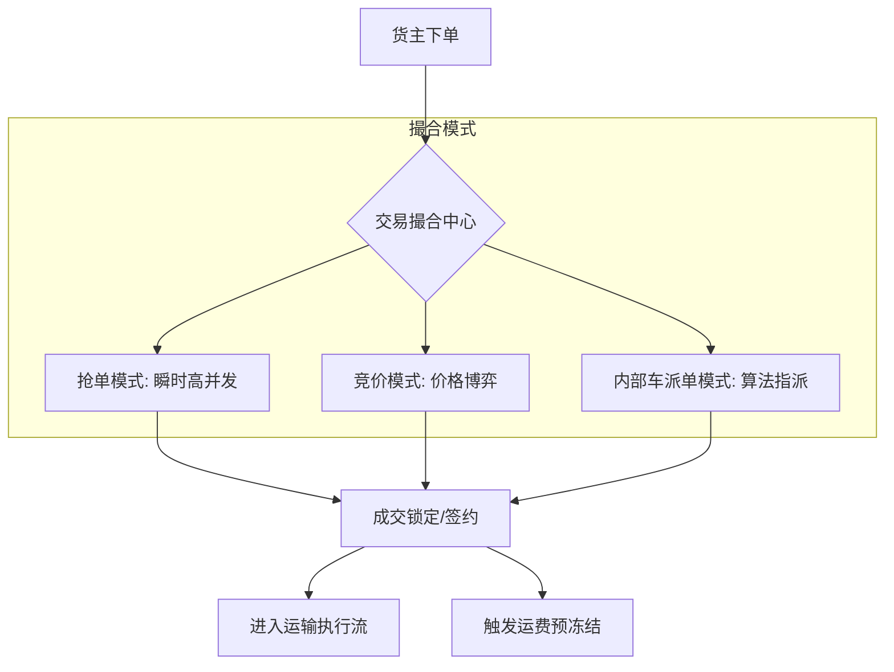

## 促成交易系统

**场景：**促成交易系统如何搭建，也是物流行业，由货主下订单，需要找司机，平台发布货源，促成司机成交，司机中标后可以承运，运输完结走结算流程。此套一票货流程中促成交易的环境应该如何设计

分析：在物流行业中，**促成交易系统是连接货主（需求方）与司机（供给方）的核心枢纽。它不仅是一个信息发布平台，更是一个高并发的、对一致性要求极高的撮合引擎**。将这套系统拆解为**货源池、匹配引擎、成交锁定**三个核心阶段，并为你设计两套主流的交易模型。

### 一、 促成交易系统核心架构图

我们采用领域驱动设计（DDD），将交易撮合与后续的运输执行（TMS）进行解耦。

### 二、 两种主流成交模式设计

在物流场景下，你需要根据业务属性（是城配还是干线）选择不同的设计方案。

#### 方案 A：抢单模式

- **场景**：价格标准化、货源紧急。
- **技术核心**：利用 **Redis + 分布式锁**。
- **流程**：货源发布至 Redis 队列，多名司机同时“秒杀”。
- **利弊**：
  - **优点**：成交效率极高。
  - **缺点**：对系统并发压力大，容易产生“误抢”，需严格处理幂等。

#### 方案 B：竞价模式

- **场景**：大宗货源、价格不透明、长途干线。
- **技术核心**：**定时的“标书”管理 + 价格排序策略**。
- **流程**：货主发布货源，设定竞价时长（如 30 分钟）。司机出价，系统记录所有报价，时间结束后由货主选择或系统自动按“最优价”中标。
- **利弊**：
  - **优点**：能有效降低货主成本，提高平台盈利
  - **缺点**：交易闭环周期长，**对“弃标”行为需要严苛的信用惩戒机制。**

### 三、 关键组件设计

#### 1. 货源池 与索引

- **设计**：不要直接查询 MySQL 业务表。
- **实现**：使用 **Elasticsearch (ES)** 存储货源信息，支持司机的**多维度检索**（按装货地、卸货地、车型、吨位、距离）。
- **地理位置**：利用 ES 的 `geo_point` 进行半径 50km 内的货源推送，这是促成交易的精准化前提。

#### 2. 状态机驱动

促成交易过程状态复杂，必须使用状态机（如 Spring Statemachine）强管控：

- `PUBLISHED` (已发布) -> `BIDDING` (竞价中) -> `MATCHED` (已成交) -> `CONFIRMED` (司机到场确认)。
- **原则**：**状态不可逆且唯一**。例如，一旦订单进入 `MATCHED`，必须通过分布式锁锁定 `order_id`，防止第二个司机中标。

#### 3. 分布式事务与一致性

- **痛点**：司机中标的一瞬间，需要：1. 更新订单状态；2. 冻结货主余额/授信额度（实时结算）；3. 异步通知其他未中标司机。
- **架构建议**：使用 **RocketMQ 事务消息**。
  - 第一阶段：发送“确认成交”半消息。
  - 第二阶段：执行本地数据库修改（订单状态）。
  - 第三阶段：提交消息，下游财务系统订阅消息并执行资金冻结。

### 四、 兜底方案与异常处理

物流交易受线下因素影响极大，必须有以下“防御性设计”：

| **异常场景**        | **架构对策**                                                 |
| ------------------- | ------------------------------------------------------------ |
| **司机毁约 (弃标)** | 引入**保证金扣除机制**。弃标生成对应费用，结算时扣除司机保证金。针对高价值订单可以采用内部车等别的需求方案设计 |
| **货源无人问津**    | **阶梯式降级策略**。若 1 小时未成交，系统自动扩大推送半径（50km -> 100km），或自动触发“平台补差价”逻辑。 |
| **并发超卖**        | **数据库版本号**。在执行 `UPDATE order SET driver_id = xxx WHERE id = yyy AND driver_id IS NULL` 时，通过影响行数判断是否成交成功。 |

### 五、 撮合的“信任模型”

在促成交易系统中，**“信息不对称”**是最大的敌手。

- **建议**：在司机中标前，引入**“画像系统”**。系统不仅看价格，还要根据司机的历史轨迹、准时率、违规记录进行自动评分。
- **结论**：**最好的促成交易不是最快的，而是最稳的。** 频繁的线下毁约会彻底摧毁中台系统的价值。

交易系统的搭建，切记不要一上来就搞大而全。

1. **先做“稳定成交”**：保证幂等和库存预扣。
2. **再做“智能匹配”**：在基础撮合上增加权重算法。
3. **最后做“结算联动”**：在成交后的异步处理中，注入费率模型。