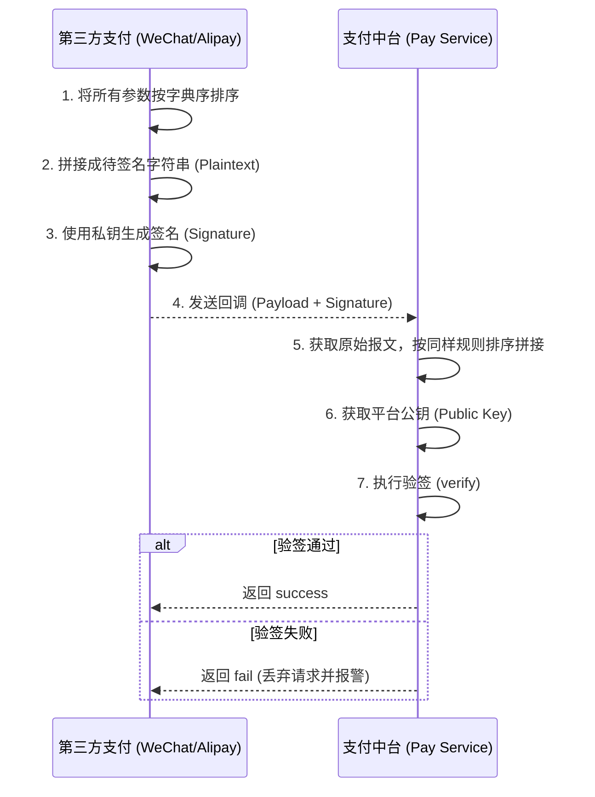

# 支付中台系统

## 支付

场景：支付系统，属于业务中台，不直接对接支付，但是会对接多种支付方式，比如快捷支付系统（微信/支付宝），对接第三方支付平台，一般是提供查询支付结果，发起支付，支付回调等交互。要怎么设计这个支付系统，应对高可用，且幂等，确保支付无问题。仍然是物流系统，微服务架构

### 一、 核心架构方案权衡

#### 方案一：基于状态机强控制的同步交易模型

- **推导逻辑**：支付请求进入系统后，通过数据库事务保证支付单创建与状态锁定的原子性。利用支付渠道的状态机（State Machine）驱动业务流转。
- **优点**：逻辑直观，数据强一致性高，适用于对支付实时性要求极高的场景。
- **缺点**：在高并发下对数据库压力大；若第三方接口延迟，会占用大量容器线程，导致系统吞吐量下降。

#### 方案二：基于事件驱动（EDA）的异步交易模型（推荐）

- **推导逻辑**：支付发起后立即返回“支付中”，后续通过 **RocketMQ** 驱动状态更新。将“发起支付”、“接收回调”、“主动对账”解耦。
- **优点**：极高的吞吐量与扩展性；第三方平台抖动时，通过消息重试机制实现自我修复。
- **缺点**：存在短暂的中间态，对业务端查询逻辑有要求。

### 二、 关键技术实现：如何确保“万无一失”

#### 1. 幂等设计

重复支付是红线。我们必须在多个层面构建防线：

- **业务层幂等（去重表）**：使用 `order_id + scene_code`（订单号+场景码）作为唯一索引。

- **支付流水层**：每一笔发往第三方的请求，生成全局唯一的 `request_no`。即便用户多次点击，发往微信/支付宝的流水号保持一致，利用第三方平台的幂等机制防重。

- **状态机控制**：

  SQL

  ```
  -- 使用乐观锁更新状态
  UPDATE payment_order SET status = 'SUCCESS', update_time = NOW() 
  WHERE pay_no = 'P123' AND status = 'PENDING';
  ```

  只有状态为 `PENDING` 时才允许变更为成功，防止回调重复处理导致逻辑重入。

#### 2. 高可用性保障

- **多渠道智能路由**：如果第三方支付 A 接口大量超时，路由模块自动熔断并切换至备用渠道 B（例如从微信切换至银联快捷支付）。（此场景不推荐，超时可能也已经发起了，如果在不确保发起支付成功之时切换到了别的支付渠道，可能会出现重复支付场景）
- **灰度与隔离**：将不同业务线（如：运费支付、押金支付）的执行链路在微服务层面进行物理隔离，防止某一边业务激增拖垮整个支付中台。

### 三、 兜底方案：主动对账系统

**核心设计**：你不能完全信任第三方的回调（可能会丢失、延迟或被墙）。

- **方案**：**延迟队列轮询 + T+1 全量对账**。
  - **定时补单（T+N min）**：支付单创建后，若 5 分钟内未收到回调，启动定时任务主动调用第三方“查询支付结果”接口。
  - **差错处理逻辑**：
    1. **本地成功/第三方失败**：极端异常，需人工介入冲正。
    2. **本地延迟/第三方成功**：自动同步状态，触发业务后续。
    3. **双向不一致**：以第三方财务账单为准（T+1 核心逻辑）。

### 四、支付回调

#### 1. 签名验证逻辑流

其核心逻辑在于：**三方平台用私钥加签，支付中台用公钥验签。**



#### 一、 架构设计权衡：两种方案

##### 方案 A：分布式拦截器验签（通用性强）

- **实现**：在支付网关或 Spring Interceptor 中拦截 `/callback/**` 路径，统一进行验签。
- **利弊**：对业务代码无侵入，能有效隔离安全逻辑。
- **风险**：不同支付渠道的签名规则（如算法、排序规则、Header名）差异巨大，会导致拦截器逻辑过于臃肿。

##### 方案 B：领域驱动策略模式（推荐）

- **实现**：定义 `PayChannelHandler` 接口，每个支付渠道实现自己的 `verifyCallback()`。
- **优势**：**逻辑内聚**。微信、支付宝、银联的验签逻辑各自独立，互不干扰，符合架构的开闭原则。

------

#### 二、 兜底方案

1. **原始报文存档 **：在验签之前，首先将 **Raw Request Body** 和 **Headers** 记录到日志或MySQL 中。
   - *作用*：如果因为程序 Bug 导致验签失败，可以基于原始报文进行“人工验签”或“手动补单”，作为最后的财务保障。
2. **IP 白名单限制**：在防火墙或网关层，仅允许支付平台官方的 IP 段访问回调接口。
3. **最终对账兜底**：如果回调彻底失效（如网络被墙），支付中台必须有**定时任务（T+N查询）**。对于所有处于 `PENDING` 状态超过 10 分钟的订单，主动调用三方的查询接口（Query API）来同步状态。

### 总结：如何保证“无问题”

没有任何分布式事务方案是“全自动”的，**监控与对账才是最终防线**。

- **幂等性是前提**：无论你选用哪种分布式事务，所有的下游接口必须实现**强幂等性**。如果下游接口不支持幂等，分布式事务架构就是空中楼阁。
- **主动对账机制**：无论多么完美的事务架构，都会因极端故障（如机房断电）导致数据不平。必须建立每日的“T+1 对账脚本”，对比 `OrderDB` 和 `FinanceDB` 的总金额，发现不一致立即告警并触发补偿。
